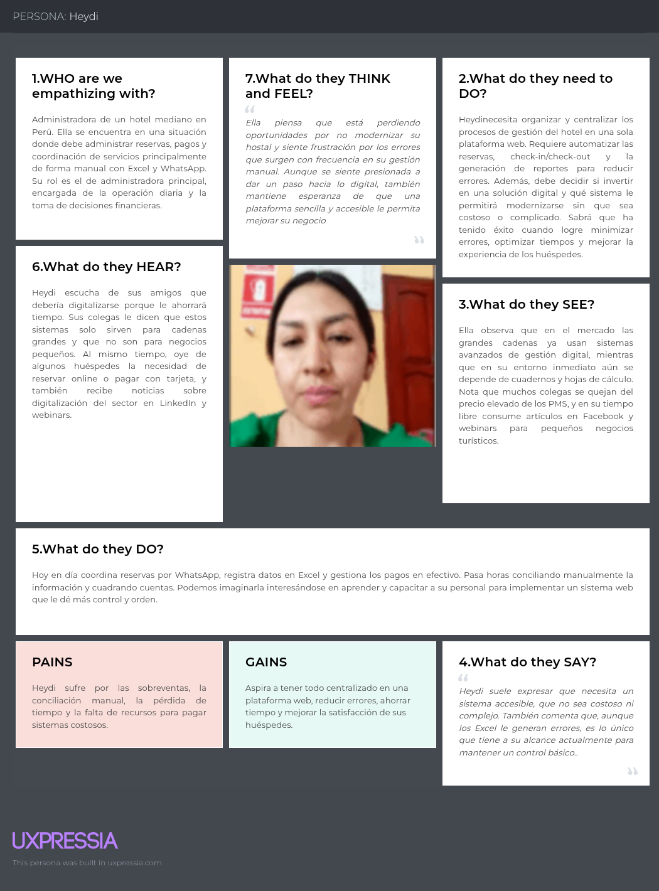
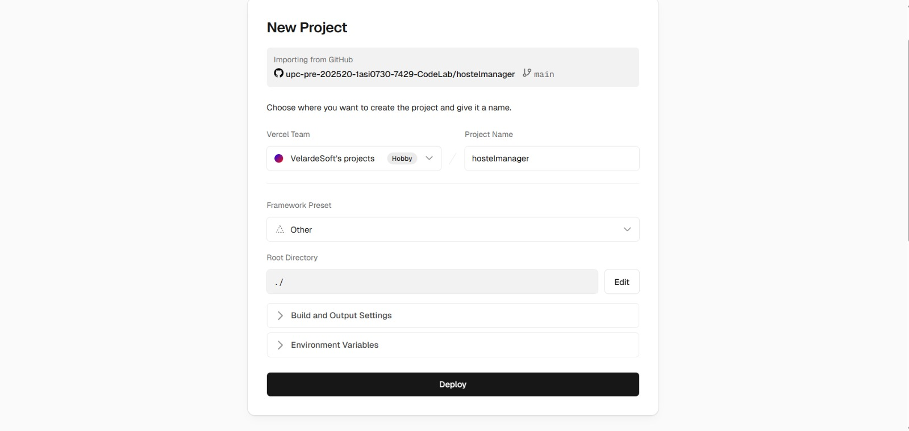

<div align="center">

  <center>
    
  </center>
  <br/>

  <center><strong>Universidad Peruana de Ciencias Aplicadas</strong></center> <br/> <br/>

  <center>Ingeniería de Software</center> <br/> <br/>

  <center><strong>CURSO:</strong> 1ASI0730 - Aplicaciones Web</center> <br/> <br/>

  <center><strong>NRC:</strong> 7429</center> <br/> <br/>

  <center><strong>Profesor:</strong> Villafuerte Bazan, Oscar Ivan</center> <br/> <br/>

  <center><strong>Informe del Trabajo Final</strong></center> <br/> <br/>

  <center><strong>Startup:</strong> Codelab</center> <br/> <br/>

  <center><strong>Producto:</strong> HostelManager</center> <br/> <br/>

  <center><strong>Integrantes:</strong></center>

  <table border="1px" align="center">
    <thead>
      <tr>
        <th><center>Integrantes</center></th>
        <th><center>Código</center></th>
      </tr>
    </thead>
    <tbody>
      <tr>
        <td><center>Bautista Rivera, Jose Diego</center></td>
        <td><center>u202310949</center></td>
      </tr>
      <tr>
        <td><center>Curi Marcelo, Angelo Marcio</center></td>
        <td><center>u202022387</center></td>
      </tr>
      <tr>
        <td><center>Janampa Gutierrez, Jhoan Darner</center></td>
        <td><center>u202323319</center></td>
      </tr>
      <tr>
        <td><center>Quiroz Caceres, Adrian Alonso</center></td>
        <td><center>u202214864</center></td>
      </tr>
      <tr>
        <td><center>Velarde Gonzales, Nestor Hernan</center></td>
        <td><center>u20211c221</center></td>
      </tr>
    </tbody>
  </table>

  <br/>

  <center><strong>15 de Noviembre del 2025</strong></center>

</div>

<div style="page-break-before: always;"></div>

# Registro de Versiones del Informe

<table border="1" align="center" style="border-collapse: collapse; width: 100%;">
  <tr>
    <td><strong>Versión</strong></td>
    <td><strong>Fecha</strong></td>
    <td><strong>Autor</strong></td>
    <td colspan="7"><strong>Descripción de modificación</strong></td>
  </tr>
  <tr>
    <td>V0.1</td>
    <td>01/09/2025</td>
    <td>Todos</td>
    <td colspan="7">Creación del repositorio para desarrollo de Front-end y Backend, además un repositorio de Informe usando texto Markdown</td>
  </tr>
  <tr>
    <td>V0.2</td>
    <td>10/10/2025</td>
    <td>Todos</td>
    <td colspan="7">Desarrollo del proyecto (Front-end) usando Vue como framework principal para nuestro aplicación web de gestión de Hoteles, además como servicio se está usando el fake api json como servicio temporal</td>
  </tr>
  <tr>
    <td>V0.3</td>
    <td>20/10/2025</td>
    <td>Todos</td>
    <td colspan="7">Corrección y mejoras del Sprint 01</td>
  </tr>
	<tr>
    <td>V0.4</td>
    <td>15/11/2025</td>
    <td>Todos</td>
    <td colspan="7">Desarrollo del Endpoint aplicando las buenas practicas de desarrollo de software, se implemento un 80% de backend en una arquitectura de monolito basado en gestion de Hoteles.</td>
  </tr>
  <tr>
    <td>V0.5</td>
    <td>05/12/2025</td>
    <td>Todos</td>
    <td colspan="7">Culminación del desarrollo del frontend y backend en tu totalidad, deploy de ambos servicios y funcionamiento de ambos servicios simultaneamente.</td>
  </tr>
</table>

<div style="page-break-before: always;"></div>

# Project Report Collaboration Insights

<table border="1" align="center" style="border-collapse: collapse; width: 100%;">
  <tr>
    <td><strong>Orden</strong></td>
    <td><strong>Descripción</strong></td>
    <td><strong>Link</strong></td>
  </tr>
  <tr>
    <td>01</td>
    <td>Nuestro landing page</td>
    <td><a href="https://upc-pre-202520-1asi0730-7429-codelab.github.io/landing-page/" target="_blank">codelab.com</a></td>
  </tr>
  <tr>
    <td>02</td>
    <td>Nuestro front-end</td>
    <td><a href="https://front-end-gamma-nine-11.vercel.app/" target="_blank">codelab/login.com</a></td>
  </tr>
  <tr>
    <td>03</td>
    <td>Nuestro Organización de GitHub</td>
    <td><a href="https://github.com/upc-pre-202520-1asi0730-7429-CodeLab" target="_blank">GitHub</a></td>
  </tr>
</table>

<div style="page-break-before: always;"></div>

# Contenido
- [Registro de Versiones del Informe](#registro-de-versiones-del-informe)
- [Project Report Collaboration Insights](#project-report-collaboration-insights)
- [Contenido](#contenido)
  - [Student Outcome](#student-outcome)
- [Capítulo I: Introducción](#capítulo-i-introducción)
  - [1.1. Startup Profile](#11-startup-profile)
    - [1.1.1. Descripción de la Startup](#111-descripción-de-la-startup)
    - [1.1.2. Perfiles de integrantes del equipo](#112-perfiles-de-integrantes-del-equipo)
  - [1.2. Solution Profile](#12-solution-profile)
    - [1.2.1. Antecedentes y problemática](#121-antecedentes-y-problemática)
    - [1.2.2. Lean UX Process](#122-lean-ux-process)
      - [1.2.2.1. Lean UX Problem Statements](#1221-lean-ux-problem-statements)
      - [1.2.2.2. Lean UX Assumptions](#1222-lean-ux-assumptions)
      - [1.2.2.3. Lean UX Hypothesis Statements](#1223-lean-ux-hypothesis-statements)
      - [1.2.2.4. Lean UX Canvas](#1224-lean-ux-canvas)
  - [1.3. Segmentos objetivo](#13-segmentos-objetivo)
- [Capítulo II: Requirements Elicitation \& Analysis](#capítulo-ii-requirements-elicitation--analysis)
  - [2.1. Competidores](#21-competidores)
    - [2.1.1. Análisis competitivo](#211-análisis-competitivo)
    - [2.1.2. Estrategias y tácticas frente a competidores](#212-estrategias-y-tácticas-frente-a-competidores)
  - [2.2. Entrevistas](#22-entrevistas)
    - [2.2.1. Diseño de entrevistas](#221-diseño-de-entrevistas)
    - [2.2.2. Registro de entrevistas](#222-registro-de-entrevistas)
    - [2.2.3. Análisis de entrevistas](#223-análisis-de-entrevistas)
    - [Análisis de Entrevistas: Administradores de Hoteles](#análisis-de-entrevistas-administradores-de-hoteles)
      - [Contexto y Características Comunes](#contexto-y-características-comunes)
      - [Problemas Identificados](#problemas-identificados)
      - [Expectativas sobre el Sistema Digital](#expectativas-sobre-el-sistema-digital)
        - [Funcionalidades clave:](#funcionalidades-clave)
      - [Resumen y Oportunidades de Mejora](#resumen-y-oportunidades-de-mejora)
    - [Análisis de Entrevistas: Huéspedes de Hoteles](#análisis-de-entrevistas-huéspedes-de-hoteles)
      - [Contexto y Características Comunes](#contexto-y-características-comunes-1)
      - [Problemas y Necesidades Identificadas](#problemas-y-necesidades-identificadas)
      - [Expectativas sobre el Sistema Digital](#expectativas-sobre-el-sistema-digital-1)
      - [Resumen y Oportunidades de Mejora](#resumen-y-oportunidades-de-mejora-1)
    - [Conclusiones Generales](#conclusiones-generales)
  - [2.3. Needfinding](#23-needfinding)
    - [2.3.1. User Personas](#231-user-personas)
      - [Segmento Objetivo: Administrador/a](#segmento-objetivo-administradora)
      - [Segmento Objetivo: Huesped](#segmento-objetivo-huesped)
    - [2.3.2. User Task Matrix](#232-user-task-matrix)
      - [Segmento Objetivo: Administrador/a](#segmento-objetivo-administradora-1)
      - [Segmento Objetivo: Huesped](#segmento-objetivo-huesped-1)
    - [2.3.3. User Journey Mapping](#233-user-journey-mapping)
    - [Segmento Objetivo : Productor](#segmento-objetivo--productor)
    - [Segmento Objetivo : Huesped](#segmento-objetivo--huesped)
    - [2.3.4. Empathy Mapping](#234-empathy-mapping)
    - [Segmento Objetivo : Productor](#segmento-objetivo--productor-1)
    - [Segmento Objetivo : Huesped](#segmento-objetivo--huesped-1)
    - [2.3.5. As-is Scenario Mapping.](#235-as-is-scenario-mapping)
    - [Segmento Objetivo : Productor](#segmento-objetivo--productor-2)
    - [Segmento Objetivo : Huesped](#segmento-objetivo--huesped-2)
  - [2.4. Big Picture EventStorming](#24-big-picture-eventstorming)
  - [2.5. Ubiquitous Language](#25-ubiquitous-language)
- [Capítulo III: Requirements Specification](#capítulo-iii-requirements-specification)
  - [3.1. To-Be Scenario Mapping](#31-to-be-scenario-mapping)
      - [Segmento Objetivo: Administrador/a](#segmento-objetivo-administradora-2)
      - [Segmento Objetivo: Húesped](#segmento-objetivo-húesped)
  - [3.2. User Stories](#32-user-stories)
    - [EPICS](#epics)
    - [User stories](#user-stories)
  - [3.3. Impact Mapping](#33-impact-mapping)
  - [3.4. Product Backlog](#34-product-backlog)
- [Capítulo IV: Product Design](#capítulo-iv-product-design)
  - [4.1. Style Guidelines](#41-style-guidelines)
    - [4.1.1. General Style Guidelines](#411-general-style-guidelines)
    - [4.1.2. Web Style Guidelines](#412-web-style-guidelines)
  - [4.2. Information Architecture](#42-information-architecture)
    - [4.2.1. Organization Systems](#421-organization-systems)
    - [4.2.2. Labeling Systems](#422-labeling-systems)
    - [4.2.3. SEO Tags and Meta Tags](#423-seo-tags-and-meta-tags)
    - [4.2.4. Searching Systems](#424-searching-systems)
    - [4.2.5. Navigation Systems](#425-navigation-systems)
  - [4.3. Landing Page UI Design](#43-landing-page-ui-design)
    - [4.3.1. Landing Page Wireframe](#431-landing-page-wireframe)
    - [4.3.2. Landing Page Mock-up](#432-landing-page-mock-up)
  - [4.4. Web Applications UX/UI Design](#44-web-applications-uxui-design)
    - [4.4.1. Web Applications Wireframes](#441-web-applications-wireframes)
    - [4.4.2. Web Applications Wireflow Diagrams](#442-web-applications-wireflow-diagrams)
      - [Inicio de Sesión:](#inicio-de-sesión)
      - [Agregar Huesped](#agregar-huesped)
      - [Editar Huesped](#editar-huesped)
      - [Buscar Huesped](#buscar-huesped)
      - [Cancelar Suscripción](#cancelar-suscripción)
    - [4.4.2. Web Applications Mock-ups](#442-web-applications-mock-ups)
    - [4.4.3. Web Applications User Flow Diagrams](#443-web-applications-user-flow-diagrams)
      - [Inicio de Sesión:](#inicio-de-sesión-1)
      - [Agregar Huesped](#agregar-huesped-1)
      - [Editar Huesped](#editar-huesped-1)
      - [Buscar Huesped](#buscar-huesped-1)
      - [Cancelar Suscripción](#cancelar-suscripción-1)
  - [4.5. Web Applications Prototyping](#45-web-applications-prototyping)
  - [4.6. Domain-Driven Software Architecture](#46-domain-driven-software-architecture)
    - [4.6.1. Design-Level EventStorming](#461-design-level-eventstorming)
    - [4.6.2. Software Architecture Context Diagram](#462-software-architecture-context-diagram)
    - [4.6.3. Software Architecture Container Diagrams](#463-software-architecture-container-diagrams)
    - [4.6.4. Software Architecture Components Diagrams](#464-software-architecture-components-diagrams)
  - [4.7. Software Object-Oriented Design](#47-software-object-oriented-design)
    - [4.7.1. Class Diagrams](#471-class-diagrams)
  - [4.8. Database Design](#48-database-design)
    - [4.8.1. Database Diagrams](#481-database-diagrams)
- [Capítulo V: Product Implementation, Validation \& Deployment](#capítulo-v-product-implementation-validation--deployment)
  - [5.1. Software Configuration Management](#51-software-configuration-management)
    - [5.1.1. Software Development Environment Configuration](#511-software-development-environment-configuration)
    - [5.1.2. Source Code Management](#512-source-code-management)
    - [5.1.3. Source Code Style Guide \& Conventions](#513-source-code-style-guide--conventions)
      - [HTML](#html)
      - [CSS](#css)
      - [JavaScript](#javascript)
      - [VUE (FRONTEND)](#vue-frontend)
      - [C# (Backend)](#c-backend)
    - [5.1.4. Software Deployment Configuration](#514-software-deployment-configuration)
      - [Estrategia de Despliegue](#estrategia-de-despliegue)
      - [Landing Page](#landing-page)
      - [Frontend Web Application (Vue)](#frontend-web-application-vue)
      - [Backend (RESTful API en Node.js)](#backend-restful-api-en-nodejs)
      - [Base de Datos](#base-de-datos)
      - [Notificaciones y Servicios Externos](#notificaciones-y-servicios-externos)
  - [5.2. Landing Page, Services \& Applications Implementation](#52-landing-page-services--applications-implementation)
    - [5.2.1. Sprint 1](#521-sprint-1)
      - [5.2.1.1. Sprint Planning 1](#5211-sprint-planning-1)
      - [5.2.1.2. Aspect Leaders and Collaborators](#5212-aspect-leaders-and-collaborators)
      - [5.2.1.3. Sprint Backlog 1](#5213-sprint-backlog-1)
    - [Sprint Backlog 1 - Entregables: Landing Page + Prototipo Web](#sprint-backlog-1---entregables-landing-page--prototipo-web)
      - [5.2.1.4. Development Evidence for Sprint Review](#5214-development-evidence-for-sprint-review)
      - [5.2.1.5. Execution Evidence for Sprint Review](#5215-execution-evidence-for-sprint-review)
      - [5.2.1.6. Services Documentation Evidence for Sprint Review](#5216-services-documentation-evidence-for-sprint-review)
      - [5.2.1.7. Software Deployment Evidence for Sprint Review](#5217-software-deployment-evidence-for-sprint-review)
      - [5.2.1.8. Team Collaboration Insights during Sprint](#5218-team-collaboration-insights-during-sprint)
    - [5.2.2. Sprint 2](#522-sprint-2)
      - [5.2.2.1. Sprint Planning 2](#5221-sprint-planning-2)
      - [5.2.2.2. Aspect Leaders and Collaborators](#5222-aspect-leaders-and-collaborators)
      - [5.2.2.3. Sprint Backlog 2](#5223-sprint-backlog-2)
    - [Sprint Backlog 2 - Entregables: Landing Page + Prototipo Web](#sprint-backlog-2---entregables-landing-page--prototipo-web)
      - [5.2.2.4. Development Evidence for Sprint Review](#5224-development-evidence-for-sprint-review)
      - [5.2.2.5. Execution Evidence for Sprint Review](#5225-execution-evidence-for-sprint-review)
      - [5.2.2.6. Services Documentation Evidence for Sprint Review](#5226-services-documentation-evidence-for-sprint-review)
      - [5.2.2.7. Software Deployment Evidence for Sprint Review](#5227-software-deployment-evidence-for-sprint-review)
        - [Fake API:](#fake-api)
        - [Front-end:](#front-end)
      - [5.2.2.8. Team Collaboration Insights during Sprint](#5228-team-collaboration-insights-during-sprint)
    - [5.2.3. Sprint 3](#523-sprint-3)
      - [5.2.3.1. Sprint Planning 3](#5231-sprint-planning-3)
      - [5.2.3.2. Aspect Leaders and Collaborators](#5232-aspect-leaders-and-collaborators)
        - [5.2.3.3.Sprint Backlog 3.](#5233sprint-backlog-3)
    - [Sprint Backlog 3 - Entregables: Backend](#sprint-backlog-3---entregables-backend)
        - [5.2.3.4.Development Evidence for Sprint Review.](#5234development-evidence-for-sprint-review)
        - [5.2.3.5.Execution Evidence for Sprint Review.](#5235execution-evidence-for-sprint-review)
        - [5.2.3.6.Services Documentation Evidence for Sprint Review.](#5236services-documentation-evidence-for-sprint-review)
        - [5.2.3.7.Software Deployment Evidence for Sprint Review.](#5237software-deployment-evidence-for-sprint-review)
        - [5.2.3.8.Team Collaboration Insights during Sprint.](#5238team-collaboration-insights-during-sprint)
    - [5.2.4. Sprint 4](#524-sprint-4)
      - [5.2.4.1.Spring Planning 4.](#5241spring-planning-4)
      - [5.2.4.2. Aspect Leaders and Collaborators.](#5242-aspect-leaders-and-collaborators)
      - [5.2.4.3.Sprint Backlog 4.](#5243sprint-backlog-4)
    - [Sprint Backlog 4 - Entregables: Frontend y Backend](#sprint-backlog-4---entregables-frontend-y-backend)
      - [5.2.4.4.Development Evidence for Sprint Review.](#5244development-evidence-for-sprint-review)
      - [FRONT-END DEPLOY:](#front-end-deploy)
      - [BACK-END DEPLOY:](#back-end-deploy)
      - [5.2.4.5.Execution Evidence for Sprint Review.](#5245execution-evidence-for-sprint-review)
      - [5.2.4.6.Services Documentation Evidence for Sprint Review.](#5246services-documentation-evidence-for-sprint-review)
      - [5.2.4.7.Software Deployment Evidence for Sprint Review.](#5247software-deployment-evidence-for-sprint-review)
      - [5.2.4.8.Team Collaboration Insights during Sprint.](#5248team-collaboration-insights-during-sprint)
  - [5.3. Validation Interviews.](#53-validation-interviews)
      - [5.3.1. Diseño de Entrevistas.](#531-diseño-de-entrevistas)
      - [5.3.2. Registro de Entrevistas.](#532-registro-de-entrevistas)
      - [5.3.3. Evaluaciones según heurísticas.](#533-evaluaciones-según-heurísticas)
      - [UX Heuristics \& Principles Evaluation](#ux-heuristics--principles-evaluation)
      - [Usability – Inclusive Design – Information Architecture](#usability--inclusive-design--information-architecture)
    - [Tareas Incluidas](#tareas-incluidas)
    - [Tareas Excluidas](#tareas-excluidas)
    - [ESCALA DE SEVERIDAD:](#escala-de-severidad)
    - [DESCRIPCIÓN DE PROBLEMAS:](#descripción-de-problemas)
  - [5.4. Video About-the-Product](#54-video-about-the-product)
- [Conclusiones](#conclusiones)
        - [Establecimiento de la base visual del producto:](#establecimiento-de-la-base-visual-del-producto)
        - [Avance en la conceptualización del sistema:](#avance-en-la-conceptualización-del-sistema)
        - [Organización y documentación inicial:](#organización-y-documentación-inicial)
        - [Despliegue exitoso del primer entregable:](#despliegue-exitoso-del-primer-entregable)
        - [Desarrollo Funcional Core y Base de Inventario](#desarrollo-funcional-core-y-base-de-inventario)
    - [Desarrollo del Backend](#desarrollo-del-backend)
    - [Despliegue satisfactorio de los servicios](#despliegue-satisfactorio-de-los-servicios)
- [Bibliografía](#bibliografía)
- [Anexos](#anexos)

<div style="page-break-before: always;"></div>

## Student Outcome
**El curso contribuye al cumplimiento del Student Outcome ABET:** ABET – EAC - Student Outcome 5
<br/> **Criterio:** La capacidad de funcionar efectivamente en un equipo cuyos miembros
juntos proporcionan liderazgo, crean un entorno de colaboración e inclusivo,
establecen objetivos, planifican tareas y cumplen objetivos.

<table border="1">
  <thead>
    <tr>
      <th>Criterio específico</th>
      <th>Acciones realizadas</th>
      <th>Conclusiones</th>
    </tr>
  </thead>
  <tbody>
    <tr>
      <td>Trabaja en equipo para proporcionar liderazgo en forma conjunta</td>
      <td>
        <strong>Velarde Gonzales, Néstor</strong><br><br>
        <strong>TB1:</strong><br>
        Durante el desarrollo de esta primera entrega, participé en las reuniones acordadas y realicé el Cap. 04, los diseños de wireframes y mockups tanto para la landing page como para la aplicación web, usando buenas prácticas y un diseño responsivo.<br><br>
		<strong>TP:</strong><br>
		Durante esta entrega mi enfoque fue trabajar en equipo y reunirme en cada sprint de avance, las estimaciones del Product Backlog fue el eje principal para avanzar en cada iteración para mejoras e implementación del proyecto con buenas practicas de desarrollo.<br><br>
		<strong>TB2:</strong><br>
		Se implemenmtó el desarrollo de endpoint con buenas practicas de desarrollo de software, aplicando Domain Drive Design y patronces de diseño como UnitOfWork, BaseRepository de ASP entre otros.
     <br>
          <strong>Curi Marcelo, Angelo Marcio</strong><br>
        <strong>TB1:</strong><br>
        Durante este primer avance, contribui en los apuntos asignados y colaboré en la actualización constante del documento del repositorio.<br><br>
        <strong>TP:</strong><br>
        Durante este avance, contribui en la implementación de las funcionalidades de los usuarios en el front-end y revisión de la documentación.<br><br>
        <strong>TB2:</strong><br>
		Durante este avance, contribui con el desarrollo del endpoint "Hotels".<br><br>
    <strong>TF:</strong><br>
		En esta ultima entrega, contribuí tanto en la unión de ambos servicios y culminación del funcionamiento de ambos.<br><br>
     </td>
      <td>
        El trabajo en equipo multidisciplinario nos proporcionó una comprensión sólida de cómo colaborar para desarrollar software de alta calidad que satisfaga las necesidades de los usuarios y del negocio. La comunicación oral fue clave y se reflejó en la finalización del trabajo.
      </td>
    </tr>
    <tr>
      <td>Crea un entorno colaborativo e inclusivo, establece metas, planifica tareas y cumple objetivos</td>
      <td>
        <strong>Velarde Gonzales, Néstor</strong><br><br>
        <strong>TB1:</strong><br>
        Realicé una investigación exhaustiva del sector de alquiler de Hoteles para comprender sus necesidades y desafíos.<br><br>
		  <strong>TP:</strong><br>
		Durante esta entrega mi enfoque fue trabajar en equipo y reunirme en cada sprint de avance, las estimaciones del Product Backlog fue el eje principal para avanzar en cada iteración para mejoras e implementación del proyecto con buenas practicas de desarrollo.<br><br>
		<strong>TB2:</strong><br>
		Se implemenmtó el desarrollo de endpoint con buenas practicas de desarrollo de software, aplicando Domain Drive Design y patronces de diseño como UnitOfWork, BaseRepository de ASP entre otros.<br><br>
        <strong>Curi Marcelo, Angelo Marcio</strong><br>
        <strong>TB1:</strong><br>
        Se realizó una investigación sobre el sector de Hoteleria para poder determinar las necesidades de nuestros futuros usuarios<br><br>
        <strong>TP:</strong><br>
        Se realizó la implementación de las funcionalidades de nuestros usuarios e investigación de como implementar los servicios externos propuestos. <br><br>
        <strong>TB2:</strong><br>
		Se implemenmtó el desarrollo de endpoint de hoteles siguiendo buenas prácticas.<br><br>
    <strong>TF:</strong><br>
		Se realizó el despliegue de ambos servicios y terminar el funcionamiento tanto del frontend como del backend.<br><br>
      </td>
      <td>
        La investigación del negocio demostró nuestra capacidad para comprender y aplicar conocimientos específicos del sector en la creación de soluciones tecnológicas efectivas. Es fundamental conocer el contexto real al emprender y desarrollar un proyecto innovador que ayude a los usuarios.
      </td>
    </tr>
  </tbody>
</table>

<div style="page-break-before: always;"></div>

# Capítulo I: Introducción

## 1.1. Startup Profile
### 1.1.1. Descripción de la Startup
Codelab es una startup orientada al desarrollo de software, cuyo principal objetivo es diseñar soluciones tecnológicas que respondan de manera creativa y eficiente a los retos que enfrentan las empresas en el entorno digital. La iniciativa surge de estudiantes de la Universidad Peruana de Ciencias Aplicadas (UPC), quienes, motivados por su formación académica y su espíritu innovador, buscan aportar valor mediante el uso estratégico de la tecnología.

**Misión:** Nuestra misión es desarrollar herramientas digitales innovadoras que permitan a empresas y organizaciones optimizar sus procesos, resolver problemas actuales y potenciar su crecimiento en un entorno cada vez más competitivo.

**Visión:** Nuestra visión es consolidarnos como una empresa referente en el sector tecnológico, contribuyendo al progreso digital y convirtiéndonos en socios estratégicos de organizaciones que buscan generar impacto sostenible en la sociedad.

<div style="page-break-before: always;"></div>

### 1.1.2. Perfiles de integrantes del equipo

| Descripción del Integrante | Imagen de Perfil |
| --------------------------- | ---------------- |
| **Nombres y Apellidos:** Janampa Gutierrez Jhoan Darner<br>**Código de Estudiante:** U292323319<br>**Carrera:** Ingeniería de Software<br><br>**Descripción:**<br>Actualmente curso el 5to ciclo de la carrera de Ingeniería de Software y tengo 19 años. Me gustan los videojuegos, ir al gimnasio, entrenar básquet y practicar programación. Deseo en un futuro desempeñarme en el rubro del desarrollo web y en ciberseguridad.<br><br>**Habilidades:**<br>Perseverancia, escucha activa, trabajo en equipo, motivación<br><br>**Compromiso:**<br>Acabar eficazmente los entregables que me dejan y apoyar en todo el proyecto en lo que falte. |  |  
| **Nombres y Apellidos:** Bautista Rivera, José Diego<br>**Código de Estudiante:** U202310949<br>**Carrera:** Ingeniería de Software<br><br>**Descripción:**<br>Me encuentro cursando el 5to ciclo de la carrera de Ingeniería de Software, con 19 años de edad. Soy una persona comprometida, organizada y responsable con el desarrollo colectivo y trabajo en equipo. Y tengo una meta y vocación de desempeñarme en áreas como desarrollador de base de datos y desarrollo web.<br><br>**Habilidades:**<br>Gran aportador de ideas, brindar apoyo integral, comunicar y ejecutar actividades de manera eficiente.<br><br>**Compromiso:**<br>Finalizar todos los entregables y actividades que me sean pendientes para el buen desarrollo del proyecto. |  |
| Soy estudiante de Ingeniería de Software en la Universidad Peruana de Ciencias Aplicadas (UPC), con conocimientos en lenguajes de programación como C++ y Python. Además, manejo herramientas que apoyan el desarrollo eficiente de proyectos de software. Siempre me esfuerzo por adquirir nuevas habilidades y mejorar mis competencias técnicas para afrontar los desafíos del desarrollo de software. Me considero una persona responsable, comprometida y enfocada en la calidad del trabajo. Tengo la capacidad de adaptarme rápidamente a nuevas tecnologías y entornos. Cumplo con los plazos establecidos y tengo una gran disposición para aprender y colaborar en equipo. Estoy seguro de que mi actitud proactiva me permitirá aportar de manera significativa al equipo.  |     |
| **Nombres y Apellidos:** Velarde Gonzales, Néstor Hernan<br>**Código de Estudiante:** U20211C221<br>**Carrera:** Ingeniería de Software<br><br>**Descripción:**<br>Actualmente curso el 5.º ciclo de Ingeniería de Software. Tengo conocimientos en Python, C++ y bases de datos SQL; además, manejo control de versiones con Git. En mi tiempo libre practico natación y juego videojuegos con amigos.<br><br>**Habilidades:**<br>Responsabilidad, trabajo en equipo, comunicación, pensamiento crítico.<br><br>**Compromiso:**<br>Colaborar activamente con el equipo, cumplir plazos y asegurar la calidad de los entregables para alcanzar los objetivos del proyecto. |     |
|**Quiroz Cáceres, Adrian Alonso (U202214864) - Ingeniería de Software** <br>Soy estudiante del 5.º ciclo de Ingeniería de Software. Tengo conocimientos en C++ y bases de datos, áreas que me permiten contribuir al desarrollo de soluciones digitales. En mi tiempo libre disfruto de escuchar música y jugar videojuegos, actividades que me ayudan a mantener el equilibrio entre lo académico y lo personal. Me comprometo a colaborar activamente con mi equipo, cumplir los plazos establecidos y asegurar la calidad de los entregables, con el objetivo de alcanzar los objetivos del proyecto de manera eficiente.  |     |
|  |     |

## 1.2. Solution Profile

En Hostel Manager nos dedicamos a diseñar soluciones tecnológicas modernas y accesibles que simplifican y optimizan la gestión hotelera en hostales y pequeños hoteles. Entendemos los desafíos que enfrentan los administradores independientes: la complejidad operativa, la dispersión de herramientas digitales y la dificultad para ofrecer un servicio ágil y personalizado. Por ello, desarrollamos una plataforma web integral que centraliza la administración de reservas, huéspedes y servicios complementarios, facilitando tanto el control diario como la toma de decisiones estratégicas.

Nuestra solución integra funcionalidades clave como:

- Gestión en tiempo real de reservas y disponibilidad, evitando sobreventas y errores en la asignación de habitaciones o servicios.

- Control centralizado de pagos y emisión automática de comprobantes, con integración a pasarelas de pago seguras como PayPal y registro de pagos presenciales.

- Módulo de opiniones y calificaciones, que promueve la retroalimentación directa y mejora continua de la experiencia del huésped.

- Reportes dinámicos y personalizados, con información sobre ocupación, ingresos y uso de servicios adicionales.

- Configuración flexible de promociones y tarifas, para atraer nuevos clientes y mejorar la rentabilidad del alojamiento.

La plataforma está desarrollada con tecnologías web modernas, garantizando una experiencia intuitiva, segura y responsiva, accesible desde cualquier dispositivo con conexión a internet.

Con Hostel Manager, aspiramos a transformar la gestión hotelera independiente en América Latina, permitiendo que los administradores dediquen más tiempo a ofrecer experiencias memorables, mientras nuestra plataforma se encarga de la eficiencia operativa y el control inteligente del negocio.


### 1.2.1. Antecedentes y problemática

En el sector turístico, hostales y hoteles enfrentan limitaciones tecnológicas significativas. muchos aún gestionan sus reservas, huéspedes y servicios adicionales de manera manual o con herramientas poco integradas, lo que genera errores, duplicidad de información y una pérdida constante de oportunidades de ingreso. Estudios recientes señalan que la transformación digital en la hospitalidad aumenta la eficiencia operativa y puede reducir los tiempos de check-in/check-out hasta en un 30%, además de mejorar la precisión en procesos críticos (ResearchGate, 2024).

Al mismo tiempo, los huéspedes actuales esperan experiencias digitales rápidas y personalizadas, como check-in móvil, pagos en línea y la posibilidad de solicitar servicios desde su propio dispositivos, lo cual ya se ha convertido en un estándar de la industria (Linkedin, 2024). Sin embargo, la adopción de estas tecnologías por parte de hoteles sigue siendo limitada debido a costos altos y a la falta de capacidades internas para implementarlas.

En este contexto, Hostel Manager surge para cerrar esa brecha: ofrece una solución integral, accesibilidad y escalable que digitaliza la gestión hotelera y mejora la eficiencia operativa.

The 5 “W's

1. What (Qué):

¿Cual es el problema?

En el sector turístico, los hostales y hoteles enfrentan problemas al gestionar reservas, huéspedes y servicios adicionales, la mayoría utiliza procesos manuales o herramientas poco integradas, lo que genera errores, pérdida de ingreso y una experiencia deficiente para los huéspedes. Además, los viajeros esperan soluciones digitales como reservas en línea, pagos seguros y solicitudes rápidas de servicio, lo cual muchas veces no está disponible en este segmento.

¿Cuál es la relación con la persona en cuestión?

Administrador: utiliza la plataforma para gestionar precios, disponibilidad, clientes y reportes.

2. When (Cuándo):

¿Cuándo sucede el problema?

La problemática ocurre en los procesos diarios de gestión hotelera: cuando se realizan reservas, check-ins, cancelaciones o solicitudes de room service. En esos momentos la falta de un sistema centralizado provoca retrasos y errores.

¿Cuándo utiliza el cliente el producto?

Los administradores lo utilizan todo el tiempo: en la operación diaria, generación de reportes y gestión de negocio.

3. Where (dónde):

¿Dónde está el cliente cuando usa el producto?

El administrador lo usa en el hostal/hotel o de manera remota gracias a la plataforma web.

¿A dónde se dirige?

El administrador busca disfrutar de una experiencia ágil y personalizada.

¿Dónde surge el problema?

En la falta de digitalización de hoteles, que genera ineficiencia y desventaja frente a grandes cadenas que ya poseen sistemas integrados de gestión.

4. Who (quién):

¿Quiénes están involucrados?

- Administradores/propietarios: gestionan operaciones, precios, reportes y personal.

- Huéspedes: reservan habitaciones y solicitan servicios.

- Desarrolladores: crean y mantienen la plataforma.

¿A quiénes le sucede el problema?

A los administradores, que pierden tiempo e ingresos por falta de herramientas modernas.

¿Quién lo utilizará?
Administradores (panel de gestion).

5. Why (por qué):

Hostel Manager busca digitalizar y profesionalizar la gestión de hostales y hoteles, ofreciendo una herramienta escalable y accesible que permita competir con grandes cadenas.

¿Cuál es la causa del problema?

La raíz está en la falta de plataformas centralizadas, accesibles y adaptadas a este tipo de negocios. Los sistemas existentes son costosos o demasiado complejos, lo que obliga a los hostales y hoteles a depender de procesos manuales que afectan su productividad y satisfacción del cliente.

The 2 “H”s

1. How(cómo):

¿En qué condiciones los clientes usan nuestro producto?

Los administradores lo usan en tiempo real como herramienta centralizada para controlar reservas, coordinar servicios adicionales y generar reportes de gestión.

¿Cómo nos conocieron los compradores?

Mediante estrategias de marketing digital, especialmente mediante campañas en redes sociales y anuncios en buscadores como Google Ads.

¿Qué llevó a la persona a llegar a esta situación?

- Frustración con métodos manuales.
- Necesidad de optimizar ingresos y procesos.
- Expectativas creciente de los huéspedes respecto a servicios digitales.

2. How much(cuánto): 

La plataforma funcionará bajo un modelo de suscripción mensual accesible para hostales y hoteles, con planes escalables según el número de habitaciones o usuarios administradores registrados. Este esquema permite a los negocios pagar únicamente por lo que utilizan, manteniendo los costos bajo control.


### 1.2.2. Lean UX Process

Con el objetivo de optimizar nuestro enfoque en el diseño centrado en el usuario, hemos adoptado las buenas prácticas descritas por Gothelf y Seiden (2021) para estructurar nuestro propio Lean UX Process dentro del proyecto. Según los autores, el Lean UX representa una evolución natural impulsada por la transformación continua en la forma en que se diseñan productos y servicios digitales. Este enfoque combina herramientas de diseño con metodologías ágiles de desarrollo de software, fomentando la colaboración continua entre todos los actores involucrados.

En el contexto hotelero y de hostales, donde la experiencia del huésped es el eje central de la propuesta de valor, Lean UX resulta particularmente valioso al permitir ciclos iterativos rápidos, validación temprana de hipótesis y una comunicación fluida entre diseñadores, desarrolladores, personal operativo y stakeholders. Esta filosofía no solo mejora la eficiencia en la toma de decisiones, sino que garantiza que las soluciones estén profundamente alineadas con las necesidades reales de los huéspedes y los objetivos estratégicos del negocio.


#### 1.2.2.1. Lean UX Problem Statements

Domain:

- Los administradores de hostales y de hoteles independientes carecen de un sistema centralizado y de fácil acceso para gestionar las reservaciones, los huéspedes y los servicios adicionales. Como resultado, recurren a procesos manuales, lo que conduce a que la información se duplique, se cometan errores y se pierdan oportunidades de ingresos.

Customer Segments:

- Administradores y propietarios de hostales y de pequeños hoteles.
- Empresas familiares que actualmente gestionan las reservas de forma manual.

Pain Points:

- Los procesos manuales para las reservas, check-in/check-out y servicios adicionales pueden generar errores y pérdida de ingresos.
- La falta de un sistema integrado y accesible para que las operaciones estén bien centralizadas.

Gap:

- Existen sistemas de gestión de hoteles en el mercado, pero la mayoría son costosos, complejos o están pensados para las grandes cadenas. Esto deja a los pequeños hostales y hoteles en una desventaja tecnológica y operacional.

Vision/Strategy:

- Hostel Manager busca ser la plataforma líder en gestión digital para hostales y hoteles en latinoamérica, reconocida por la innovación tecnológica, la integración con dispositivos inteligentes y el modelo de suscripción flexible. Aspirando a construir un ecosistema turístico más  competitivo, eficiente y sostenible, donde la tecnología impulse el crecimiento de los negocios.

Initial Segment:

- El segmento inicial lo conforman hostales y hoteles pequeños situados en zonas turísticas de Perú y Latinoamérica, con recursos económicos limitados, que necesitan una solución de gestión sencilla y flexible mediante una suscripción mensual.

#### 1.2.2.2. Lean UX Assumptions

- Los administradores de hostales necesitan herramientas tecnológicas fáciles de usar y de bajo costo.  
- Los procesos manuales provocan una pérdida de tiempo, generan errores y generan una baja competitividad en comparación con las grandes cadenas. 
- Una aplicación accesible que centralice sus operaciones puede resolver estas necesidades.
- Los administradores podrán optimizar los ingresos, reducir los errores operativos y mejorar la satisfacción de los huéspedes. 
- Los usuarios estarán dispuestos a pagar una suscripción mensual si les ayuda a aumentar la eficiencia y la rentabilidad.


#### 1.2.2.3. Lean UX Hypothesis Statements

1. Adopción inicial de la plataforma en Lima Metropolitana 
   
Creemos que al ofrecer Hostel Manager como servicio de suscripción mensual, al menos un 10 % de los hostales y pequeños hoteles de Lima Metropolitana se registrará y mantendrá activa su suscripción en los primeros 12 meses, alcanzando un 5 % al cierre del sexto mes.

Si tenemos razón, veremos un crecimiento sostenido de altas en el CRM y en las suscripciones activas de la plataforma.

Sabremos que tenemos razón si, a los 6 meses, alcanzamos una penetración mayor al 5 % (hostales suscritos sobre total de hostales identificados) y al cumplir 12 meses logramos superar el 10 %, con una tasa de cancelación inferior al 15 % mensual.

2. Retención de clientes administradores 
   
Creemos que al ofrecer una plataforma web tan intuitiva y sencilla que los administradores puedan usarla sin necesidad de ayuda, junto con reportes dinámicos de ocupación e ingresos, más del 75 % de los administradores conservará su suscripción activa en los primeros 6 meses y más del 85 % al cumplir un año.

Si tenemos razón, observaremos estabilidad en el MRR y en las cohortes de usuarios que mantienen sus pagos activos.

Sabremos que tenemos razón si más del 75 % de los administradores mantienen su suscripción activa en los primeros 6 meses, más del 85 % al cumplir un año, y los ingresos recurrentes crecen de forma sostenida mes a mes.

3. Incremento de ingresos por suscripción 
   
Creemos que gracias a la escalabilidad del modelo SaaS y la captación constante de nuevos clientes, Hostel Manager logrará un crecimiento significativo en su MRR durante el primer año.

Si tenemos razón, los reportes financieros mostrarán un crecimiento constante en la facturación mensual.

Sabremos que tenemos razón si los ingresos recurrentes crecen de forma sostenida mes a mes y alcanzamos las metas establecidas para el cierre de los 12 meses de operación.

4. Reducción de costos operativos por soporte
   
Creemos que al diseñar una interfaz intuitiva con un video de demostracion y FAQs accesibles, menos del 20 % de los administradores necesitará soporte recurrente para tareas básicas, manteniendo un ratio máximo de 1 ticket de soporte por cada 5 administradores activos.

Si tenemos razón, los tickets de soporte se concentrarán en funciones avanzadas en lugar de problemas de uso cotidiano.

Sabremos que tenemos razón si los registros del sistema muestran ≤ 1 ticket por cada 5 administradores activos al trimestre, y el 70 % de los administradores califica la facilidad de uso con ≥ 4/5.

5. Posicionamiento competitivo en el mercado local (Business Outcome 5)
    
Creemos que al integrar funcionalidades diferenciadoras como check-in online, notificaciones automatizadas y reportes dinámicos, Hostel Manager alcanzará al menos un 20 % de participación en el mercado de software de gestión para hostales independientes de Lima Metropolitana en 18 meses.

Si tenemos razón, estudios de mercado y encuestas a administradores reflejarán una preferencia creciente por Hostel Manager frente a competidores locales.

Sabremos que tenemos razón si en el mes 18 obtenemos un 20 % de cuota de mercado estimada, validada mediante encuestas y análisis comparativo con soluciones existentes.


#### 1.2.2.4. Lean UX Canvas


## 1.3. Segmentos objetivo


| Descripción | Estadísticas demográficas | Comportamiento y retos | Justificación de datos |
|---|---|---|---|
| **Administradores de Hostales y Pequeños Hoteles Independientes** <br><br> Este segmento agrupa a propietarios o administradores de hostales de entre 10 y 50 habitaciones que operan de manera independiente y sin grandes cadenas de respaldo. Su principal motivación es optimizar la ocupación, reducir errores de gestión manual y mejorar la experiencia del huésped para sostener la competitividad frente a la creciente oferta local y digital (ej. Airbnb, Booking, etc.). A pesar de tener conocimientos básicos en gestión hotelera, suelen depender de hojas de cálculo o sistemas desconectados que generan sobreventa, errores en asignación de habitaciones y altos costos de soporte. | **Edad:** 28–55 años <br><br> **Género:** Tanto hombres como mujeres <br><br> **Nivel socioeconómico:** Medio a medio-alto <br><br> **Educación:** Superior técnica o universitaria (administración, turismo, contabilidad o afines) <br><br> **Ubicación:** Principalmente en Lima Metropolitana y ciudades con alta afluencia turística (Cusco, Arequipa, Piura) <br><br> **Tamaño de negocio:** Hostales y pequeños hoteles con entre 10 y 50 habitaciones <br><br> **Pain Points:** Sobrecarga administrativa, errores en check-in/out, dificultad de integración con plataformas de reservas online, sobrecostos en soporte | **Digitalización rezagada:** El 55 % de hostales y pequeños hoteles en Latinoamérica aún operan con sistemas manuales o herramientas no integradas, generando pérdidas de eficiencia y errores en reservas (ALTUS, 2024). <br><br> **Competencia digital:** Plataformas como Airbnb y Booking capturan más del 35 % de las reservas urbanas, obligando a pequeños negocios a modernizar sus procesos para mantenerse competitivos (Statista, 2024). <br><br> **Impacto económico:** La sobreventa y la doble asignación generan pérdidas del 10–15 % en ingresos anuales para negocios independientes que no usan sistemas de gestión integrados (Hospitality Tech Report, 2023). <br><br> **Demanda de SaaS accesible:** Los pequeños hoteles priorizan soluciones de bajo costo y fácil adopción, siendo el SaaS una opción creciente en mercados emergentes (LATAM Hotel Tech Study, 2024). | **Oportunidad de adopción inmediata:** Hostel Manager se posiciona como una solución costo-eficiente que elimina errores manuales y profesionaliza la gestión. <br><br> **Escalabilidad en el mercado local:** Al dirigirse a negocios de 10–50 habitaciones, se atiende un segmento amplio y altamente desatendido en Perú y la región. <br><br> **Reducción de fricciones:** El diseño intuitivo y los reportes dinámicos permiten que administradores con poca experiencia digital puedan adaptarse rápidamente. <br><br> **Apalancamiento competitivo:** Un producto bien posicionado en este segmento puede convertirse en referencia en Lima y luego expandirse hacia hubs turísticos clave. |
| **Huéspedes Digitales y Viajeros Millennials** <br><br> Este segmento reúne a viajeros jóvenes (nacionales e internacionales) que buscan experiencias prácticas, rápidas y sin fricciones en sus estadías. Valoran herramientas como check-in online, notificaciones en tiempo real y comunicación directa con el hostal vía digital. Su motivación principal es reducir tiempos de espera y asegurar que su estadía sea cómoda y sin sorpresas negativas. Aunque no son quienes contratan el software directamente, su experiencia impacta en la percepción y recomendación del hostal, influyendo en la decisión del administrador de mantener la suscripción a Hostel Manager. | **Edad:** 20–40 años <br><br> **Género:** Hombres y mujeres con predominio del perfil millennial y centennial <br><br> **Nivel socioeconómico:** Medio a medio-alto <br><br> **Educación:** Secundaria completa o estudios superiores <br><br> **Ubicación:** Principalmente turistas nacionales de Lima, Cusco, Arequipa y extranjeros en tránsito por circuitos turísticos del Perú <br><br> **Perfil viajero:** Frecuentan hostales por viajes cortos, escapadas urbanas o turismo de aventura <br><br> **Pain Points:** Check-in lento, mala comunicación con el hostal, falta de notificaciones claras sobre reservas y servicios | **Preferencia digital:** Más del 70 % de los viajeros millennials prefiere gestionar sus reservas y check-in desde dispositivos móviles (Phocuswright, 2023). <br><br> **Intolerancia a la fricción:** El 60 % de los huéspedes abandona una reserva si el proceso digital es complejo o poco confiable (Booking Insights, 2024). <br><br> **Impacto en reviews:** Hasta el 80 % de las calificaciones negativas en plataformas como TripAdvisor están asociadas a demoras en check-in y deficiencias de comunicación (Travel Tech Association, 2023). <br><br> **Tendencia mobile-first:** El 65 % de las reservas en hostales urbanos de LATAM proviene de dispositivos móviles (Statista, 2024). | **Relevancia indirecta en la adopción:** Aunque los huéspedes no pagan por el software, sus expectativas digitales influyen en la decisión del administrador de mantener Hostel Manager activo. <br><br> **Efecto en reputación:** Mejorar la experiencia digital del huésped reduce reseñas negativas y aumenta la recomendación boca a boca, un factor crítico para hostales independientes. <br><br> **Tendencia global alineada:** La digitalización de la experiencia del huésped es un estándar creciente en hotelería, lo que convierte a Hostel Manager en una solución indispensable para mantenerse competitivo. <br><br> **Valor agregado en fidelización:** Al responder a las demandas de los viajeros tech, se refuerza la lealtad del administrador hacia la plataforma. |

<div style="page-break-before: always;"></div>

# Capítulo II: Requirements Elicitation & Analysis

## 2.1. Competidores
### 2.1.1. Análisis competitivo

<table border="1" style="text-align: center; border-collapse: collapse; width: 100%;">
  <tbody>
    <tr>
      <td colspan="6"><strong>Competitive Analysis Landscape</strong></td>
    </tr>
    <tr>
      <td colspan="2"><strong>¿Por qué llevar a cabo este análisis?</strong></td>
      <td colspan="4">
        Este análisis nos permitirá identificar las fortalezas y carencias de los competidores actuales en el sector hotelero,
        para posicionar a <strong>Hostel Manager</strong> como la solución más accesible, escalable y adaptada a hostales y pequeños hoteles en LATAM.
      </td>
    </tr>
    <tr>
      <td colspan="2"></td>
      <td><strong>Hostel Manager</strong></td>
      <td><strong>Small Hotels Latin America</strong></td>
      <td><strong>Samin PMS</strong></td>
      <td><strong>Amenitiz</strong></td>
    </tr>
    <tr>
      <td rowspan="2"><strong>Perfil</strong></td>
      <td>Overview</td>
      <td>Plataforma web moderna para gestión de reservas, huéspedes e inventario de habitaciones en hostales y pequeños hoteles, con foco en simplicidad, bajo costo y escalabilidad en LATAM.</td>
      <td>Software hotelero para hoteles boutique y medianos, con foco regional y funcionalidades básicas de gestión, reservas y reportes.</td>
      <td>PMS robusto orientado a hoteles medianos y grandes, con herramientas avanzadas de housekeeping, reportes e integraciones globales.</td>
      <td>Plataforma todo en uno que integra PMS, motor de reservas, channel manager y creador de páginas web, enfocada en pequeños hoteles y B&Bs.</td>
    </tr>
    <tr>
      <td>Ventaja competitiva / Valor</td>
      <td>Accesible, fácil de usar, soporte cultural y regional para hostales en LATAM. Permite digitalizar procesos sin grandes inversiones.</td>
      <td>Experiencia consolidada en la región, solución confiable para hoteles boutique con mayor presupuesto.</td>
      <td>Escalabilidad, integraciones avanzadas y funcionalidades completas para cadenas y hoteles de gran operación.</td>
      <td>Simplicidad, solución integral y rápida adopción, con fuerte enfoque en reservas directas y digitalización rápida.</td>
    </tr>
    <tr>
      <td rowspan="2"><strong>Perfil de Marketing</strong></td>
      <td>Mercado objetivo</td>
      <td>Hostales y pequeños hoteles independientes con menos de 30 habitaciones en LATAM, que operan aún con sistemas manuales.</td>
      <td>Hoteles pequeños y medianos (20–100 habitaciones) en zonas turísticas de LATAM.</td>
      <td>Hoteles medianos y grandes (50+ habitaciones), cadenas hoteleras y resorts.</td>
      <td>Pequeños hoteles, hostales y B&Bs (menos de 50 habitaciones) en Europa y LATAM.</td>
    </tr>
    <tr>
      <td>Estrategias de marketing</td>
      <td>Marketing digital segmentado, alianzas con asociaciones de turismo, y modelo freemium para captar pequeños hostales.</td>
      <td>Ferias de turismo, alianzas con cámaras hoteleras, marketing B2B directo.</td>
      <td>Presencia en ferias internacionales, alianzas con cadenas hoteleras, promoción en medios especializados.</td>
      <td>Marketing digital intensivo, inbound con tutoriales y casos de éxito, fuerte presencia en redes sociales.</td>
    </tr>
    <tr>
      <td rowspan="3"><strong>Perfil de Producto</strong></td>
      <td>Productos & Servicios</td>
      <td>Gestión de reservas, huéspedes, inventario, reportes básicos, soporte multicanal y conexión con OTAs.</td>
      <td>Motor de reservas online, gestión de ocupación, reportes financieros básicos e integración con Booking/Expedia.</td>
      <td>Gestión avanzada de reservas, housekeeping, reportes detallados, integraciones con OTAs y soporte multi-sucursal.</td>
      <td>PMS básico, motor de reservas directo, channel manager, creador de páginas web, facturación y pagos online.</td>
    </tr>
    <tr>
      <td>Precios & Costos</td>
      <td>Planes accesibles y flexibles según tamaño; orientado a pequeños negocios con bajo presupuesto.</td>
      <td>Suscripción mensual alta, escalada por habitaciones; costo adicional por integraciones.</td>
      <td>Precio elevado, suscripción mensual/anual por número de habitaciones; módulos premium aparte.</td>
      <td>Suscripción mensual accesible, escalada según servicios; sin grandes costos iniciales.</td>
    </tr>
    <tr>
      <td>Canales de distribución</td>
      <td>Plataforma web con soporte en español.</td>
      <td>Web responsive y app móvil limitada, SaaS directo.</td>
      <td>Plataforma web completa + app móvil para staff, SaaS.</td>
      <td>Web + app móvil básica, distribución online con onboarding guiado.</td>
    </tr>
    <tr>
      <td rowspan="4"><strong>Análisis SWOT</strong></td>
      <td>Fortalezas</td>
      <td>
        <ul>
          <li>Precios accesibles.</li>
          <li>Enfoque en hostales pequeños de LATAM.</li>
          <li>Plataforma simple y escalable.</li>
        </ul>
      </td>
      <td>
        <ul>
          <li>Presencia regional consolidada.</li>
          <li>Conexión con OTAs internacionales.</li>
        </ul>
      </td>
      <td>
        <ul>
          <li>Plataforma robusta y escalable.</li>
          <li>Integraciones con OTAs globales.</li>
        </ul>
      </td>
      <td>
        <ul>
          <li>Todo en uno (PMS + web + reservas).</li>
          <li>Fácil de usar y rápida adopción.</li>
        </ul>
      </td>
    </tr>
    <tr>
      <td>Debilidades</td>
      <td>
        <ul>
          <li>Menos funciones avanzadas.</li>
          <li>Menor presencia internacional.</li>
        </ul>
      </td>
      <td>
        <ul>
          <li>No apto para hostales pequeños.</li>
          <li>Precios altos.</li>
        </ul>
      </td>
      <td>
        <ul>
          <li>Costo elevado.</li>
          <li>Curva de aprendizaje alta.</li>
        </ul>
      </td>
      <td>
        <ul>
          <li>PMS limitado frente a opciones más robustas.</li>
          <li>Menos personalizable.</li>
        </ul>
      </td>
    </tr>
    <tr>
      <td>Oportunidades</td>
      <td>
        <ul>
          <li>Aprovechar la digitalización en LATAM.</li>
          <li>Captar segmento desatendido de micro-hoteles.</li>
        </ul>
      </td>
      <td>
        <ul>
          <li>Expansión a micro-hoteles.</li>
          <li>Crecimiento turístico regional.</li>
        </ul>
      </td>
      <td>
        <ul>
          <li>Versión ligera para pequeños hoteles.</li>
          <li>Demanda de soluciones integradas.</li>
        </ul>
      </td>
      <td>
        <ul>
          <li>Expansión en LATAM.</li>
          <li>Integrar nuevas tecnologías (IA, check-in online).</li>
        </ul>
      </td>
    </tr>
    <tr>
      <td>Amenazas</td>
      <td>
        <ul>
          <li>Competidores globales con mayor alcance.</li>
          <li>Expectativas de mayor sofisticación.</li>
        </ul>
      </td>
      <td>
        <ul>
          <li>Competencia de soluciones más baratas.</li>
          <li>Entrada de players globales.</li>
        </ul>
      </td>
      <td>
        <ul>
          <li>Competidores accesibles y simples.</li>
          <li>Mercado saturado de PMS.</li>
        </ul>
      </td>
      <td>
        <ul>
          <li>Competidores regionales más baratos.</li>
          <li>Falta de escalabilidad para clientes en crecimiento.</li>
        </ul>
      </td>
    </tr>
  </tbody>
</table>

### 2.1.2. Estrategias y tácticas frente a competidores

Para destacar frente a competidores como Small Hotels Latin America, Samin PMS y Amenitiz y consolidar nuestra posición en el mercado de soluciones de gestión para hostales y pequeños hoteles, resulta imprescindible diseñar un conjunto de estrategias y tácticas coordinadas que refuercen la diferenciación de HostelManager, aumenten la adopción en LATAM y consoliden su escalabilidad.

1. Desarrollo de una Propuesta de Valor Distintiva

Estrategia:

Posicionar a HostelManager como el PMS más simple y económico para hoteles y hostales de LATAM, ofreciendo en una sola plataforma las funciones esenciales (reservas, gestión de huéspedes, facturación y calendario de disponibilidad), sin necesidad de soporte externo ni configuraciones complejas.

Tácticas:

- Entrevistas con administradores para identificar problemas clave (sobreventa, errores, pagos).

- Encuestas masivas para validar funciones mínimas necesarias.

- Pruebas A/B en landing pages con mensajes directos.

- Videos cortos demostrativos.

- Testimonios de clientes piloto.

Indicadores de éxito:

- Conversión en landing pages ≥ 12 %.

- Valor percibido en encuestas ≥ 4.3/5.

- Engagement en videos ≥ 40 % visualización.


2. Optimización de la Experiencia de Usuario (UX)

Estrategia:

Diseñar una plataforma intuitiva y práctica que no requiera asistencia externa, garantizando que cualquier administrador pueda aprender a usarla en pocos minutos.

Tácticas:

- Flujos simples para tareas críticas (reservas, check-in, facturación).

- Testeo con usuarios sin experiencia en 3 rondas.

- Medición de errores y tiempos para mejorar la interfaz.

Indicadores de éxito:

- SUS (System Usability Scale) > 80.

- Tasa de error en tareas clave < 10 %.

- Tiempo de check-in ≤ 2 minutos.

3. Expansión de la Base de Usuarios

Estrategia:

Iniciar con hostales independientes de bajo presupuesto en LATAM y luego expandirse a pequeños hoteles familiares y B&B urbanos.

Tácticas:

- Flujos simples para tareas críticas (reservas, check-in, facturación).

- Testeo con usuarios sin experiencia en 3 rondas.

- Medición de errores y tiempos para mejorar la interfaz.

Indicadores de éxito:

- Conversión de freemium a suscripción ≥ 18 %.

- Penetración inicial en segmento hostales ≥ 10 % en 6 meses.

- Tasa de referidos ≥ 20 %.

4. Marketing Digital de Alta Precisión

Estrategia:

Atraer administradores mediante campañas enfocadas en simplicidad y bajo costo, sin prometer soporte extra.

Tácticas:

- Publicidad en Facebook, Instagram y Google Ads.

- Retargeting para visitantes no convertidos.

- Casos de éxito en formatos visuales (videos, carruseles).

Indicadores de éxito:

- ROAS ≥ 3.5x.

- CPA ≤ S/ 45.

- CTR en anuncios de video ≥ 2.5 %.

5. Alianzas Comerciales y Cooperaciones Estratégicas

Estrategia:

Aumentar la visibilidad y adopción de HostelManager mediante convenios con actores del ecosistema turístico y educativo.

Tácticas:

- Convenios con asociaciones y cámaras de turismo.

- Alianzas con universidades y escuelas de hotelería.

- Participación en ferias y eventos.

- Programa de comisiones para consultores.

Indicadores de éxito:

- ≥ 15 alianzas estratégicas en el primer año.

- Ventas vía alianzas ≥ 20 % del total.

- Conversión en eventos ≥ 30 % de asistentes interesados.


## 2.2. Entrevistas
### 2.2.1. Diseño de entrevistas

Con el fin de comprender a profundidad las necesidades, problemas y expectativas de nuestros usuarios potenciales, hemos realizado entrevistas a administradores de hoteles y huéspedes que se hospedan en establecimientos de mediana y pequeña escala.

Para ello, les planteamos una serie de preguntas generales y específicas que nos permiten mapear su contexto, hábitos, experiencias previas y nivel de disposición hacia soluciones como nuestro sistema de gestión digital.

Administradores de hoteles (pequeños y medianos).

a Preguntas Generales
- ¿Cómo se llama su establecimiento y cuántas habitaciones administran?


- ¿Cuál es su rol dentro del hostal/hotel?


- ¿Actualmente cómo gestionan las reservas, check-in, check-out y servicios adicionales?


- ¿Qué métodos de pago ofrecen a sus clientes?


- ¿Han usado antes algún sistema digital para gestión? ¿Qué les gustó y qué no?


b Preguntas Específicas

- ¿Cuáles son los principales problemas que enfrentan en la administración diaria (errores en reservas, pagos, comunicación, etc.)?


- ¿Qué tan importante es para usted contar con reportes de ocupación, ingresos y satisfacción de clientes?


- ¿Le resultaría útil contar con una plataforma que integre en un solo lugar reservas, pagos y comunicación con clientes?


- Si tuviera un sistema que enviará notificaciones automáticas (ej. recordatorios de pago o llegada de clientes), ¿lo usaría?


- ¿Qué tan dispuesto estaría a pagar una suscripción mensual por un sistema que le ahorre tiempo y evite pérdidas económicas?


- ¿Qué funcionalidades considera más críticas para su negocio (control de habitaciones, facturación digital, integración con pasarelas de pago, etc.)?


- ¿Cuánto tiempo diario invierte en la gestión manual de su hostal/hotel y cuánto le gustaría reducirlo?


- ¿Le sería útil un sistema que le muestre estadísticas de temporadas altas y bajas para planificar precios?


Huéspedes de hoteles

a Preguntas Generales

- ¿Cómo te llamas y cuántos años tienes?


- ¿Qué tan seguido te hospedas en hoteles/hostales (viajes de estudio, trabajo, turismo)?


- ¿Cómo sueles buscar y reservar hospedajes (apps, webs, agencias, redes sociales)?


- ¿Qué dispositivos utilizas más para buscar hospedajes (celular, laptop, tablet)?


-¿Qué factores consideras más importantes al elegir un hospedaje (precio, ubicación, reseñas, servicios)?


b Preguntas Específicas

-¿Has tenido alguna vez problemas con reservas manuales (ej. confusión al llegar, reservas no registradas)?


-¿Qué tan importante es para ti poder reservar, pagar y solicitar servicios desde el celular sin llamadas o papeleo?


-¿Qué servicios adicionales valoras más al hospedarte (desayuno, limpieza, lavandería, transporte, WiFi)?


- ¿Qué tan útil te parecería que un sistema te confirme en tiempo real tu reserva y pago?


- ¿Te gustaría recibir notificaciones automáticas con información de tu reserva, horarios de check-in y promociones?


- ¿Qué canales digitales usas para validar la confianza de un hotel (reseñas en Google, Booking, Instagram, TikTok)?


- ¿Qué fue lo que más te frustró en tu última experiencia de hospedaje y qué te gustaría que mejorara?


- ¿Qué tan importante sería para ti poder chatear con el hotel directamente por la app antes y durante tu estancia?


- ¿Si tuvieras que recomendar un hospedaje a un amigo, qué aspecto debería destacar para que lo recomiendes?


- ¿Qué tanto confiarías en un sistema digital que centraliza todo (reserva, pago y comunicación con el hotel) en un solo lugar?


### 2.2.2. Registro de entrevistas

Segmento Objetivo 1: Administrador/a

Entrevista N1:

* **Nombre y apellidos:** Jakeline Gutierrez 
  * **Edad:** 36 años
  * **Departamento:** Ayacucho
  * **Ocupación:** Administradora de hostel <br><br>
  * **Tiempo de Entrevista:** 3 minutos con 02 segundos
  * **Inicio de Entrevista:** 0:00
  * **Final de Entrevista:** 3:02


* **Resumen De Entrevista**

Jalkelin explicó que administra el hostal Nogales en Ayacucho con 15 habitaciones. Maneja las reservas manualmente en un cuaderno y coordina algunas por WhatsApp. Los métodos de pago más comunes son efectivo y transferencias por Yape/Plin. Nunca ha usado un sistema digital de gestión.
Mencionó que los problemas principales son las reservas duplicadas y la falta de control de pagos cuando los clientes llegan por diferentes canales. Dedica entre 3 y 4 horas diarias a la gestión, y desearía reducirlo a menos de 1 hora con ayuda de un sistema digital. Considera críticas funciones como control de habitaciones, facturación digital, integración con pagos con tarjeta y reportes de temporadas altas/bajas. Estaría dispuesta a pagar aproximadamente S/100 mensuales si el sistema realmente le ahorra tiempo y pérdidas.


**Link:** https://url-shortener.me/4UMU

---

Entrevista N2:

* **Nombre y apellidos:** Heydi Janampa Silva
  * **Edad:** 35 años
  * **Departamento:** Ayacucho
  * **Ocupación:** Administradora de hostel <br><br>
  * **Tiempo de Entrevista:** 4 minutos con 37 segundos
  * **Inicio de Entrevista:** 0:00
  * **Final de Entrevista:** 4:37 min


* **Resumen De Entrevista**

Resumen: Heydi explicó que administra el hospedaje Sueño Dorado en Ayacucho, el cual cuenta con 25 habitaciones. Actualmente maneja las reservas de manera manual en un cuaderno y también coordina algunas a través de WhatsApp. Los métodos de pago más comunes entre sus huéspedes son efectivo y transferencias por Yape/Plin. Comentó que nunca ha utilizado un sistema digital de gestión.
Entre los principales problemas mencionó las reservas duplicadas y la falta de control en los pagos, especialmente cuando los clientes llegan por diferentes canales como Booking o redes sociales. Dijo que dedica entre 3 y 4 horas diarias a la gestión administrativa, y le gustaría reducir ese tiempo a menos de 1 hora con ayuda de un sistema digital.
Respecto a las funciones que considera más importantes, destacó el control de habitaciones, la facturación digital, la integración con pagos con tarjeta y los reportes de temporadas altas/bajas para planificar mejor sus precios. Aunque no supo precisar cuánto estaría dispuesta a pagar por un sistema de este tipo, aseguró que sí está interesada en implementarlo si le ofrece una solución práctica y confiable para mejorar la administración de su hospedaje.


**Link:** https://acortar.link/gFQKlK

---

Entrevista N3:

* **Nombre y apellidos:** José Luis Carranza Gastelo
  * **Edad:** 35 años
  * **Departamento:** Cajamarca
  * **Ocupación:** Administrador de Hotel<br><br>
  * **Tiempo de Entrevista:** 6 minutos con 20 segundos
  * **Inicio de Entrevista:** 0:00
  * **Final de Entrevista:** 6:20 min


* **Resumen De Entrevista**

Resumen: José Carranza menciona que es dueño y administrador de un Hotel de 15 habitaciones llamado “Hotel Cutervo” en la ciudad de Cutervo en Cajamarca. Menciona que las reservas y la gestión general del hotel las hace mediante un cuaderno de notas y redes sociales como Whatsapp, los métodos de pago que usa son las billeteras digitales como Yape.

Menciona que le es muy complicado administrar un hotel usando solamente métodos manuales, esto muchas veces le ha traído problemas ya que no puede llevar una buena contabilidad cuando trabaja. En términos generales, le toma mucho tiempo administrar y le gustaría que fuese todo más digitalizado para poder reducir costos y tiempos.

Las funcionalidades que él menciona gustaría que se implementen es poder realizar reservas de manera digital, el cual le ayudaría a llevar un control de la cantidad de huéspedes que se hospedan, fechas de entrada y salida más precisas. Le gustaría también una funcionalidad que le permita generar reportes detallados y estadísticas por temporadas, para poder así administrar de una mejor manera su hotel y evitar contratiempos.


**Link:** https://acortar.link/HERdbK

---

Entrevista N4:

* **Nombre y apellidos:** Milagro Del Castillo alvera
  * **Edad:** 22 años
  * **Departamento:**  Cusco
  * **Ocupación:** Administrador de Hotel<br><br>
  * **Tiempo de Entrevista:** 4 minutos con 52 segundos
  * **Inicio de Entrevista:** 0:00
  * **Final de Entrevista:** 4:52 min


* **Resumen De Entrevista**

Resumen: Milagro trabaja en un hotel ubicado en Megantoni, Cusco, una provincia algo alejada de las principales ciudades. El hotel, llamado Max, cuenta con 18 habitaciones. Actualmente, Milagro lleva el registro de manera manual, lo cual le consume tiempo, especialmente al calcular el monto total de las ganancias. Nos comenta que le gustaría contar con un programa que le facilite este proceso, además de permitirle generar reportes sobre la cantidad de personas que ingresan al hotel según la temporada. Ella estaría dispuesta a pagar por este servicio si le ayuda a reducir el tiempo que dedica al registro y a la contabilización de las ganancias.


**Link:** https://acortar.link/TrBNLa


---

Segmento Objetivo 2: Huesped de Hotel


Entrevista N5:

* **Nombre y apellidos:** María Yolanda Pérez Diaz 
  * **Edad:** 35 años
  * **Departamento:** Lima
  * **Ocupación:** Docente de primaria<br><br>
  * **Tiempo de Entrevista:** 6 minutos con 25 segundos
  * **Inicio de Entrevista:** 0:00
  * **Final de Entrevista:** 6:25 min


* **Resumen De Entrevista**

Resumen: María Yolanda explica que suele viajar en épocas de vacaciones o temporadas variadas, busca hoteles mediante redes sociales y mediante recomendaciones de amistades.

Menciona que la principal complicación que tiene es que se le es muy complicado hacer una reserva en el momento, muchas veces ha tenido problemas con ello o al momento de hacer el checking.

Le gustaría que se implementaran funcionalidades tales como poder realizar reservas desde la comodidad de su casa, para así evitar largas esperas y costos innecesarios. En general que todo sea más digital y automatizado.


**Link:** https://acortar.link/kpEQW0

---

Entrevista N6:

* **Nombre y apellidos:** Franklin ochoa
  * **Edad:** 21 años
  * **Departamento:** Lima
  * **Ocupación:** Estudiante universitario<br><br>
  * **Tiempo de Entrevista:** 7 minutos con 41 segundos
  * **Inicio de Entrevista:** 0:00
  * **Final de Entrevista:** 7:41 min


* **Resumen De Entrevista**

Resumen: Franklin explicó que mayormente viaja por turismos y que según él busca hoteles según la ubicación y recomendaciones que encuentra en las redes, mayormente busca hoteles desde su celular y laptop.

Según franklin le gusta que los hoteles higiénicos, además la hospitalidad del hotel. Mayormente franklin busca los hospedajes por las recomendaciones que encuentre en su página, además revisa todas las redes sociales que tiene el hotel.

Nos comentó que si le gustaría tener un sistema que le facilite las reservas, también quiere saber los detalles de la reserva y tener el contacto con la administradora del hotel para saber si por algún inconveniente le cancelan la reserva .


**Link:** https://acortar.link/gpGcJY


### 2.2.3. Análisis de entrevistas


### Análisis de Entrevistas: Administradores de Hoteles

#### Contexto y Características Comunes

- **Tamaño y tipo de los establecimientos**: Los administradores entrevistados están a cargo de pequeños establecimientos, la mayoría con entre 15 y 25 habitaciones.
- **Métodos de gestión**: Predomina la gestión manual, especialmente a través de cuadernos y WhatsApp. Ninguno de los entrevistados ha utilizado un sistema digital para la gestión.
- **Métodos de pago**: Los métodos más comunes son efectivo y billeteras electrónicas como Yape/Plin, lo que sugiere una preferencia por pagos rápidos y directos, sin necesidad de tarjetas.
- **Problemas comunes**: Los problemas recurrentes mencionados incluyen la duplicación de reservas, falta de control en los pagos, y dificultad para gestionar la información dispersa (por ejemplo, reservas hechas por WhatsApp y otras plataformas).

#### Problemas Identificados

- **Gestión manual y falta de control**: Todos los administradores expresaron que la gestión manual es ineficiente y propensa a errores, como reservas duplicadas o la pérdida de información clave.
- **Tiempo invertido en la gestión**: Los administradores mencionaron que dedican entre 3 y 4 horas diarias a la gestión manual, un tiempo que desearían reducir a menos de 1 hora mediante el uso de un sistema digital.
- **Necesidad de centralización de procesos**: La mayoría mostró un fuerte interés en tener un sistema que integre reservas, pagos y comunicación con los clientes en una sola plataforma. Esto sería clave para evitar los errores derivados de múltiples canales.

#### Expectativas sobre el Sistema Digital

##### Funcionalidades clave:
- **Control de habitaciones**: Fundamental para evitar duplicaciones y pérdidas.
- **Facturación digital**: Crucial para simplificar los pagos y mejorar la contabilidad.
- **Integración con métodos de pago (especialmente Yape/Plin) y tarjetas**: Para facilitar las transacciones y evitar complicaciones.
- **Reportes de ocupación y estadísticas por temporadas**: Esto permitiría a los administradores ajustar precios según la demanda y optimizar los ingresos.

- **Disposición a pagar**: Los administradores están dispuestos a pagar una suscripción mensual que ronde los S/100 si el sistema les ahorra tiempo y mejora la eficiencia.

#### Resumen y Oportunidades de Mejora

- **Falta de sistemas digitales**: Hay una oportunidad clara para introducir un sistema de gestión digital fácil de usar que permita centralizar la información y automatizar tareas.
- **Interés en la simplificación**: Los administradores necesitan herramientas que les ayuden a reducir el tiempo de gestión y minimizar los errores humanos. La integración con sistemas de pago actuales y la automatización de notificaciones son características valoradas positivamente.

---

### Análisis de Entrevistas: Huéspedes de Hoteles

#### Contexto y Características Comunes

- **Motivos de viaje**: Los huéspedes consultados viajan principalmente por turismo y vacaciones, aunque algunos también lo hacen por trabajo o estudios.
- **Métodos de reserva**: La mayoría de los huéspedes buscan y reservan alojamiento a través de redes sociales, apps, y recomendaciones de amigos.
- **Dispositivos de búsqueda**: El celular es el dispositivo más utilizado para realizar reservas, seguido de cerca por las laptops.

#### Problemas y Necesidades Identificadas

- **Problemas con reservas manuales**: Algunos huéspedes mencionaron dificultades al realizar reservas manuales o problemas al llegar al hotel, como reservas no registradas o confusión con la disponibilidad.
- **Importancia de la digitalización**: Los huéspedes valoran la capacidad de hacer reservas de manera autónoma y rápida, sin tener que realizar llamadas telefónicas o enfrentarse a papeleo innecesario.
- **Valoración de la facilidad de pago**: Quieren poder reservar, pagar y solicitar servicios directamente desde su celular, lo que les ahorra tiempo y evita posibles inconvenientes.
- **Comunicación directa con el hotel**: Los huéspedes expresaron que sería útil poder chatear directamente con el hotel para resolver dudas o confirmar detalles de la reserva.

#### Expectativas sobre el Sistema Digital

- **Confirmación en tiempo real**: Los huéspedes valoran la confirmación instantánea de sus reservas y pagos, lo que les genera confianza en el proceso.
- **Notificaciones automáticas**: Están interesados en recibir notificaciones automáticas sobre su reserva, horarios de check-in y promociones.
- **Confianza digital**: Algunos huéspedes mencionaron que confían en reseñas y redes sociales para validar la reputación del hotel. Un sistema que centralice todo el proceso (reserva, pago y comunicación) en una sola plataforma les parecería conveniente y confiable.

#### Resumen y Oportunidades de Mejora

- **Facilidad de uso**: Los huéspedes desean un sistema que les permita realizar todo el proceso de manera sencilla, rápida y segura, desde la búsqueda de alojamiento hasta el pago y la comunicación con el hotel.
- **Automatización y notificaciones**: La implementación de notificaciones automáticas es una oportunidad clave para mejorar la experiencia del usuario, especialmente si el sistema permite un seguimiento continuo y notificaciones sobre cualquier cambio.

---

### Conclusiones Generales

- **Para los Administradores**: Existe una fuerte necesidad de sistemas de gestión digital que puedan centralizar reservas, pagos y comunicaciones. Además, los administradores valoran profundamente las herramientas de facturación digital y la posibilidad de obtener reportes de ocupación y estadísticas.
- **Para los Huéspedes**: La demanda de una experiencia digital simplificada es clara, desde la reserva hasta la comunicación con el hotel. Los huéspedes buscan sistemas que les permitan hacer todo el proceso de forma eficiente desde su celular, con notificaciones automáticas y sin complicaciones.


## 2.3. Needfinding

En esta sección presentamos los artefactos generados a partir del análisis exhaustivo de la información recopilada en las entrevistas: perfiles de User Personas, User Task Matrix, User Journey Maps, Empathy Mapping y As-Is Scenario Mapping. Cada uno de estos elementos refleja las necesidades, motivaciones y puntos de dolor identificados, y sirve como base para definir soluciones de diseño centradas en el usuario. Al mostrar estos entregables, buscamos asegurar que todas las decisiones de producto se fundamenten en datos cualitativos sólidos y en una comprensión profunda de los comportamientos reales de nuestros usuarios.


### 2.3.1. User Personas

En esta sección presentamos la construcción de las fichas de User Persona para los dos segmentos clave de nuestro proyecto: administradores de hostales y huéspedes. Estas fichas se basan en un análisis detallado de los comportamientos, necesidades y desafíos típicos de cada grupo, combinando información demográfica y psicográfica para comprender mejor sus expectativas. Esto nos permite orientar el diseño de Hostel Manager hacia funcionalidades que faciliten la gestión eficiente para los administradores y una experiencia digital fluida y satisfactoria para los huéspedes.

#### Segmento Objetivo: Administrador/a


#### Segmento Objetivo: Huesped


### 2.3.2. User Task Matrix

El User Task Matrix nos permite identificar las acciones clave que realizan los administradores de hostales y los huéspedes durante su experiencia de gestión u hospedaje, sin suponer aún la existencia de una solución digital. A través de esta matriz, analizamos cada tarea según su frecuencia y nivel de importancia, lo cual nos permite priorizar funcionalidades en Hostel Manager que respondan directamente a los procesos más críticos y frecuentes para cada segmento, asegurando así un diseño funcional alineado con sus necesidades reales.


#### Segmento Objetivo: Administrador/a

| Actividades                                               | Frecuencia | Importancia |
|-----------------------------------------------------------|------------|-------------|
| Gestionar reservas y disponibilidad de habitaciones       | Alta       | Alta        |
| Realizar check-in y check-out de huéspedes                | Alta       | Alta        |
| Generar reportes de ingresos y ocupación                  | Media      | Alta        |
| Coordinar servicios adicionales (desayunos, limpieza, lavandería) | Media      | Media       |
| Configurar precios y promociones                          | Media      | Alta        |
| Gestionar pagos y emitir comprobantes                     | Alta       | Alta        |
| Atender consultas y solicitudes de huéspedes              | Alta       | Media       |
| Revisar reseñas y feedback de huéspedes                   | Media      | Media       |


#### Segmento Objetivo: Huesped

| Actividades                                                          | Frecuencia | Importancia |
|----------------------------------------------------------------------|------------|-------------|
| Buscar y comparar hostales/hoteles en la web                         | Alta       | Alta        |
| Realizar reserva online                                              | Alta       | Alta        |
| Hacer check-in web antes o al llegar                                 | Media      | Alta        |
| Realizar pago online y recibir comprobante digital                   | Alta       | Alta        |
| Consultar servicios adicionales (ej: desayuno, tours, lavandería)    | Media      | Media       |
| Solicitar servicios extra desde la web                               | Media      | Media       |
| Revisar fotos, reseñas y detalles prácticos (Wi-Fi, horarios)        | Alta       | Alta        |
| Dejar reseña o compartir experiencia                                 | Baja       | Media       |
| Descargar o guardar factura digital para sus gastos                  | Baja       | Alta        |


### 2.3.3. User Journey Mapping

Aquí se presentan los User Journey Maps para cada uno de nuestros User Personas, mostrando el recorrido actual que realizan tanto los administradores como los huéspedes al gestionar o acceder a servicios de un hostal. Analizamos cada etapa del proceso, desde la reserva hasta la solicitud de servicios y el check-out, identificando puntos de fricción y oportunidades de mejora. Esta visualización nos permite diseñar flujos más eficientes y una experiencia centrada en el usuario.

### Segmento Objetivo : Productor


### Segmento Objetivo : Huesped


### 2.3.4. Empathy Mapping

En esta sección se describen el proceso y los resultados de los Empathy Maps desarrollados para cada User Persona definida previamente. A partir de la información recopilada en entrevistas y análisis del contexto, organizamos las observaciones en seis áreas clave:

- ¿Qué ve?

- ¿Qué dice?

- ¿Qué hace?

- ¿Qué escucha?

- ¿Qué piensa?

- ¿Qué siente?

Luego, identificamos los principales Pains (frustraciones y obstáculos) y Gains (motivaciones y necesidades) para comprender en profundidad la experiencia del usuario. Este ejercicio nos permite diseñar soluciones más alineadas con sus expectativas, comportamientos y emociones.

### Segmento Objetivo : Productor



### Segmento Objetivo : Huesped


### 2.3.5. As-is Scenario Mapping.

El As-Is Scenario Mapping es una herramienta clave en Hostel Manager para analizar cómo los administradores de hostales y hoteles pequeños actualmente gestionan sus operaciones sin tecnología integrada. A través de esta metodología, se identifican paso a paso sus acciones (Doing), pensamientos (Thinking) y emociones (Feeling) en tareas como reservas, check-in o cobros, lo que permite detectar puntos de dolor, ineficiencias y oportunidades de mejora que guían el diseño de una solución digital centrada en sus necesidades reales.

### Segmento Objetivo : Productor


### Segmento Objetivo : Huesped


## 2.4. Big Picture EventStorming

En esta sección se realiza el Event Storming, una técnica colaborativa y visual utilizada para explorar y modelar los procesos de negocio de nuestro sistema propuesto. A través de la identificación y discusión de los eventos clave que ocurren en el dominio, se busca comprender de manera integral cómo los diferentes componentes interactúan entre sí, las reglas que los gobiernan y las posibles áreas de mejora.


## 2.5. Ubiquitous Language

En esta sección presentamos el glosario de Lenguaje Ubicuo, conformado por los términos clave del dominio de la gestión hotelera independiente utilizados en Hostel Manager. Cada término está escrito en inglés, con su equivalente en español entre paréntesis, y acompañado de una definición clara y específica. Este glosario busca garantizar que todos los miembros del equipo —desde desarrolladores hasta stakeholders— compartan un entendimiento común y sin ambigüedades, facilitando así la comunicación efectiva durante todo el ciclo de vida del proyecto. El Lenguaje Ubicuo se enfoca exclusivamente en conceptos del dominio del negocio, excluyendo jerga técnica de ingeniería de software.

| **Term**                                   | **Definición**                                                                                                                                                                |
| ------------------------------------------ | ----------------------------------------------------------------------------------------------------------------------------------------------------------------------------- |
| **Administrator**                          | Persona encargada de gestionar un hostal o pequeño hotel. Es el usuario principal de la plataforma Hostel Manager. Puede ser el propietario o un trabajador asignado.         |
| **Guest**                                  | Cliente que se aloja en el establecimiento. Su experiencia debe ser fluida, rápida y digitalizada, desde la reserva hasta el check-out.                                       |
| **Reservation**                            | Proceso por el cual un huésped solicita y asegura una habitación. Puede ser realizada manualmente o a través de canales digitales.                                            |
| **Check-in / Check-out**                   | Proceso de entrada/salida del huésped. Hostel Manager permite automatizar este flujo con formularios digitales, notificaciones y validación de identidad.                     |
| **Overbooking**                            | Error en la gestión de reservas que genera múltiples asignaciones para una misma habitación en el mismo periodo. Uno de los principales problemas que resuelve la plataforma. |
| **Availability**                           | Estado de ocupación de las habitaciones. La plataforma gestiona esta información en tiempo real para evitar errores.                                                          |
| **Additional Services**                    | Productos o servicios complementarios al hospedaje, como desayuno, lavandería, tours, transporte, etc. También se gestionan desde la plataforma.                              |
| **Payment Gateway**                        | Sistema que permite recibir pagos de forma electrónica, segura y eficiente. Se integra con Hostel Manager para transacciones online o presenciales.                           |
| **MRR (Monthly Recurring Revenue)**        | Ingreso mensual recurrente derivado del modelo de suscripción de Hostel Manager.                                                                                              |
| **Churn Rate**                             | Porcentaje de clientes que cancelan su suscripción en un periodo determinado. Indicador clave de retención.                                                                   |
| **Dashboard**                              | Interfaz principal donde el administrador visualiza el estado del hostal, reservas, pagos y reportes clave.                                                                   |
| **Dynamic Reports**                        | Informes generados automáticamente por la plataforma, que permiten visualizar métricas como ocupación, ingresos, desempeño del personal, etc.                                 |
| **Monthly Subscription**                   | Modelo de negocio basado en pagos periódicos que da acceso al sistema y a sus funcionalidades.                                                                                |
| **Intuitive**                              | Diseño de interfaz amigable y fácil de usar, que requiere poca o ninguna capacitación técnica para operar.                                                                    |
| **Automation**                             | Eliminación de tareas manuales mediante procesos digitales que se ejecutan de forma autónoma o programada.                                                                    |
| **Automated Notifications**                | Mensajes enviados automáticamente al huésped o administrador para confirmar reservas, recordar pagos, etc.                                                                    |
| **Reviews/Ratings**                        | Comentarios dejados por los huéspedes después de su estadía, visibles en el módulo de retroalimentación.                                                                      |
| **Independent Hostel/Lodging**             | Establecimiento de alojamiento pequeño o mediano, que no forma parte de una cadena hotelera. Público objetivo principal de Hostel Manager.                                    |
| **Online Check-in**                        | Proceso digital que permite al huésped registrarse antes de llegar, agilizando su ingreso al hostal.                                                                          |
| **FAQs**                                   | Sección de preguntas frecuentes que ayuda al administrador a resolver dudas sin necesidad de contactar soporte.                                                               |
| **CRM (Customer Relationship Management)** | Sistema que gestiona la relación con clientes, usado en Hostel Manager para seguimiento de huéspedes y administración de contactos.    


<div style="page-break-before: always;"></div>


# Capítulo III: Requirements Specification

## 3.1. To-Be Scenario Mapping

El mapeo de escenarios "To-Be" nos permite visualizar cómo será el proceso o flujo de trabajo deseado en el futuro después de implementar las mejoras propuestas. Nos ayuda a identificar los cambios necesarios en los procesos actuales y a diseñar soluciones para optimizarlos. Al crear escenarios "To-Be", podemos visualizar claramente cómo se verá el proceso una vez que se implementen las mejoras, lo que nos permite comunicar mejor la visión del proyecto y alinear a todas las partes interesadas en torno a los objetivos comunes. Esto facilita la planificación y la implementación efectiva de los cambios para lograr los resultados deseados.

#### Segmento Objetivo: Administrador/a

</strong>


#### Segmento Objetivo: Húesped

</strong>

## 3.2. User Stories

En esta sección, definimos y estructuramos las User Stories (historias de usuario), una técnica ágil que permite describir funcionalidades desde la perspectiva del usuario final. Cada historia representa una unidad de valor que el producto debe entregar, facilitando la colaboración entre el equipo de desarrollo, el negocio y los usuarios.

Además, estas User Stories se relacionan y agrupan dentro de épicas (epics), que son descripciones de alto nivel de funcionalidades más grandes o complejas. A medida que se avanza en el refinamiento del backlog, las épicas se dividen en historias más pequeñas, facilitando su implementación, estimación y seguimiento.

### EPICS

| Epic ID | Título                     | Descripción                                                                                                                                                     |
|---------|-----------------------------|-----------------------------------------------------------------------------------------------------------------------------------------------------------------|
| EP01    | Gestión de Reservas         | Como administrador de un hostal quiero gestionar todo el ciclo de reservas (búsqueda, creación, cambios y cancelaciones) para que se reduzcan errores y se optimice la ocupación de habitaciones. |
| EP02    | Operación de Huéspedes      | Como administrador quiero controlar check-in, check-out y el historial de cada huésped para que pueda ofrecer un servicio rápido y personalizado.              |
| EP03    | Servicios y Experiencia     | Como huésped quiero solicitar y pagar servicios adicionales en tiempo real para que mi estadía sea más cómoda y completa.                                      |
| EP04    | Administración financiera   | Como administrador quiero registrar pagos, generar facturas y obtener reportes para que pueda llevar un control financiero confiable del negocio.              |
| EP05    | Plataforma y Acceso Seguro  | Como usuario (administrador) quiero autenticarme y acceder desde cualquier dispositivo para que mis datos estén protegidos y pueda operar en todo momento.     |
| EP06    | Marketing y Capacitación    | Como visitante o potencial cliente quiero conocer la propuesta de valor, planes y testimonios en una landing page para que pueda decidir registrarme o solicitar más información. |
| EP07    | API Pública e Integraciones | Como desarrollador externo quiero consumir una API RESTful de reservas, pagos y usuarios para que pueda integrar Hostel Manager con otros sistemas o aplicaciones. |


### User stories

| ID   | Título                        | Descripción                                                                                       | Criterios de Aceptación                                                                                                                                                                                                 | Epic  |
|------|-------------------------------|---------------------------------------------------------------------------------------------------|------------------------------------------------------------------------------------------------------------------------------------------------------------------------------------------------------------------------|-------|
| US01 | Buscar disponibilidad         | Como huésped quiero consultar habitaciones libres por fecha para poder planificar mi viaje.       | **Escenario 1: Búsqueda exitosa**<br>Dado que el huésped ingresa fechas válidas, cuando solicita disponibilidad, entonces el sistema muestra habitaciones y tarifas.<br>**Escenario 2: Fechas inválidas**<br>Dado que el huésped ingresa un rango invertido, cuando solicita disponibilidad, entonces el sistema informa “Fechas no válidas”. | EP01  |
| US02 | Crear reserva                 | Como administrador quiero registrar una reserva con datos de huésped y habitación para que se asegure la disponibilidad. | **Escenario 1: Reserva confirmada**<br>Dado que ingresa datos válidos, cuando confirma, entonces el sistema guarda la reserva y confirma.<br>**Escenario 2: Reserva fallida**<br>Dado que la habitación está ocupada, cuando intenta reservar, entonces el sistema muestra “No disponible”. | EP01  |
| US03 | Modificar reserva             | Como administrador quiero actualizar las fechas o datos de una reserva para que la información esté siempre correcta. | **Escenario 1: Actualización exitosa**<br>Dado que la reserva está activa, cuando modifica fechas, entonces el sistema valida y guarda cambios.<br>**Escenario 2: Actualización fallida**<br>Dado que las nuevas fechas se superponen, cuando guarda, entonces el sistema muestra “Conflicto de fechas”. | EP01  |
| US04 | Cancelar reserva              | Como administrador quiero cancelar reservas confirmadas para que pueda liberar la habitación.      | **Escenario 1: Cancelar reserva**<br>Dado que selecciona una reserva activa, cuando confirma, entonces el sistema marca la reserva como cancelada.<br>**Escenario 2: Reserva ya cancelada**<br>Dado que la reserva ya está cancelada, cuando intenta cancelarla, entonces el sistema indica “Reserva ya cancelada”. | EP01  |
| US05 | Reserva en línea              | Como huésped quiero crear y pagar una reserva desde mi dispositivo para que tenga confirmación inmediata. | **Escenario 1: Confirmación**<br>Dado que ingresa datos válidos y método de pago, cuando confirma, entonces el sistema registra la reserva y envía confirmación.<br>**Escenario 2: Pago rechazado**<br>Dado que el pago falla, cuando intenta reservar, entonces el sistema notifica “Transacción no completada”. | EP01  |
| US06 | Confirmación por correo       | Como huésped quiero recibir un email con los detalles de la reserva para que pueda comprobarla en cualquier momento. | **Escenario 1: Éxito**<br>Dado que la reserva es creada, cuando el sistema procesa, entonces envía correo de confirmación.<br>**Escenario 2: Correo inválido**<br>Dado que el correo del huésped es incorrecto, cuando se intenta enviar, entonces el sistema registra el error y alerta al administrador. | EP01  |
| US07 | Registrar huésped             | Como administrador quiero registrar la información de un nuevo huésped para que pueda mantener un historial de clientes. | **Escenario 1: Registro completo**<br>Dado que ingresa todos los datos requeridos, cuando guarda, entonces el sistema confirma “Huésped registrado”.<br>**Escenario 2: Datos incompletos**<br>Dado que falta información obligatoria, cuando se guarda, entonces el sistema muestra “Datos incompletos”. | EP02  |
| US08 | Actualizar datos de huésped   | Como administrador quiero editar información personal de un huésped para que los registros estén actualizados. | **Escenario 1: Cambios guardados**<br>Dado que el huésped existe, cuando modifica datos, entonces el sistema guarda los cambios.<br>**Escenario 2: No encontrado**<br>Dado que el ID no existe, cuando intenta modificar, entonces el sistema muestra “Huésped no encontrado”. | EP02  |
| US09 | Check-in digital              | Como administrador quiero registrar el check-in de un huésped para que el estado de la habitación se actualice en tiempo real. | **Escenario 1: Cambio de estado**<br>Dado que hay reserva confirmada, cuando registra check-in, entonces el sistema cambia estado a “Ocupado”.<br>**Escenario 2: Sin reserva**<br>Dado que no hay reserva, cuando intenta check-in, entonces el sistema muestra “Reserva no encontrada”. | EP02  |
| US10 | Check-out digital             | Como administrador quiero registrar la salida de un huésped para que la habitación quede disponible. | **Escenario 1: Check-in liberación**<br>Dado que la habitación está ocupada, cuando confirma check-out, entonces el sistema libera la habitación.<br>**Escenario 2: Sin check-in**<br>Dado que no se ha hecho check-in, cuando intenta check-out, entonces el sistema muestra “Check-in no registrado”. | EP02  |
| US11 | Consultar historial de huésped| Como administrador quiero revisar el historial de visitas de cada huésped para que pueda ofrecer un servicio personalizado. | **Escenario 1: Registro**<br>Dado que selecciona un huésped válido, cuando solicita historial, entonces el sistema muestra reservas previas.<br>**Escenario 2: Sin registro**<br>Dado que el huésped no tiene historial, cuando solicita, entonces el sistema muestra “Sin registros disponibles”. | EP02  |
| US12 | Registrar preferencias        | Como administrador quiero guardar preferencias especiales de cada huésped para que pueda personalizar futuras estadías. | **Escenario 1: Preferencias**<br>Dado que ingresa preferencias, cuando guarda, entonces el sistema las asocia al perfil.<br>**Escenario 2: Huésped inexistente**<br>Dado que el ID no existe, cuando guarda, entonces el sistema indica “Huésped no encontrado”. | EP02  |
| US13 | Crear servicio adicional      | Como administrador quiero definir servicios extras con precios para que pueda ofrecer más opciones de venta. | **Escenario 1: Registro servicio**<br>Dado que ingresa nombre y precio, cuando confirma, entonces el sistema lo registra.<br>**Escenario 2: Datos incompletos**<br>Dado que falta el precio, cuando se guarda, entonces el sistema muestra “Información incompleta”. | EP03  |
| US14 | Editar servicio adicional     | Como administrador quiero modificar o eliminar un servicio extra para que la oferta se mantenga actualizada. | **Escenario 1: Edición completada**<br>Dado que el servicio existe, cuando se actualiza o elimina, entonces el sistema guarda cambios.<br>**Escenario 2: No encontrado**<br>Dado que el ID no existe, cuando intenta modificar, entonces el sistema muestra “Servicio no encontrado”. | EP03  |
| US15 | Solicitar servicio en estadía | Como huésped quiero pedir un servicio extra en tiempo real para que mi experiencia sea más cómoda. | **Escenario 1: Servicio activo**<br>Dado que hay servicios activos, cuando selecciona uno, entonces el sistema registra la solicitud y notifica.<br>**Escenario 2: Servicio inactivo**<br>Dado que el servicio está deshabilitado, cuando intenta solicitar, entonces el sistema muestra “Servicio no disponible”. | EP03  |
| US16 | Pagar servicio adicional      | Como huésped quiero pagar los servicios consumidos para que pueda cerrar mi cuenta de manera rápida y segura. | **Escenario 1: Pago exitoso**<br>Dado que selecciona método de pago válido, cuando confirma, entonces el sistema procesa pago y emite comprobante.<br>**Escenario 2: Pago fallido**<br>Dado que el método es inválido, cuando confirma, entonces el sistema informa “Pago rechazado”. | EP03  |
| US17 | Registrar pago de reserva     | Como administrador quiero validar y registrar pagos recibidos para que el control financiero sea exacto. | **Escenario 1: Éxito**<br>Dado que ingresa datos correctos, cuando confirma, entonces el sistema registra el pago.<br>**Escenario 2: Datos incompletos**<br>Dado que falta monto, cuando confirma, entonces el sistema muestra “Información insuficiente”. | EP04  |
| US18 | Emisión de factura electrónica| Como administrador quiero generar comprobantes automáticos de pago para que cumpla con requisitos legales. | **Escenario 1: Éxito**<br>Dado que se registra un pago, cuando se procesa, entonces el sistema envía factura al correo.<br>**Escenario 2: Correo inválido**<br>Dado que el correo es incorrecto, cuando intenta enviar, entonces el sistema registra error y alerta al administrador. | EP04  |
| US19 | Reporte financiero por fechas | Como administrador quiero obtener reportes de ingresos y ocupación para que pueda analizar el desempeño del negocio. | **Escenario 1: Éxito**<br>Dado que selecciona rango válido, cuando solicita, entonces el sistema genera reporte con totales.<br>**Escenario 2: Rango inválido**<br>Dado que la fecha inicial es mayor a la final, cuando solicita, entonces el sistema muestra “Rango de fechas inválido”. | EP04  |
| US20 | Conciliación de pagos         | Como administrador quiero conciliar pagos con reservas para que se detecten discrepancias.         | **Escenario 1: Éxito**<br>Dado que existen transacciones, cuando solicita conciliación, entonces el sistema identifica coincidencias.<br>**Escenario 2: Sin transacciones**<br>Dado que no hay pagos, cuando solicita, entonces el sistema muestra “No hay datos para conciliar”. | EP04  |
| US21 | Autenticación segura          | Como usuario quiero iniciar sesión con credenciales protegidas para que mis datos permanezcan seguros. | **Escenario 1: Éxito**<br>Dado que las credenciales son válidas, cuando se envían, entonces el sistema concede acceso.<br>**Escenario 2: Credenciales inválidas**<br>Dado que la contraseña es incorrecta, cuando se envían, entonces el sistema responde “Usuario o contraseña incorrectos”. | EP05  |
| US22 | Recuperar contraseña          | Como usuario quiero restablecer mi contraseña olvidada para que pueda volver a acceder.            | **Escenario 1: Éxito**<br>Dado que ingresa correo registrado, cuando solicita recuperación, entonces el sistema envía enlace temporal.<br>**Escenario 2: Correo no registrado**<br>Dado que el correo no existe, cuando solicita, entonces el sistema muestra “Correo no encontrado”. | EP05  |
| US23 | Gestión de roles              | Como administrador quiero asignar roles con distintos permisos para que cada usuario tenga el acceso adecuado. | **Escenario 1: Éxito**<br>Dado que selecciona un usuario y rol, cuando guarda, entonces el sistema aplica permisos.<br>**Escenario 2: Rol inválido**<br>Dado que el rol no existe, cuando intenta asignarlo, entonces el sistema muestra “Rol no válido”. | EP05  |
| US24 | Acceso multicanal             | Como usuario quiero acceder desde web o móvil para que tenga flexibilidad de uso.                 | **Escenario 1: Éxito**<br>Dado que posee credenciales válidas, cuando inicia sesión desde cualquier dispositivo, entonces el sistema ofrece las mismas funciones.<br>**Escenario 2: Dispositivo no soportado**<br>Dado que el navegador no es compatible, cuando inicia sesión, entonces el sistema muestra “Dispositivo no soportado”. | EP05  |
| US25 | Información en landing page   | Como visitante quiero ver la propuesta de valor y testimonios para que pueda decidir si registrarme. | **Escenario 1: Éxito**<br>Dado que accede a la landing, cuando la página carga, entonces se muestran secciones informativas.<br>**Escenario 2: Error de carga**<br>Dado que el servidor está inactivo, cuando intenta acceder, entonces el sistema muestra mensaje de mantenimiento. | EP06  |
| US26 | Registro rápido desde landing | Como administrador interesado quiero crear una cuenta desde la landing para que pueda empezar a usar la plataforma de inmediato. | **Escenario 1: Éxito**<br>Dado que ingresa datos válidos, cuando envía el formulario, entonces el sistema crea la cuenta y envía confirmación.<br>**Escenario 2: Datos inválidos**<br>Dado que el correo no es válido, cuando envía, entonces el sistema muestra “Formato de correo inválido”. | EP06  |
| US27 | Formulario de contacto        | Como visitante quiero enviar una consulta o solicitud de demostración para que el equipo comercial me responda. | **Escenario 1: Éxito**<br>Dado que completa nombre, correo y mensaje, cuando envía, entonces el sistema confirma el envío y notifica al equipo.<br>**Escenario 2: Campos vacíos**<br>Dado que falta un campo obligatorio, cuando envía, entonces el sistema muestra “Complete todos los campos”. | EP06  |
| US28 | Visualizar planes y precios   | Como visitante quiero revisar planes de suscripción y costos para que pueda elegir el más adecuado. | **Escenario 1: Éxito**<br>Dado que accede a la sección de precios, cuando carga, entonces el sistema muestra planes actualizados.<br>**Escenario 2: Error de actualización**<br>Dado que ocurre fallo de datos, cuando carga, entonces el sistema muestra “Información no disponible temporalmente”. | EP06  |
| US29 | Endpoint de reservas          | Como desarrollador externo quiero crear reservas mediante un endpoint RESTful para que pueda integrar mi aplicación con el sistema. | **Escenario 1: Éxito**<br>Dado que el request contiene datos correctos, cuando se envía, entonces el sistema responde 201 con JSON de la reserva.<br>**Escenario 2: Datos incompletos**<br>Dado que falta un campo obligatorio, cuando se envía, entonces el sistema responde 400 con mensaje de error. | EP07  |
| US30 | Endpoint de pagos             | Como desarrollador externo quiero registrar pagos mediante un endpoint RESTful para que pueda sincronizar mis sistemas de cobro. | **Escenario 1: Éxito**<br>Dado que el request es válido, cuando se procesa, entonces el sistema responde 201 con confirmación de pago.<br>**Escenario 2: Rechazo de pasarela**<br>Dado que la pasarela rechaza el pago, cuando se procesa, entonces el sistema responde 402 con mensaje de rechazo. | EP07  |


## 3.3. Impact Mapping

En esta sección, aplicamos la técnica de Impact Mapping, una herramienta visual que ayuda a los equipos a definir y alinear las acciones con los objetivos estratégicos del proyecto.

</strong>

## 3.4. Product Backlog

En esta sección, presentamos el Product Backlog, una herramienta esencial en la gestión ágil que centraliza y organiza todo el trabajo pendiente necesario para construir el producto. Se trata de una lista priorizada que contiene las funcionalidades que aportan valor al negocio y al usuario final.

En el Product Backlog se colocan principalmente las funcionalidades más importantes de la aplicación a realizar, representadas como historias de usuario, cada una acompañada de su estimación en story points. Estos puntos permiten al equipo dimensionar el esfuerzo, la complejidad y el riesgo asociado a cada historia, facilitando así la planificación y la toma de decisiones.

| #Orden | User Story ID | Título                     | Descripción (resumen)                                                             | Story Points |
|--------|---------------|----------------------------|-----------------------------------------------------------------------------------|--------------|
| 1      | US01          | Buscar disponibilidad      | Como huésped quiero consultar habitaciones libres para planificar mi viaje.       | 5            |
| 2      | US02          | Crear reserva              | Como administrador quiero registrar una reserva para asegurar disponibilidad.      | 8            |
| 3      | US05          | Reserva en línea           | Como huésped quiero reservar y pagar en línea para obtener confirmación inmediata. | 8            |
| 4      | US03          | Modificar reserva          | Como administrador quiero actualizar fechas o datos de una reserva.                | 5            |
| 5      | US04          | Cancelar reserva           | Como administrador quiero cancelar reservas confirmadas.                           | 3            |
| 6      | US06          | Confirmación por correo    | Como huésped quiero recibir un email con los detalles de la reserva.              | 3            |
| 7      | US09          | Check-in digital           | Como administrador quiero registrar el check-in para actualizar ocupación en tiempo real. | 5      |
| 8      | US10          | Check-out digital          | Como administrador quiero registrar la salida de un huésped.                       | 3            |
| 9      | US07          | Registrar huésped          | Como administrador quiero registrar la información de un nuevo huésped.            | 3            |
| 10     | US08          | Actualizar datos de huésped| Como administrador quiero editar información personal de un huésped.              | 3            |
| 11     | US11          | Consultar historial        | Como administrador quiero revisar el historial de visitas.                         | 3            |
| 12     | US12          | Registrar preferencias     | Como administrador quiero guardar preferencias del huésped.                        | 3            |
| 13     | US13          | Crear servicio adicional   | Como administrador quiero definir servicios extras.                                | 5            |
| 14     | US15          | Solicitar servicio en estadía | Como huésped quiero pedir un servicio extra en tiempo real.                     | 5            |
| 15     | US16          | Pagar servicio adicional   | Como huésped quiero pagar los servicios consumidos.                                | 5            |
| 16     | US14          | Editar servicio adicional  | Como administrador quiero modificar o eliminar un servicio extra.                  | 3            |
| 17     | US17          | Registrar pago de reserva  | Como administrador quiero validar y registrar pagos recibidos.                     | 5            |
| 18     | US18          | Emisión de factura         | Como administrador quiero generar comprobantes automáticos de pago.                | 5            |
| 19     | US19          | Reporte financiero         | Como administrador quiero obtener reportes de ingresos y ocupación.                | 5            |
| 20     | US20          | Conciliación de pagos      | Como administrador quiero conciliar pagos con reservas.                            | 3            |
| 21     | US25          | Información en landing page| Como visitante quiero ver la propuesta de valor y testimonios.                     | 3            |
| 22     | US26          | Registro rápido en landing | Como administrador interesado quiero crear una cuenta desde la landing.            | 5            |
| 23     | US27          | Formulario de contacto     | Como visitante quiero enviar una consulta o solicitud de demostración.             | 3            |
| 24     | US28          | Visualizar planes y precios| Como visitante quiero revisar planes de suscripción y costos.                      | 3            |
| 25     | US21          | Autenticación segura       | Como usuario quiero iniciar sesión con credenciales protegidas.                    | 5            |
| 26     | US22          | Recuperar contraseña       | Como usuario quiero restablecer mi contraseña olvidada.                            | 3            |
| 27     | US23          | Gestión de roles           | Como visitante quiero registrarme como huesped o administrador.                    | 5            |
| 28     | US24          | Acceso multicanal          | Como usuario quiero acceder desde web o móvil.                                     | 3            |
| 29     | US29          | Endpoint de reservas       | Como desarrollador externo quiero crear reservas mediante un endpoint RESTful.     | 8            |
| 30     | US30          | Endpoint de pagos          | Como desarrollador externo quiero registrar pagos mediante un endpoint RESTful.    | 8            |


<div style="page-break-before: always;"></div>


# Capítulo IV: Product Design

## 4.1. Style Guidelines

A continuación se plantean los estilos y herramientas que se están utilizando como guías para el desarrollo de la aplicación web.


### 4.1.1. General Style Guidelines

1. **Misión**
   Desarrollar una plataforma integral y accesible que permita a los administradores de hostales y hoteles pequeños gestionar reservas, huéspedes y servicios adicionales de manera eficiente, mejorando la rentabilidad y experiencia de los huéspedes.

2. **Visión**
   Ser la plataforma líder en la digitalización de la gestión hotelera en América Latina, conocida por su simplicidad, accesibilidad y su enfoque en pequeñas y medianas empresas del sector turístico.

3. **Brand Name**
   El nombre del producto es **Hostel Manager**, una solución web diseñada para optimizar las operaciones de hostales y hoteles independientes. El logo de la marca está compuesto por una combinación de símbolos que representan la simplicidad y eficiencia, con un uso predominante del color **azul**, que transmite confianza y seguridad.

4. **Logo**
   
   

5. **Colores** 
    Hemos elegido una paleta de colores que incluye verde claro, lila y azul, creando una combinación ligera y agradable a la vista para usuarios de diversas edades.

    

6. **Tipografía**
    Elegimos la fuente Open Sans porque es legible y popular en el diseño de aplicaciones web. Esto asegura que nuestros clientes, con toda clase de necesidades visuales, logren leer fácilmente el contenido de nuestra web.

    

7. **Espaciado**
   Para nuestra aplicación, usaremos un espaciado de 1.5, que es un poco más amplio que el habitual. Esto evitará que el texto se sienta pesado o genere complicaciones de legibilidad. Tamaño de letra: 42px - 20px Interlineado: 1.5px Tono de comunicación y lenguaje aplicado Usaremos un tono de comunicación entusiasta y amigable en toda la web, ya que consideramos que es adecuado para nuestro tipo de aplicación al buscar incentivar el uso frecuente de esta. Además, haremos uso de un lenguaje popular para ser inclusivos con todo tipo de niveles lingüísticos entre nuestros usuarios.

### 4.1.2. Web Style Guidelines

La aplicación web se adaptará a todo tipos de dispositivos tecnológicos usados por nuestros segmentos objetivos, garantizando que la usabilidad se mantenga en todo momento. Esto ofrecerá una experiencia de usuario satisfactoria y coherente, independientemente del dispositivo que use el usuario en ese momento.

Se utilizará un patrón Z para el diseño de nuestro landing page, dado que queremos que el usuario mire primero nuestro logo para luego proceder con las opciones del navegador, donde luego vea el contenido de cada sección y termine con el texto que contiene cada una de las secciones.

Para la aplicación web pensamos usar el patrón F porque queremos que el usuario vea las opciones disponibles para navegar para luego proceder con sus respectivas búsquedas y usos en la aplicación web.

1. **Paleta de colores**  
   Asignamos los colores verde y lila como los más representativos de la web, además del color blanco, para reducir la saturación cromática y dirigir la atención de los usuarios hacia los servicios.

2. **Diseño Responsivo**  
   La aplicación debe ser compatible con diferentes dispositivos y tamaños de pantalla para asegurar una experiencia de usuario consistente.

3. **Navegación Intuitiva**  
   Se establecerá una estructura de navegación clara y fácil de usar que permita a los usuarios encontrar rápidamente la información que buscan, priorizando la simplicidad.

4. **Carga Rápida**  
   Se optimizará el rendimiento de la aplicación para tiempos de carga rápidos, incluyendo la optimización de imágenes y el uso de técnicas de almacenamiento en caché.

5. **Diseño de Tarjetas**  
   Usaremos diseños de tarjetas para presentar información de manera visualmente atractiva y organizada, especialmente para destinos y detalles de viajes.

6. **Botones de la web**  
   Los botones serán rectangulares con esquinas redondeadas, además de incluir botones en forma de texto en la barra de navegación para mejorar la usabilidad.

**Accesibilidad:**
- Contraste de color que cumple WCAG 2.1 AA
- Textos alternativos para todas las imágenes
- Navegación completa por teclado
- Etiquetas ARIA para componentes personalizados

**Animaciones y transiciones:**
- Transiciones suaves (0.2s-0.3s) para cambios de estado
- Animaciones funcionales (no decorativas) para mejorar UX
- Feedback visual inmediato para acciones del usuario

**Accesibilidad:**
- Contraste de color que cumple WCAG 2.1 AA
- Textos alternativos para todas las imágenes
- Navegación completa por teclado
- Etiquetas ARIA para componentes personalizados

## 4.2. Information Architecture

En esta sección, estableceremos la estructura de las secciones de nuestro software que incluye el landing page y la aplicación web para cada segmento objetivo.

### 4.2.1. Organization Systems

1. **Jerarquía Visual:** Para mantener la estética de nuestra plataforma interactiva y a la vanguardia de la competencia, hemos decidido priorizar la interfaz según importancia, facilitando así la interacción con el usuario.

2. **Jerarquía de Tipografía:** La información en nuestra plataforma se presenta en un orden específico según la demanda. Es fundamental considerar las características que definen nuestros títulos, subtítulos y párrafos.

3. **Alineación:** Las imágenes y botones en nuestra plataforma están siempre alineados vertical y horizontalmente, permitiendo agrupar objetos de diversos tipos con información similar.

4. **Color y Contraste:** El color juega un rol crucial en nuestra aplicación, promoviendo composiciones adecuadas para dirigir emociones y utilizando el contraste para enfatizar elementos importantes.

5. **Organización Secuencial:** Los métodos de almacenamiento de registros que utiliza el usuario final siguen una organización secuencial, mejorando la simplicidad y rapidez en el acceso a los mismos. En nuestro proyecto, se visualizará una lista de scooters.

6. **Esquemas de Categorización de Contenido:** Utilizaremos un sistema jerárquico para resaltar los componentes a los que deseamos que el usuario preste mayor atención, dirigiendo su enfoque hacia elementos clave. Para el proceso de reservas de scooters utilizaremos organización secuencial

### 4.2.2. Labeling Systems

Para las etiquetas en nuestra landing page, hemos elegido un lenguaje sencillo que permite a los usuarios familiarizarse fácilmente con las opciones proporcionadas, logrando una navegación intuitiva.

En la Landing Page se visualizarán los siguientes botones de navegación:

| Etiqueta       | Descripción                                                                 |
|----------------|----------------------------------------------------------------------------|
| Inicio         | Apartado donde se muestra la información de la aplicación explicando sus características. |
| Sobre Nosotros | Apartado donde se informa al usuario sobre el equipo y el propósito.       |
| Servicios      | Apartado donde se muestra el tipo de usuario que puede ser y sus ventajas. |
| Planes         | Apartado donde se muestran todos los planes de suscripción.               |
| Team           | Apartado donde el usuario puede comunicarse con nosotros.                  |
| Empieza Ya!    | Apartado para redirigir a la aplicación web.                               |

Para la página es importante contar con un sistema de etiquetado efectivo para permitir que los usuarios encuentren fácilmente la información y los servicios que necesitan. Nuestro sistema de etiquetado considera cuidadosamente cómo presentar la información en el sitio web. Después de establecer la organización visual y los esquemas de categorización del contenido, se elegirán etiquetas claras y concisas que reflejen el lenguaje común y la comprensión del usuario, utilizando palabras de no más de tres términos.  

Nos aseguraremos de utilizar etiquetas intuitivas y fáciles de recordar para representar los diferentes conjuntos de información y asociaciones entre ellos. También se utilizarán diferentes colores y diseños para resaltar y diferenciar las etiquetas y conjuntos de información en el sitio web. Para evitar confusiones y asegurar la coherencia visual en todo el sitio web, se mantendrá un sistema de etiquetado consistente y se evitará el uso de términos técnicos o jerga que podrían ser confusos para los usuarios.


### 4.2.3. SEO Tags and Meta Tags

**Landing Page:**

```html
<title>HostelManager - Gestiona tu hostal con facilidad</title>
<meta name="description" content="Plataforma web para centralizar reservas, pagos, room service y reportes de tu hostal o pequeño hotel en LATAM.">
<meta name="keywords" content="hotelera, reservas online, hotel pequeño, hostal, software hotel.
">
```

**Web Application**
```html
<head>
  <title>Hostel Manager – App de Gestión.</title>
  <meta name="description" content="Administra tus habitaciones, reservas y servicios adicionales de manera simple y efectiva.">
  <meta name="keywords" content="Administración hotelera, reservas, reportes, room service">
  <meta name="author" content="Hostel Manager Team">
</head>

```

### 4.2.4. Searching Systems

- Barra de búsqueda global en Dashboard
- Filtros disponibles:
 - Habitaciones → tipo, disponibilidad, capacidad.
 - Reservas → fecha, huésped, estado de pago.
 - Room Service → tipo de servicio, estado, fecha.


### 4.2.5. Navigation Systems

- Menú superior fijo con secciones: “Reservas”, “Habitaciones”, “Room Service”, “Reportes”, “Promociones”.
- Botones CTA en secciones clave (reservar, pagar, generar reporte).
- Navegación adaptada a Mobile: menú hamburguesa y accesos rápidos.


## 4.3. Landing Page UI Design

### 4.3.1. Landing Page Wireframe

La wireframe de la landing page de HostelManager presenta una estructura clara y orientada a la conversión, con las siguientes secciones:


### 4.3.2. Landing Page Mock-up

El mock-up de alta fidelidad incorpora todos los elementos de la wireframe con el diseño visual completo:


## 4.4. Web Applications UX/UI Design

### 4.4.1. Web Applications Wireframes


Figma: https://www.figma.com/design/YmmcLGjrEreHZClnFjWuHQ/Hostel-Manager---Landing-Page?node-id=8-3123&t=5Mu3ryN8G2CZrJv9-1

### 4.4.2. Web Applications Wireflow Diagrams


En esta sección se presentan los Wireflow Diagrams desarrollados para una aplicación web, los cuales combinan wireframes de baja fidelidad con la representación visual de los flujos de usuario asociados a funciones clave de la plataforma.

Estos wireflows permiten visualizar tanto la estructura básica de las pantallas como la navegación entre vistas, mostrando cómo los usuarios interactúan con el sistema a través de distintas funcionalidades.

Se diseñaron wireflows específicos para las siguientes acciones principales de la aplicación:

- Inicio de Sesión: Representa el flujo desde la pantalla de acceso hasta la validación de credenciales y el ingreso exitoso al sistema.

- Editar: Muestra cómo un usuario puede acceder a un registro existente y modificar su contenido.

- Buscar: Ilustra la interacción con el motor de búsqueda y visualización de resultados.

- Crear Huésped: Describe el proceso completo para agregar un nuevo huésped al sistema, desde la apertura del formulario hasta la confirmación.

- Cancelar Suscripción: Detalla los pasos necesarios para dar de baja una suscripción, incluyendo confirmaciones.

Estos wireflows sirvieron como base para validar los flujos de navegación, identificar mejoras en la experiencia de usuario y alinear al equipo de diseño y desarrollo en torno a una visión compartida del funcionamiento de la aplicación.

#### Inicio de Sesión:


#### Agregar Huesped


#### Editar Huesped  


#### Buscar Huesped  


#### Cancelar Suscripción 


### 4.4.2. Web Applications Mock-ups

Los mock-ups de alta fidelidad implementan todos los elementos de los wireframes con el diseño visual completo:

**Características visuales destacadas:**
- Paleta completa de colores aplicada coherentemente
- Tipografía Roboto para textos y Montserrat para títulos
- Iconografía Material Design personalizada
- Elementos interactivos con estados visuales claros
- Jerarquía visual definida con tamaños y pesos tipográficos

**Dashboard administrativo:**
- Widgets con información crítica resaltada
- Gráficos con paleta de colores consistente
- Indicadores visuales de estado (semáforo para ocupación)
- Accesos rápidos a funciones frecuentes

**Sistema de reservas:**
- Calendario con indicadores visuales de disponibilidad
- Formularios con validación visual inmediata
- Proceso paso a paso con indicador de progreso
- Confirmaciones visualmente destacadas

**Room service digital:**
- Catálogo visual con imágenes de alta calidad
- Estados de pedido claramente diferenciados por color
- Notificaciones push para actualizaciones de estado
- Interfaces adaptadas para acceso desde dispositivo del huésped


Figma: https://www.figma.com/design/YmmcLGjrEreHZClnFjWuHQ/Hostel-Manager---Landing-Page?node-id=8-3123&t=5Mu3ryN8G2CZrJv9-1

### 4.4.3. Web Applications User Flow Diagrams

En esta sección se presentan los User Flows (flujos de usuario) diseñados para representar las rutas que sigue un usuario dentro de la aplicación web para alcanzar objetivos específicos. Un User Flow es un diagrama que ilustra, de forma lógica y secuencial, cómo interactúa un usuario con el sistema, desde el punto de entrada hasta la finalización de una tarea.

<div style="page-break-before: always;"></div>

#### Inicio de Sesión:


#### Agregar Huesped


#### Editar Huesped  


#### Buscar Huesped  


#### Cancelar Suscripción 


## 4.5. Web Applications Prototyping

En esta sección se aborda el proceso de prototipado aplicado al desarrollo de aplicaciones web. El prototyping consiste en crear una representación interactiva del producto, que permite simular su funcionamiento antes de pasar a la etapa de desarrollo final.


## 4.6. Domain-Driven Software Architecture
### 4.6.1. Design-Level EventStorming


### 4.6.2. Software Architecture Context Diagram

En esta sección se presenta el Software Architecture Context Diagram, un diagrama que proporciona una visión general del sistema en su contexto de operación. Su objetivo principal es mostrar cómo el sistema interactúa con los actores externos, como otros sistemas, usuarios y servicios. Este diagrama es fundamental para comprender el entorno en el que el sistema se despliega y cómo se conecta con componentes externos.


### 4.6.3. Software Architecture Container Diagrams

En esta sección se presenta el Software Architecture Container Diagrams, diagrama que representa los principales contenedores del sistema y cómo se comunican entre sí. Un contenedor, en este contexto, hace referencia a una unidad de ejecución que encapsula un conjunto de funcionalidades del sistema. Estos contenedores pueden ser aplicaciones, bases de datos, servicios o cualquier otro componente que ejecute código o almacene datos de manera independiente.


### 4.6.4. Software Architecture Components Diagrams

En esta sección se presenta el Software Architecture Components Diagrams, diagrama que detalla los componentes internos del sistema a un nivel más bajo de granularidad que los Container Diagrams. Este diagrama tiene como objetivo representar cómo los componentes individuales dentro de cada contenedor interactúan entre sí y cómo se organizan para cumplir con las funcionalidades del sistema.


## 4.7. Software Object-Oriented Design
### 4.7.1. Class Diagrams

En esta sección se presentan el Diagrama de Clases, una representación clave del diseño orientado a objetos del sistema HostelManager. Este diagrama permite visualizar la estructura estática del sistema, describiendo las clases principales que lo componen, sus atributos, métodos, relaciones y jerarquías.


## 4.8. Database Design
### 4.8.1. Database Diagrams

En esta sección se presenta el Diagrama de base de datos, lo cual presenta la estructura lógica del modelo de datos que sustenta el sistema HostelManager. Este diagrama describe las principales entidades del sistema, sus atributos y las relaciones entre ellas, sirviendo como guía para la implementación de la base de datos relacional.


<div style="page-break-before: always;"></div>


# Capítulo V: Product Implementation, Validation & Deployment

## 5.1. Software Configuration Management

En esta sección el equipo define las decisiones, herramientas y convenciones necesarias para mantener la consistencia durante todo el ciclo de desarrollo del proyecto “Hostel Manager”. Esto incluye la gestión del entorno de desarrollo, la administración del código fuente, las guías de estilo de programación y la configuración de despliegue.


### 5.1.1. Software Development Environment Configuration

Asegurando la homogeneidad entre los integrantes del equipo, se establecen las siguientes herramientas y entornos de desarrollo del proyecto:

| Herramienta                 | Propósito                                                  | Tipo        | Referencia/Descarga                                                   |
|-----------------------------|------------------------------------------------------------|-------------|-----------------------------------------------------------------------|
| Visual Studio Code          | Desarrollo de la Landing Page                              | IDE         | https://code.visualstudio.com/                                        |
| JetBrains WebStorm (Angular CLI) | Desarrollo del Frontend Web Application en Angular       | IDE         | https://www.jetbrains.com/help/webstorm/angular.html                  |
| JetBrains IntelliJ IDEA     | Desarrollo del Backend (RESTful API) en Node.js/Java       | IDE         | https://www.jetbrains.com/idea/                                       |
| Node.js                     | Entorno de ejecución para el Backend y gestión de dependencias (npm) | Runtime     | https://nodejs.org/es                                                 |
| PostgreSQL                  | Base de datos principal del sistema.                       | DBMS        | https://www.postgresql.org/                                           |
| MySQL Server                | Base de datos alternativa para pruebas e integraciones.    | DBMS        | https://www.mysql.com/                                                |
| Postman                     | Pruebas de endpoints y validación de APIs                  | Testing Tool| https://www.postman.com/                                              |
| GitHub                      | Repositorios de control de versiones                       | SCM         | https://github.com/                                                   |
| Figma                       | Diseño de UI/UX para Landing Page y WebApp                 | Diseño      | https://www.figma.com/es-es/                                          |


### 5.1.2. Source Code Management

Para llevar una correcta administración del código fuente se utilizará “GitHub” como plataforma central de control de versiones. Cada módulo del proyecto tendrá su propio repositorio:
 
 - Landing Page: https://github.com/upc-pre-202520-1asi0729-7338-CodeLab/LandingPage.git
 - Frontend WebApp: Por definir.
 - Web Service (API): Por definir.

GitFlow Workflow:

Se adoptará el modelo de branching “GitFlow” (Vincent Driessen) con las siguientes ramas principales:

 - main: versión completa en producción.
 - develop: integración de nuevas funcionalidades antes del release.
 - feat/nombre: ramas para nuevas características, en nuestro caso dividida en capítulos. Ejemplo: feat/chapter-1

Conventional Commits:

Se usará el estándar de Conventional Commits para mensajes de los commits:
 - feat: nueva funcionalidad en código.
 - fix: correción de bug.
 - docs: cambios en documentación.
 - style: formato y estilo (sin cambios funcionales).
 - refactor: cambios internos en el código.
 - test: pruebas añadidas o modificadas.
Ejemplo: git commit -m “feat: add room service request module”


### 5.1.3. Source Code Style Guide & Conventions


A continuación se mencionan las convenciones y guías de estilo adoptadas para el desarrollo del proyecto **HostelManager**, siguiendo lineamientos internacionales y buenas prácticas de codificación.  
Toda la nomenclatura será escrita en **inglés**, independientemente del lenguaje utilizado.  

El proyecto se desarrollará en tres entornos principales:  
- **Visual Studio Code** para la Landing Page (HTML, CSS y JavaScript).  
- **WebStorm** para el frontend en **Vue/TypeScript**.  
- **JetBrains IntelliJ IDEA** para el backend en **Node.js/Java**.  


#### HTML
- Declarar el tipo de documento en la primera línea.  
- Usar etiquetas en minúscula.  
- Cerrar todas las etiquetas.  
- Atributos en minúscula y siempre entre comillas dobles.  
- Todas las imágenes deben incluir `alt`, `width` y `height`.  
- Evitar espacios innecesarios en atributos.  

```html
<!-- Declaración del tipo de documento -->
<!DOCTYPE html>

<!-- Uso de etiquetas en minúscula -->
<section>
  <p>This is a paragraph.</p>
</section>

<!-- Atributos en minúscula y entre comillas -->
<div class="menu"></div>

<!-- Imagen con alt, width y height -->


<!-- Evitar espacios innecesarios en atributos -->
<link rel="stylesheet" href="style.css" />
 ```

#### CSS

- Se adopta la metodología BEM (Block, Element, Modifier).

- Indentar con 2 espacios.

- Evitar IDs, preferir clases.

```html

/* Block */
.card {
  background-color: #eee; /* Fondo gris claro */
}

/* Element */
.card__title {
  color: #111; /* Texto oscuro */
}

/* Modifier */
.card--dark {
  background-color: #111; /* Fondo oscuro */
}


 ```

#### JavaScript

- Basado en las guías de MDN y W3C.

- Usar comillas simples ' '.

- Llaves de apertura en la misma línea.

- Punto y coma obligatorio.

- Arrow functions para callbacks.

- Constantes en UPPER_CASE_SNAKE_CASE.

 ``` html

// Saludo de ejemplo
const greeting = 'Hello World';

// Condición con llaves en la misma línea
if (true) {
  console.log('Valid');
}

// Arrow function
const sum = (a, b) => a + b;

// Constante global
const API_URL = 'https://api.hostelmanager.com';


 ```

#### VUE (FRONTEND)

- Componentes y clases: PascalCase.

- Interfaces: prefijo I.

- Servicios: sufijo Service.

- Módulos/Stores: PascalCase.

- Props y variables: camelCase.

```html 
<template>
  <!-- Sección principal de reservas -->
  <section class="booking">
    <!-- Mostrar el ID de reserva -->
    <h2>Booking ID: {{ reservationId }}</h2>

    <!-- Botón que confirma la reserva -->
    <button @click="confirmBooking">Confirm</button>
  </section>
</template>

<script setup lang="ts">
// Importación de ref para variables reactivas
import { ref } from 'vue'
import { BookingService } from '@/services/BookingService'

// Variable reactiva que almacena el ID de reserva
const reservationId = ref<number>(0)

// Instancia del servicio de reservas
const bookingService = new BookingService()

// Método que confirma la reserva usando el servicio
const confirmBooking = (): void => {
  bookingService.confirm(reservationId.value)
}
</script>

<style scoped>
/* Estilos locales para el componente Booking */
.booking {
  padding: 1rem; /* Espaciado interno */
}
</style>
```


#### C# (Backend)

- Paquetes: lowercase.

- Clases: PascalCase.

- Métodos y variables: camelCase.

- Constantes: UPPER_CASE.

- Apertura de llaves en la misma línea.

- Usar final para constantes inmutables.

- Manejar excepciones solo cuando sea necesario.

```html

// Clase Reservation que representa una reserva
public class Reservation {
    // Nombre del huésped
    private String guestName;

    // Número de habitación
    private int roomNumber;

    /**
     * Método que confirma la reserva.
     * Ejemplo de uso de Javadoc para documentación.
     */
    public void confirmBooking() {
        System.out.println("Booking confirmed");
    }
}


```


### 5.1.4. Software Deployment Configuration


#### Estrategia de Despliegue

La estrategia de despliegue se realizará considerando cada componente del sistema:

#### Landing Page
- **Hospedaje:** GitHub Pages o Vercel.  
- **Proceso:**
  1. Push en rama `main`.
  2. GitHub Actions ejecuta build automático.
  3. Publicación automática en URL de producción.

#### Frontend Web Application (Vue)
- **Hospedaje:** Vercel o Netlify.  
- **Proceso:**
  1. Merge a `main` desde `develop`.
  2. Pipeline CI/CD ejecuta `npm run build`.
  3. Despliegue automático en entorno productivo.

#### Backend (RESTful API en Node.js)
- **Hospedaje:** Heroku, Render o AWS EC2.  
- **Proceso:**
  1. Pipeline en CI/CD compila y ejecuta pruebas.
  2. Despliegue de contenedor **Docker** en servidor.
  3. Base de datos conectada a **PostgreSQL** en AWS RDS o ElephantSQL.

#### Base de Datos
- **Motor:** PostgreSQL desplegado en entorno cloud (AWS RDS o ElephantSQL).  
- **Migraciones:** Administradas con **Sequelize** o **TypeORM**.

#### Notificaciones y Servicios Externos
- **Integraciones:** Stripe, PayPal, MercadoPago, WhatsApp Cloud API.  
- **Seguridad:** Variables sensibles gestionadas mediante `.env` y **GitHub Secrets**.


## 5.2. Landing Page, Services & Applications Implementation
### 5.2.1. Sprint 1

El primer sprint es un hito importante en nuestro proceso de desarrollo ágil. Durante este período, nos enfocamos en la implementación de las características y funcionalidades prioritarias identificadas en la planificación inicial. Esto implica traducir los requisitos y especificaciones en código funcional, desarrollando las bases de nuestro producto de manera iterativa.

#### 5.2.1.1. Sprint Planning 1

El sprint planning es una reunión en la metodología ágil donde el equipo planifica las actividades del próximo sprint. Define qué trabajo se hará, cuánto tiempo tomará y quién será responsable. El objetivo es establecer un plan claro y alcanzable para el equipo, fomentando la colaboración y asegurando que todos estén alineados en cuanto a objetivos y prioridades.

<table  style="text-align: center;">
    <tbody>
        <tr>
			<td colspan="1">Sprint #</td>
            <td colspan="1"> Sprint 1  </td>
		</tr>
        <tr>
			<td colspan="2">Sprint Planning Background </td>
		</tr>
        <tr>
			<td colspan="1">Date</td>
            <td colspan="1"> 2025-09-21 </td>
		</tr>
        <tr>
			<td colspan="1">Time</td>
            <td colspan="1"> 11:00 PM </td>
		</tr>
        <tr>
			<td colspan="1">Location</td>
            <td colspan="1">Microsoft Teams (Reunion virtual)</td>
		</tr>
        <tr>
			<td colspan="1">Prepared By</td>
            <td colspan="1">Janampa Gutierrez, Jhoan Darner</td>
		</tr>
        <tr>
			<td colspan="1"> Attendees (to planning meeting)</td>
            <td colspan="1">Bautista Rivera, Jose Diego // Curi Marcelo, Angelo Marcio //  Janampa Gutierrez, Jhoan Darner // Quiroz Caceres, Adrian Alonso // Velarde Gonzales, Nestor Hernan </td>
		</tr>
         <tr>
			<td colspan="1">Sprint 1 – 1 Review Summary </td>
            <td colspan="1">En el Sprint 1 se definieron el alcance general del proyecto y los objetivos principales que guiarán el desarrollo del MVP. Se realizaron los wireframes tanto para la landing page como para el frontend, permitiendo establecer una visión clara del diseño y la experiencia de usuario. Además, se completó el despliegue de la landing page, dejándola operativa en el entorno de producción. Este sprint sentó las bases visuales y estratégicas del proyecto, alineando al equipo en torno a una misma dirección.</td>
		</tr>
         <tr>
			<td colspan="1">Sprint 1 – 1 Retrospective Summary </td>
            <td colspan="1">Durante este Sprint 1 se presentaron dificultades en la organización y gestión del tiempo, lo que representó un desafío para el equipo. Sin embargo, a pesar de estos inconvenientes, se logró completar el trabajo dentro del plazo establecido. Este resultado dejó en evidencia la necesidad de mejorar la planificación y coordinación interna, aspectos que se abordarán con mayor atención en los próximos sprints para optimizar la eficiencia y el trabajo en equipo."</td>
		</tr>
         <tr>
			<td colspan="2">Sprint Goal & User Stories </td>
		</tr>
         <tr>
			<td colspan="1">Sprint 1 Goal</td>
            <td colspan="1">En este Sprint se cumplieron los objetivos planteados, entre los que se incluyeron la definición del alcance, propósito y objetivos del proyecto. Además, se logró desplegar correctamente la landing page desde el repositorio, asegurando su funcionamiento sin inconvenientes. También se completó el diseño inicial para el frontend, lo que sienta una base visual sólida para el desarrollo posterior."</td>
		</tr>
        <tr>
			<td colspan="1">Sprint 1 Velocity </td>
            <td colspan="1">Para este sprint se han elegido 7 User Stories.</td>
		</tr>
        <tr>
			<td colspan="1">Sum of Story Points </td>
            <td colspan="1">35</td>
		</tr>
</tbody>
</table>

#### 5.2.1.2. Aspect Leaders and Collaborators

La tabla Aspect Leaders and Collaborators es una herramienta de gestión esencial que proporciona una visión clara y concisa de las responsabilidades individuales dentro del equipo en relación con los diversos aspectos del Sprint.

| Team Member (Last Name, First Name) | GitHub Username    | Landing Page (L/C) | Front-End Prototype (L/C) | Documentation (L/C) |
|---|---|---|---|---|
| Bautista Rivera, Jose Diego | Gogotes17 | C | C |  L |
| Curi Marcelo, Angelo Marcio | AngeloC999 | - | C |  C |
| Janampa Gutierrez, Jhoan Darner | orraiAKBDFSK | L | - |  C |
| Quiroz Caceres, Adrian Alonso | Aqc1019 | C | C | C  |
| Velarde Gonzales, Nestor Hernan | VelardeSoft | L | L | C  |

#### 5.2.1.3. Sprint Backlog 1

En este primer sprint, nos enfocamos en la implementación de la Landing Page del sistema, abarcando la estructura general, el diseño visual y la navegación básica. Además, se trabajó en el prototipo visual del frontend, permitiendo validar las principales funcionalidades desde la perspectiva del usuario.

### Sprint Backlog 1 - Entregables: Landing Page + Prototipo Web

| # | User Story ID | Título                       | Prioridad | Story Points | Estado     |
|---|---------------|------------------------------|-----------|--------------|------------|
| 1 | US25          | Información en landing page  | Alta      | 3            | Hecho      |
| 2 | US26          | Registro rápido en landing   | Media     | 5            | Hecho      |
| 3 | US27          | Formulario de contacto       | Media     | 3            | Hecho      |
| 4 | US28          | Visualizar planes y precios  | Alta      | 3            | Hecho      |
| 5 | US01          | Buscar disponibilidad        | Alta      | 5            | Prototipo  |
| 6 | US02          | Crear reserva                | Alta      | 8            | Prototipo  |
| 7 | US05          | Reserva en línea             | Alta      | 8            | Prototipo  |
| 8 | -             | Documentación del Sprint     | Media     | 3  | Hecho      |
| 9 | -             | Despliegue de Landing Page   | Alta      | 3  | Hecho      |


#### 5.2.1.4. Development Evidence for Sprint Review

En esta sección se explican y presentan los avances de implementación en relación con la solución desarrollada, según el alcance definido para el sprint. En esta iteración, se completó la implementación de la Landing Page en su totalidad.

| Repository | Branch | Commit ID | Commit Message | Commit Message Body | Commited on (Date) |
| ---------- | ------ | --------- | -------------- | ------------------- | ------------------ |
|upc-pre-202520-1asi0730-7429-CodeLab/LandingPage|main|74c53d5|Initial commit|-|17/09/2025|
|upc-pre-202520-1asi0730-7429-CodeLab/LandingPage|main|ca89c80|feat: Add style in the project|-|17/09/2025|
|upc-pre-202520-1asi0730-7429-CodeLab/LandingPage|main|2925f46|feat: Add functional in Javascript|-|17/09/2025|
|upc-pre-202520-1asi0730-7429-CodeLab/LandingPage|main|4bab0b8|feat: Add interfaces in html|-|17/09/2025|
|upc-pre-202520-1asi0730-7429-CodeLab/LandingPage|main|aad5c44|feat: upgrade landing page style.|-|20/09/2025|


#### 5.2.1.5. Execution Evidence for Sprint Review

Para este sprint, se logró implementar y desplegar correctamente la Landing Page de la aplicación, cumpliendo con el diseño y los requerimientos establecidos para la plataforma web del negocio. A continuación, se presentan capturas de las vistas implementadas correspondientes a esta sección.


#### 5.2.1.6. Services Documentation Evidence for Sprint Review

En esta sección se muestra la ejecución funcional de la landing page, junto con los wireframes y mockups correspondientes al diseño del frontend. Esto permite visualizar el resultado actual y compararlo con las etapas previas de diseño para validar la coherencia entre la planificación y la implementación.


#### 5.2.1.7. Software Deployment Evidence for Sprint Review

Para realizar el despligue de la landing page, se utilizó la herramienta Github Pages el cuál permite desplegar páginas estáticas de forma sencilla y veloz. Además, proporciona un pipeline de CI/CD que permite desplegar a producción cada vez que se realiza un commit en la rama 'main'. 

Landing Page: https://aqc1019.github.io/#hero


#### 5.2.1.8. Team Collaboration Insights during Sprint

Esta sección proporciona una visión detallada sobre cómo colaboró el equipo durante el desarrollo del sprint.


### 5.2.2. Sprint 2

El Sprint 2 ha sido un hito crucial en nuestro desarrollo ágil, enfocado en establecer las herramientas fundamentales para la gestión tanto administrativa como de usuario. Durante este periodo, logramos implementar las funcionalidades operativas clave para el Administrador de Hoteles: se habilitó la creación de hoteles y habitaciones, sentando las bases del inventario, se completó la creación de su cuenta de acceso y se integró la función de verificación de reservas, dándole visibilidad inmediata sobre la ocupación. Paralelamente, para los Clientes, integramos las funcionalidades de creación de cuenta, la visualización de hoteles y habitaciones disponibles, y la reserva de habitaciones.

#### 5.2.2.1. Sprint Planning 2

El sprint planning es una reunión en la metodología ágil donde el equipo planifica las actividades del próximo sprint. Define qué trabajo se hará, cuánto tiempo tomará y quién será responsable. El objetivo es establecer un plan claro y alcanzable para el equipo, fomentando la colaboración y asegurando que todos estén alineados en cuanto a objetivos y prioridades.


<table  style="text-align: center;">
    <tbody>
        <tr>
			<td colspan="1">Sprint #</td>
            <td colspan="1"> Sprint 2  </td>
		</tr>
        <tr>
			<td colspan="2">Sprint Planning Background </td>
		</tr>
        <tr>
			<td colspan="1">Date</td>
            <td colspan="1"> 2025-09-21 </td>
		</tr>
        <tr>
			<td colspan="1">Time</td>
            <td colspan="1"> 11:00 PM </td>
		</tr>
        <tr>
			<td colspan="1">Location</td>
            <td colspan="1">Microsoft Teams (Reunion virtual)</td>
		</tr>
        <tr>
			<td colspan="1">Prepared By</td>
            <td colspan="1">Janampa Gutierrez, Jhoan Darner</td>
		</tr>
        <tr>
			<td colspan="1"> Attendees (to planning meeting)</td>
            <td colspan="1">Bautista Rivera, Jose Diego // Curi Marcelo, Angelo Marcio //  Janampa Gutierrez, Jhoan Darner // Quiroz Caceres, Adrian Alonso // Velarde Gonzales, Nestor Hernan </td>
		</tr>
         <tr>
			<td colspan="1">Sprint 2 – 1 Review Summary </td>
            <td colspan="1">Este Sprint 2 se dedicó por completo a la construcción y despliegue del frontend, creando la primera capa de interacción para nuestros usuarios clave. Se consolidaron las herramientas de gestión hotelera para el Administrador, implementando el flujo de creación de hoteles y habitaciones, además del control de acceso mediante la creación de su cuenta, la capacidad de monitorear las reservas y la integración de la gestión de suscripciones disponibles. Simultáneamente, se lanzó el ciclo de vida del Cliente, que ahora puede registrar su cuenta, navegar por el inventario disponible y completar el proceso de reserva de habitaciones.</td>
		</tr>
         <tr>
			<td colspan="1">Sprint 2 – 1 Retrospective Summary </td>
            <td colspan="1">A pesar de haber logrado completar todo el trabajo propuesto y entregar la interfaz de usuario funcional, el equipo enfrentó problemas de gestión de tiempo, exacerbados por la dedicación requerida para otros cursos y proyectos académicos. Además, se presentaron errores iniciales en la implementación de algunas funcionalidades del Front-end que requirieron esfuerzo extra para corregir. Esto evidencia una necesidad clara de mejorar la planificación de la capacidad del equipo para el próximo sprint, priorizar el tiempo libre de distracciones y reforzar la calidad del código antes de la integración final.</td>
		</tr>
         <tr>
			<td colspan="2">Sprint Goal & User Stories </td>
		</tr>
         <tr>
			<td colspan="1">Sprint 2 Goal</td>
            <td colspan="1">En este Sprint se cumplieron los objetivos planteados, centrados en la entrega de la Interfaz de Usuario funcional y la validación de sus flujos. Se logró poner en marcha la capa principal del Front-end, implementando el control de acceso y el ciclo de vida esencial para el Administrador (hoteles, habitaciones, suscripciones) y el Cliente (registro y reservas), dejando una base sólida para la integración con la lógica de negocio y el Back-end real.</td>
		</tr>
        <tr>
			<td colspan="1">Sprint 2 Velocity </td>
            <td colspan="1">Para este sprint se han elegido 5 User Stories.</td>
		</tr>
        <tr>
			<td colspan="1">Sum of Story Points </td>
            <td colspan="1">36</td>
		</tr>
</tbody>
</table>


#### 5.2.2.2. Aspect Leaders and Collaborators

La tabla Aspect Leaders and Collaborators es una herramienta de gestión esencial que proporciona una visión clara y concisa de las responsabilidades individuales dentro del equipo en relación con los diversos aspectos del Sprint.

| Team Member (Last Name, First Name) | GitHub Username    | Landing Page (L/C) | Front-End (L/C) | Documentation (L/C) |  Deploy  landing/front-end       |
|---|---|---|---|---|---|
| Bautista Rivera, Jose Diego | Gogotes17 | C | - |  C | - |
| Curi Marcelo, Angelo Marcio | AngeloC999 | - | C |  L | C  |
| Janampa Gutierrez, Jhoan Darner | orraiAKBDFSK | C | - |  C | - |
| Quiroz Caceres, Adrian Alonso | Aqc1019 | C | C | C  | -  |
| Velarde Gonzales, Nestor Hernan | VelardeSoft | L | L | C | L  |

#### 5.2.2.3. Sprint Backlog 2

En este primer sprint, nos enfocamos en la implementación del front-end del sistema, abarcando la estructura general, el diseño visual y la navegación del administrador y cliente.

### Sprint Backlog 2 - Entregables: Landing Page + Prototipo Web

| # | User Story ID | Título                       | Prioridad | Story Points | Estado     |
|---|---------------|------------------------------|-----------|--------------|------------|
| 1 | US02          | Crear reserva  | Alta      | 8           | Hecho      |
| 2 | US05          | Reserva en línea   | Alta    | 8           | Hecho      |
| 3 | US04          | Cancelar reserva       | Media     | 3            | Hecho      |
| 4 | US21          | Autenticación segura  | Alta      | 3            | Hecho      |
| 5 | US01          | Buscar disponibilidad        | Alta      | 5            | Hecho  |
| 6 | -             | Documentación del Sprint     | Media     | 3  | Hecho      |
| 7 | -             | Despliegue de Nueva versión de Landing Page   | Alta      | 3  | Hecho      |
| 8 | -             | Despliegue de Front-End  | Alta      | 3  | Hecho      |


#### 5.2.2.4. Development Evidence for Sprint Review

En esta sección se presentan los avances de implementación en relación con la solución desarrollada, según el alcance definido para el sprint. En esta iteración, se realizó la primera versión de la implementación del front-end cubriendo las funcionalidades básicas para el usuario administrador y cliente.

| Repository | Branch | Commit ID | Commit Message | Commit Message Body | Commited on (Date) |
| ---------- | ------ | --------- | -------------- | ------------------- | ------------------ |
|upc-pre-202520-1asi0730-7429-CodeLab/front-end|main|47238b8|first commit|-|30/09/2025|
|upc-pre-202520-1asi0730-7429-CodeLab/front-end|main|c72c2f1|feat: The internalization of the language in Spanish and English was developed, and it was perfected in the Hostel Managers project|-|01/10/2025|
|upc-pre-202520-1asi0730-7429-CodeLab/front-end|main|ea46cd8|feat: import primevue/api|-|01/10/2025|
|upc-pre-202520-1asi0730-7429-CodeLab/front-end|main|1892977|feat: Agregate new functional in Owner and Client|-|01/10/2025|
|upc-pre-202520-1asi0730-7429-CodeLab/front-end|main|b15b66c|feat: feat: Develoment functional Owner and Client|-|01/10/2025|
|upc-pre-202520-1asi0730-7429-CodeLab/front-end|main|5c4ff7f|feat: Add alert confirm|-|03/10/2025|
|upc-pre-202520-1asi0730-7429-CodeLab/front-end|main|2a2affb|feat: add paypal service|-|04/10/2025|


#### 5.2.2.5. Execution Evidence for Sprint Review

Para este sprint, se logró implementar y desplegar correctamente la primera versión del Front-End, cumpliendo con el diseño y los requerimientos establecidos para la plataforma web del negocio. A continuación, se presentan capturas de las vistas implementadas correspondientes a esta sección.


#### 5.2.2.6. Services Documentation Evidence for Sprint Review

Dado que el enfoque del Sprint 2 fue la implementación del Front-End, no se desarrolló ni se integró el Backend real durante este periodo.

#### 5.2.2.7. Software Deployment Evidence for Sprint Review

Para realizar el despliegue del Front-end y la Fake API, se utilizó Vercel, el cual permite desplegar activos pre-construidos de forma sencilla y veloz, manejando también la fuente de datos simulada. Además, proporciona un pipeline de CI/CD que permite el despliegue instantáneo a producción cada vez que se realiza un commit en la rama main.

Front-end: [https://front-end-1lrg.vercel.app/](https://front-end-gamma-nine-11.vercel.app/)

Fake API: https://hostelmanager-two.vercel.app/

##### Fake API: 

1. Json-server se desplegará al servicio de vercel


2. Se importa el repositorio del json-server


3. Se confirma el deploy



4. Finalmente, se deployo salistafctoriamente


5. Se puede verificar los endpoint


##### Front-end:

1. Se actualiza el json-server deployado (api)


2. Se identifica el Front-end


3. Valida los datos


4. Ha sido deployado salistafactoriamnet


5. Vista confirmada


#### 5.2.2.8. Team Collaboration Insights during Sprint

Esta sección proporciona una visión detallada sobre cómo colaboró el equipo durante el desarrollo del sprint.


### 5.2.3. Sprint 3

El tercer sprint marcó el enfoque principal en la implementación del Backend. Este hito fue crucial para dar funcionalidad a la arquitectura del sistema, concentrando los esfuerzos en el diseño y desarrollo de los endpoints necesarios para gestionar la lógica de negocio de los cuatro Bounded Contexts definidos, sentando las bases para la comunicación con el Front-End.

#### 5.2.3.1. Sprint Planning 3

El sprint planning es una reunión en la metodología ágil donde el equipo planifica las actividades del próximo sprint. Define qué trabajo se hará, cuánto tiempo tomará y quién será responsable. El objetivo es establecer un plan claro y alcanzable para el equipo, fomentando la colaboración y asegurando que todos estén alineados en cuanto a objetivos y prioridades.

<table  style="text-align: center;">     <tbody>         <tr>       <td colspan="1">Sprint #</td>             <td colspan="1"> Sprint 3  </td>     </tr>         <tr>       <td colspan="2">Sprint Planning Background </td>     </tr>         <tr>       <td colspan="1">Date</td>             <td colspan="1"> 2025-10-19 </td>     </tr>         <tr>       <td colspan="1">Time</td>             <td colspan="1"> 10:00 PM </td>     </tr>         <tr>       <td colspan="1">Location</td>             <td colspan="1">Microsoft Teams (Reunion virtual)</td>     </tr>         <tr>       <td colspan="1">Prepared By</td>             <td colspan="1">Janampa Gutierrez, Jhoan Darner</td>     </tr>         <tr>       <td colspan="1"> Attendees (to planning meeting)</td>             <td colspan="1">Bautista Rivera, Jose Diego // Curi Marcelo, Angelo Marcio //  Janampa Gutierrez, Jhoan Darner // Quiroz Caceres, Adrian Alonso // Velarde Gonzales, Nestor Hernan </td>     </tr>          <tr>       <td colspan="1">Sprint 3 – 1 Review Summary </td>             <td colspan="1">El enfoque principal del Sprint 3 fue el desarrollo del Backend. Se lograron crear los endpoints RESTful para cada uno de los cuatro Bounded Contexts definidos en la arquitectura del sistema. Esto incluyó la configuración de la base de datos, la lógica de negocio básica y las rutas de acceso. Se verificó que los endpoints estuvieran operativos para las operaciones CRUD esenciales.</td>     </tr>          <tr>       <td colspan="1">Sprint 3 – 1 Retrospective Summary </td>             <td colspan="1">El sprint enfrentó desafíos significativos relacionados con la gestión del tiempo, debido a la concurrencia con otras actividades académicas y personales del equipo. Además, se identificaron fallas en la comunicación interna que generaron cuellos de botella temporales en la integración de módulos. A pesar de estas dificultades, el equipo se comprometió a fondo y logró completar todos los entregables del Backend dentro del plazo, destacando la resiliencia y el esfuerzo individual.</td>     </tr>          <tr>       <td colspan="2">Sprint Goal & User Stories </td>     </tr>          <tr>       <td colspan="1">Sprint 3 Goal</td>             <td colspan="1">Establecer una arquitectura de Backend funcional y modular al desarrollar y probar los endpoints para los cuatro Bounded Contexts, asegurando que el sistema esté listo para manejar la lógica de negocio y la persistencia de datos requerida por el Front-End en sprints posteriores.</td>     </tr>         <tr>       <td colspan="1">Sprint 3 Velocity </td>             <td colspan="1">Para este sprint se han elegido 8 User Stories.</td>     </tr>         <tr>       <td colspan="1">Sum of Story Points </td>             <td colspan="1">50</td>     </tr> </tbody> </table>

#### 5.2.3.2. Aspect Leaders and Collaborators

La tabla Aspect Leaders and Collaborators es una herramienta de gestión esencial que proporciona una visión clara y concisa de las responsabilidades individuales dentro del equipo en relación con los diversos aspectos del Sprint.

| Team Member (Last Name, First Name) | GitHub Username    | Backend | Documentation (L/C) |
|---|---|---|---|
| Bautista Rivera, Jose Diego | Gogotes17 | C | C |
| Curi Marcelo, Angelo Marcio | AngeloC999 | C | C |
| Janampa Gutierrez, Jhoan Darner | orraiAKBDFSK | C | C |
| Quiroz Caceres, Adrian Alonso | Aqc1019 | C | C | 
| Velarde Gonzales, Nestor Hernan | VelardeSoft | L | L | 


##### 5.2.3.3.Sprint Backlog 3.

En este primer sprint, nos enfocamos en la implementación del Backend del sistema, abarcando la estructura general,para poder lograr unirlo con el front-end.

### Sprint Backlog 3 - Entregables: Backend

| #  | User Story ID | Título                    | Story Points | Estado |
|----|---------------|---------------------------|--------------|--------|
| 1  | US02          | Crear reserva             | 8            | Hecho  |
| 2  | US05          | Reserva en línea          | 8            | Hecho  |
| 3  | US04          | Cancelar reserva          | 3            | Hecho  |
| 4  | US21          | Autenticación segura      | 5            | Hecho  |
| 5  | US01          | Buscar disponibilidad     | 5            | Hecho  |
| 9  | US29          | Endpoint de reservas      | 8            | Hecho  |
| 10 | US30          | Endpoint de pagos         | 8            | Hecho  |
| 11 | US17          | Registrar pago de reserva | 5            | Hecho  |


##### 5.2.3.4.Development Evidence for Sprint Review.

El proyecto es una API Web ASP.NET Core en C# que sigue una arquitectura en capas y bounded contexts (IAM, Plans, Profile, Suscriptions, Shared). Emplea EF Core para persistencia, JWT para autenticación y BCrypt para hashing. Se usan inyección de dependencias, repositorios y UnitOfWork; Swagger está habilitado para documentación de la API.


##### 5.2.3.5.Execution Evidence for Sprint Review.

Endpoint: Crear plan (POST **/api/v1/plans**) 

Permite crear un nuevo plan de suscripción para la gestión de hoteles. El plan puede ser mensual, semestral y anual, e incluye información relevante como el costo y la descripción del servicio.

Prueba de ejecución: 

```hash
{
  "name": "Mensual",
  "cost": 49.90,
  "description": "Este es un plan mensual para gestión de Hoteles con capacidad menor de habitaciones"
}

```


Endpoint: Crear Hotel (POST **/api/v1/hotels**) 

Permite registrar la información de contacto y perfil básico de un nuevo hotel en el sistema. Incluye datos esenciales como el nombre, dirección, teléfono, la URL de su imagen o logo, y el identificador del usuario responsable.

Prueba de ejecución: 

```hash
{
  "name": "string",
  "imagen": "string",
  "address": "string",
  "phone": "string",
  "usersId": 0
}

```


Endpoint: Obtener Subscripcion (GET **/api/v1/Subs/**) 
Prueba de ejecicion:
```hash
{
  "typePlan": "Premium",
  "numberCard": "1234567890123456",
  "date": "12/28",
  "cvv": "123"
}

```

Permite obtener la informacion de tarjeta y el monto del usuario.


Endpoint: Crear Subscripcion (POST **/api/v1/Subs/**) 

Permite registrar la informacion de de la tarjeta y el monto del usuario.


Endpoint: Obtener Hotel (GET **/api/v1/hotels/id**) 

Permite obtener la información de un Hotel mediante su ID

Prueba de ejecución: 

```hash
{
  "id": "integer"
}

```


Endpoint: Crear Usuario (POST **/api/v1/users**)

Prueba de ejecución: 

```hash
{
  "name": "string",
  "email": "string@gmail",
  "password": "string",
  "typeUser": "Host",
  "subscriptionId": 0
}

```


Endpoint: Obtener Usuario (GET **/api/v1/users/id**) 

Permite obtener la información de un Usuario mediante su ID

Prueba de ejecución: 

```hash
{
  "id": 3
}

```


Endpoint: Actualizar Usuario (PUT **/api/v1/users/id**) 

Permite actualizar la información de un Usuario mediante su ID

Prueba de ejecución: 

```hash
{
  "id": 3,
  "name": "john",
  "email": "string@gmail",
  "password": "string",
  "typeUser": "Host",
  "subscriptionId": 0
}

```


Endpoint: Eliminar Usuario (DELETE **/api/v1/users/id**) 

Permite eliminar la información de un Usuario mediante su ID

Prueba de ejecución: 

```hash
{
  "id": 3
}

```


##### 5.2.3.6.Services Documentation Evidence for Sprint Review.

Dentro de desarrollo para IAM se usó las buenas practicas de de implementación de seguridad, usando el Hash, Bcryp, ACL para anticorrupctions layers, como se muestra en el siguiente ejecución se crea satisfactoriamente un usuario desde Swagger. 


Se puede visualizar la base de datos con User Creadas en MyQSL. 


##### 5.2.3.7.Software Deployment Evidence for Sprint Review.

Para esta entregable no se desarrolló en deploy de los servicios, ni el Backend y el DataBase

##### 5.2.3.8.Team Collaboration Insights during Sprint.


### 5.2.4. Sprint 4

El último sprint fue crucial y representó la fase final de integración y despliegue del proyecto. Los principales logros se pueden resumir en tres áreas fundamentales: Desarrollo Funcional, Integración y Puesta en Producción.

#### 5.2.4.1.Spring Planning 4.

El sprint planning es una reunión en la metodología ágil donde el equipo planifica las actividades del próximo sprint. Define qué trabajo se hará, cuánto tiempo tomará y quién será responsable. El objetivo es establecer un plan claro y alcanzable para el equipo, fomentando la colaboración y asegurando que todos estén alineados en cuanto a objetivos y prioridades.

<table style="text-align: center;">
    <tbody>
        <tr>
            <td colspan="1">Sprint #</td>
            <td colspan="1"> Sprint 4 </td>
        </tr>
        <tr>
            <td colspan="2">Sprint Planning Background </td>
        </tr>
        <tr>
            <td colspan="1">Date</td>
            <td colspan="1"> 2025-10-30 </td>
        </tr>
        <tr>
            <td colspan="1">Time</td>
            <td colspan="1"> 10:00 AM </td>
        </tr>
        <tr>
            <td colspan="1">Location</td>
            <td colspan="1">Microsoft Teams (Reunion virtual)</td>
        </tr>
        <tr>
            <td colspan="1">Prepared By</td>
            <td colspan="1">Janampa Gutierrez, Jhoan Darner</td>
        </tr>
        <tr>
            <td colspan="1"> Attendees (to planning meeting)</td>
            <td colspan="1">Bautista Rivera, Jose Diego // Curi Marcelo, Angelo Marcio // Janampa Gutierrez, Jhoan Darner // Quiroz Caceres, Adrian Alonso // Velarde Gonzales, Nestor Hernan </td>
        </tr>
        <tr>
            <td colspan="1">Sprint 4 – 1 Review Summary </td>
            <td colspan="1">El Sprint 4 representó la culminación del proyecto, cubriendo el **Desarrollo Funcional**, la **Integración** y la **Puesta en Producción**. Se completó la implementación final del Front-end y del Back-end, se definieron y crearon todos los endpoints necesarios, y se verificó su correcta conexión. El logro principal fue dejar el sistema listo para su operación.</td>
        </tr>
        <tr>
            <td colspan="1">Sprint 4 – 1 Retrospective Summary </td>
            <td colspan="1">El foco en la integración reveló la necesidad de una comunicación constante para resolver dependencias de Front-end y Back-end. El desafío más significativo fue el proceso de **Deploy**, el cual requirió ajustes de configuración y coordinación de infraestructura. Se destaca la alta colaboración y el esfuerzo final del equipo para lograr el despliegue exitoso de ambos servicios.</td>
        </tr>
        <tr>
            <td colspan="2">Sprint Goal & User Stories </td>
        </tr>
        <tr>
            <td colspan="1">Sprint 4 Goal</td>
            <td colspan="1">Completar la funcionalidad total de Front-end y Back-end, implementar y validar la conexión de todos los endpoints, y ejecutar el despliegue (deploy) exitoso de ambos servicios para la puesta en producción del sistema.</td>
        </tr>
        <tr>
            <td colspan="1">Sprint 4 Velocity </td>
            <td colspan="1">Para este sprint se han elegido 4 User Stories y 10 tareas enfocadas en integración y despliegue.</td>
        </tr>
        <tr>
            <td colspan="1">Sum of Story Points </td>
            <td colspan="1"> 42 </td>
        </tr>
    </tbody>
</table>

#### 5.2.4.2. Aspect Leaders and Collaborators.

La tabla Aspect Leaders and Collaborators es una herramienta de gestión esencial que proporciona una visión clara y concisa de las responsabilidades individuales dentro del equipo en relación con los diversos aspectos del Sprint.

| Team Member (Last Name, First Name) | GitHub Username    | Backend | Frontend |    Documentation (L/C)  |   Deploy   |
|---|---|---|---|---|---|
| Bautista Rivera, Jose Diego | Gogotes17 | C | C | - | - |
| Curi Marcelo, Angelo Marcio | AngeloC999 | L | L | L | L |
| Janampa Gutierrez, Jhoan Darner | orraiAKBDFSK | C | C |- | - |
| Quiroz Caceres, Adrian Alonso | Aqc1019 | C | C | C | C |
| Velarde Gonzales, Nestor Hernan | VelardeSoft | L | L | L | L |

#### 5.2.4.3.Sprint Backlog 4.

En este primer sprint, nos enfocamos en la implementación del front-end del sistema, abarcando la estructura general, el diseño visual y la navegación del administrador y cliente.

### Sprint Backlog 4 - Entregables: Frontend y Backend

| # | User Story ID | Título                       | Prioridad | Story Points | Estado     |
|---|---------------|------------------------------|-----------|--------------|------------|
| 1 | US01       | Buscar disponibilidad | Alta      | 5          | Hecho      |
| 2 | US05          | Reserva en línea   | Alta    | 8           | Hecho      |
| 3 | US17          | Registrar pago de reserva      | Media     | 5            | Hecho      |
| 4 | US21          | Autenticación segura  | Alta      | 3            | Hecho      |
| 6 | -             | Documentación del Sprint     | Media     | 3  | Hecho      |
| 7 | -             | Despliegue de versión final de Landing Page   | Alta      | 3  | Hecho      |
| 8 | -             | Despliegue de versión final de Front-end | Alta      | 5  | Hecho      |
| 9 | -             | Despliegue de Front-End  | Alta      | 5  | Hecho      |
| 10 | -            | Despliegue de Backend | Alta      | 5  | Hecho      |

#### 5.2.4.4.Development Evidence for Sprint Review.

El Sprint Review se enfocará en demostrar el incremento de producto logrado durante el Sprint 4, validando que los endpoints previamente desarrollados en el Back-end (para Reservas, Autenticación, Hoteles, Habitaciones y Suscripciones) ahora están completamente integrados y operativos desde la interfaz de usuario (Front-end)


#### FRONT-END DEPLOY: 

Link: https://hostelmanager2.vercel.app/


#### BACK-END DEPLOY: 


#### 5.2.4.5.Execution Evidence for Sprint Review.

#### 5.2.4.6.Services Documentation Evidence for Sprint Review.

A continuación se muestra el funcionamiento del front-end conectado al backend. 

1. Registro de nuevo usuario
   


2. Login con el nuevo usuario
   


3. Se ingresa a la plataforma para elegir una suscripción


#### 5.2.4.7.Software Deployment Evidence for Sprint Review.

Se realizó el deploy del servicio de backend en Azure, a continuación se muestra los pasos realizados

1. En servicios de Azure elegimos Servidores de Azure Database for MYSQL


2. Continuando creamos uno nuevo


3. Creamos un servidor flexible y le damos en Creación rápida. 


4. LLenamos la información que nos solicita y le damos en crear.


5. Cuando los datos sean validados nos mostrará la información del servicio creado.


#### 5.2.4.8.Team Collaboration Insights during Sprint.

FRONT-END: 


BACK-END:


## 5.3. Validation Interviews.

#### 5.3.1. Diseño de Entrevistas.

Con el fin de comprender a profundidad las necesidades, problemas y expectativas de nuestros usuarios potenciales, hemos realizado entrevistas a administradores de hoteles y huéspedes que se hospedan en establecimientos de mediana y pequeña escala.

Para ello, les planteamos una serie de preguntas generales y específicas que nos permiten mapear su contexto, hábitos, experiencias previas y nivel de disposición hacia soluciones como nuestro sistema de gestión digital.

Administradores de hoteles (pequeños y medianos).

a Preguntas Generales
- ¿Cómo se llama su establecimiento y cuántas habitaciones administran?


- ¿Cuál es su rol dentro del hostal/hotel?


- ¿Actualmente cómo gestionan las reservas, check-in, check-out y servicios adicionales?


- ¿Qué métodos de pago ofrecen a sus clientes?


- ¿Han usado antes algún sistema digital para gestión? ¿Qué les gustó y qué no?


b Preguntas Específicas

- ¿Cuáles son los principales problemas que enfrentan en la administración diaria (errores en reservas, pagos, comunicación, etc.)?


- ¿Qué tan importante es para usted contar con reportes de ocupación, ingresos y satisfacción de clientes?


- ¿Le resultaría útil contar con una plataforma que integre en un solo lugar reservas, pagos y comunicación con clientes?


- Si tuviera un sistema que enviará notificaciones automáticas (ej. recordatorios de pago o llegada de clientes), ¿lo usaría?


- ¿Qué tan dispuesto estaría a pagar una suscripción mensual por un sistema que le ahorre tiempo y evite pérdidas económicas?


- ¿Qué funcionalidades considera más críticas para su negocio (control de habitaciones, facturación digital, integración con pasarelas de pago, etc.)?


- ¿Cuánto tiempo diario invierte en la gestión manual de su hostal/hotel y cuánto le gustaría reducirlo?


- ¿Le sería útil un sistema que le muestre estadísticas de temporadas altas y bajas para planificar precios?


Huéspedes de hoteles

a Preguntas Generales

- ¿Cómo te llamas y cuántos años tienes?


- ¿Qué tan seguido te hospedas en hoteles/hostales (viajes de estudio, trabajo, turismo)?


- ¿Cómo sueles buscar y reservar hospedajes (apps, webs, agencias, redes sociales)?


- ¿Qué dispositivos utilizas más para buscar hospedajes (celular, laptop, tablet)?


-¿Qué factores consideras más importantes al elegir un hospedaje (precio, ubicación, reseñas, servicios)?


b Preguntas Específicas

-¿Has tenido alguna vez problemas con reservas manuales (ej. confusión al llegar, reservas no registradas)?


-¿Qué tan importante es para ti poder reservar, pagar y solicitar servicios desde el celular sin llamadas o papeleo?


-¿Qué servicios adicionales valoras más al hospedarte (desayuno, limpieza, lavandería, transporte, WiFi)?


- ¿Qué tan útil te parecería que un sistema te confirme en tiempo real tu reserva y pago?


- ¿Te gustaría recibir notificaciones automáticas con información de tu reserva, horarios de check-in y promociones?


- ¿Qué canales digitales usas para validar la confianza de un hotel (reseñas en Google, Booking, Instagram, TikTok)?


- ¿Qué fue lo que más te frustró en tu última experiencia de hospedaje y qué te gustaría que mejorara?


- ¿Qué tan importante sería para ti poder chatear con el hotel directamente por la app antes y durante tu estancia?


- ¿Si tuvieras que recomendar un hospedaje a un amigo, qué aspecto debería destacar para que lo recomiendes?


- ¿Qué tanto confiarías en un sistema digital que centraliza todo (reserva, pago y comunicación con el hotel) en un solo lugar?


#### 5.3.2. Registro de Entrevistas.

Segmento Objetivo 1: Administrador/a

Entrevista N1:

* **Nombre y apellidos:** Jakeline Gutierrez 
  * **Edad:** 36 años
  * **Departamento:** Ayacucho
  * **Ocupación:** Administradora de hostel <br><br>
  * **Tiempo de Entrevista:** 3 minutos con 02 segundos
  * **Inicio de Entrevista:** 0:00
  * **Final de Entrevista:** 3:02


* **Resumen De Entrevista**

Jalkelin explicó que administra el hostal Nogales en Ayacucho con 15 habitaciones. Maneja las reservas manualmente en un cuaderno y coordina algunas por WhatsApp. Los métodos de pago más comunes son efectivo y transferencias por Yape/Plin. Nunca ha usado un sistema digital de gestión.
Mencionó que los problemas principales son las reservas duplicadas y la falta de control de pagos cuando los clientes llegan por diferentes canales. Dedica entre 3 y 4 horas diarias a la gestión, y desearía reducirlo a menos de 1 hora con ayuda de un sistema digital. Considera críticas funciones como control de habitaciones, facturación digital, integración con pagos con tarjeta y reportes de temporadas altas/bajas. Estaría dispuesta a pagar aproximadamente S/100 mensuales si el sistema realmente le ahorra tiempo y pérdidas.


**Link:** https://url-shortener.me/4UMU

---

Entrevista N2:

* **Nombre y apellidos:** Heydi Janampa Silva
  * **Edad:** 35 años
  * **Departamento:** Ayacucho
  * **Ocupación:** Administradora de hostel <br><br>
  * **Tiempo de Entrevista:** 4 minutos con 37 segundos
  * **Inicio de Entrevista:** 0:00
  * **Final de Entrevista:** 4:37 min


* **Resumen De Entrevista**

Resumen: Heydi explicó que administra el hospedaje Sueño Dorado en Ayacucho, el cual cuenta con 25 habitaciones. Actualmente maneja las reservas de manera manual en un cuaderno y también coordina algunas a través de WhatsApp. Los métodos de pago más comunes entre sus huéspedes son efectivo y transferencias por Yape/Plin. Comentó que nunca ha utilizado un sistema digital de gestión.
Entre los principales problemas mencionó las reservas duplicadas y la falta de control en los pagos, especialmente cuando los clientes llegan por diferentes canales como Booking o redes sociales. Dijo que dedica entre 3 y 4 horas diarias a la gestión administrativa, y le gustaría reducir ese tiempo a menos de 1 hora con ayuda de un sistema digital.
Respecto a las funciones que considera más importantes, destacó el control de habitaciones, la facturación digital, la integración con pagos con tarjeta y los reportes de temporadas altas/bajas para planificar mejor sus precios. Aunque no supo precisar cuánto estaría dispuesta a pagar por un sistema de este tipo, aseguró que sí está interesada en implementarlo si le ofrece una solución práctica y confiable para mejorar la administración de su hospedaje.


**Link:** https://acortar.link/gFQKlK

---

Entrevista N3:

* **Nombre y apellidos:** José Luis Carranza Gastelo
  * **Edad:** 35 años
  * **Departamento:** Cajamarca
  * **Ocupación:** Administrador de Hotel<br><br>
  * **Tiempo de Entrevista:** 6 minutos con 20 segundos
  * **Inicio de Entrevista:** 0:00
  * **Final de Entrevista:** 6:20 min


* **Resumen De Entrevista**

Resumen: José Carranza menciona que es dueño y administrador de un Hotel de 15 habitaciones llamado “Hotel Cutervo” en la ciudad de Cutervo en Cajamarca. Menciona que las reservas y la gestión general del hotel las hace mediante un cuaderno de notas y redes sociales como Whatsapp, los métodos de pago que usa son las billeteras digitales como Yape.

Menciona que le es muy complicado administrar un hotel usando solamente métodos manuales, esto muchas veces le ha traído problemas ya que no puede llevar una buena contabilidad cuando trabaja. En términos generales, le toma mucho tiempo administrar y le gustaría que fuese todo más digitalizado para poder reducir costos y tiempos.

Las funcionalidades que él menciona gustaría que se implementen es poder realizar reservas de manera digital, el cual le ayudaría a llevar un control de la cantidad de huéspedes que se hospedan, fechas de entrada y salida más precisas. Le gustaría también una funcionalidad que le permita generar reportes detallados y estadísticas por temporadas, para poder así administrar de una mejor manera su hotel y evitar contratiempos.


**Link:** https://acortar.link/HERdbK

---

Entrevista N4:

* **Nombre y apellidos:** Milagro Del Castillo alvera
  * **Edad:** 22 años
  * **Departamento:**  Cusco
  * **Ocupación:** Administrador de Hotel<br><br>
  * **Tiempo de Entrevista:** 4 minutos con 52 segundos
  * **Inicio de Entrevista:** 0:00
  * **Final de Entrevista:** 4:52 min


* **Resumen De Entrevista**

Resumen: Milagro trabaja en un hotel ubicado en Megantoni, Cusco, una provincia algo alejada de las principales ciudades. El hotel, llamado Max, cuenta con 18 habitaciones. Actualmente, Milagro lleva el registro de manera manual, lo cual le consume tiempo, especialmente al calcular el monto total de las ganancias. Nos comenta que le gustaría contar con un programa que le facilite este proceso, además de permitirle generar reportes sobre la cantidad de personas que ingresan al hotel según la temporada. Ella estaría dispuesta a pagar por este servicio si le ayuda a reducir el tiempo que dedica al registro y a la contabilización de las ganancias.


**Link:** https://acortar.link/TrBNLa


---

Segmento Objetivo 2: Huesped de Hotel


Entrevista N5:

* **Nombre y apellidos:** María Yolanda Pérez Diaz 
  * **Edad:** 35 años
  * **Departamento:** Lima
  * **Ocupación:** Docente de primaria<br><br>
  * **Tiempo de Entrevista:** 6 minutos con 25 segundos
  * **Inicio de Entrevista:** 0:00
  * **Final de Entrevista:** 6:25 min


* **Resumen De Entrevista**

Resumen: María Yolanda explica que suele viajar en épocas de vacaciones o temporadas variadas, busca hoteles mediante redes sociales y mediante recomendaciones de amistades.

Menciona que la principal complicación que tiene es que se le es muy complicado hacer una reserva en el momento, muchas veces ha tenido problemas con ello o al momento de hacer el checking.

Le gustaría que se implementaran funcionalidades tales como poder realizar reservas desde la comodidad de su casa, para así evitar largas esperas y costos innecesarios. En general que todo sea más digital y automatizado.


**Link:** https://acortar.link/kpEQW0

---

Entrevista N6:

* **Nombre y apellidos:** Franklin ochoa
  * **Edad:** 21 años
  * **Departamento:** Lima
  * **Ocupación:** Estudiante universitario<br><br>
  * **Tiempo de Entrevista:** 7 minutos con 41 segundos
  * **Inicio de Entrevista:** 0:00
  * **Final de Entrevista:** 7:41 min


* **Resumen De Entrevista**

Resumen: Franklin explicó que mayormente viaja por turismos y que según él busca hoteles según la ubicación y recomendaciones que encuentra en las redes, mayormente busca hoteles desde su celular y laptop.

Según franklin le gusta que los hoteles higiénicos, además la hospitalidad del hotel. Mayormente franklin busca los hospedajes por las recomendaciones que encuentre en su página, además revisa todas las redes sociales que tiene el hotel.

Nos comentó que si le gustaría tener un sistema que le facilite las reservas, también quiere saber los detalles de la reserva y tener el contacto con la administradora del hotel para saber si por algún inconveniente le cancelan la reserva .


**Link:** https://acortar.link/gpGcJY


#### 5.3.3. Evaluaciones según heurísticas.


#### UX Heuristics & Principles Evaluation


#### Usability – Inclusive Design – Information Architecture


**CARRERA** : Ingeniería de Software

**CURSO** : Aplicaciones Web

**SECCIÓN** : 7429

**PROFESORES** : Oscar Ivan Villafuerte Bazan

**AUDITOR** : HostelManager

**CLIENTE(S)** : usuarios que frecuencian hosteles, administradores de hoteles


**SITE o APP A EVALUAR:**


Hostel Manager (Plataforma Web Integral de Gestión Hotelera)


### Tareas Incluidas


- Registro de una nueva reserva (por canales manuales/externos).


- Asignación y control de disponibilidad de habitaciones/servicios en tiempo real.


- Registro y seguimiento de un pago (efectivo, Yape/Plin, o tarjeta) a una reserva existente.


- Generación de un Reporte de Ocupación/Ingresos en un período específico.


- Emisión de un comprobante/factura digital simple al huésped.


- Modificación o Cancelación de una reserva ya registrada en el sistema.


- Búsqueda y visualización de disponibilidad de un alojamiento en la plataforma (vista Huésped).


- Reserva de una habitación (selección de fechas y tipo de habitación, vista Huésped).


- Proceso de Pago digital (integración con pasarelas) al momento de la reserva (vista Huésped).


### Tareas Excluidas


No están incluidas en esta versión de la evaluación las siguientes tareas:


- Integración directa con OTAs (Online Travel Agencies) como Booking.com.


- Configuración avanzada de impuestos y múltiples regímenes contables.


- Módulo de Fidelización y administración de puntos de programas de lealtad.


- Chatbot o comunicación automatizada compleja con el huésped.


### ESCALA DE SEVERIDAD:


Los errores serán puntuados tomando en cuenta la siguiente escala de severidad


<table border="1" style="width:100%; border-collapse: collapse;">
  <thead>
    <tr>
      <th style="padding: 10px; text-align: left; width: 10%;">Nivel</th>
      <th style="padding: 10px; text-align: left;">Descripción</th>
    </tr>
  </thead>
  <tbody>
    <tr>
      <td style="padding: 10px; text-align: center;">1</td>
      <td style="padding: 10px;">Problema superficial: puede ser fácilmente superado por el usuario o ocurre con muy poca frecuencia. No necesita ser arreglado a no ser que exista disponibilidad de tiempo.</td>
    </tr>
    <tr>
      <td style="padding: 10px; text-align: center;">2</td>
      <td style="padding: 10px;">Problema menor: puede ocurrir un poco más frecuentemente o es un poco más difícil de superar para el usuario. Se le debería asignar una prioridad baja resolverlo de cara al siguiente *release*.</td>
    </tr>
    <tr>
      <td style="padding: 10px; text-align: center;">3</td>
      <td style="padding: 10px;">Problema mayor: ocurre frecuentemente o los usuarios no son capaces de resolverlos. Es importante que sean corregidos y se les debe asignar una prioridad alta.</td>
    </tr>
    <tr>
      <td style="padding: 10px; text-align: center;">4</td>
      <td style="padding: 10px;">Problema muy grave: un error de gran impacto que impide al usuario continuar con el uso de la herramienta. Es imperativo que sea corregido antes del lanzamiento.</td>
    </tr>
  </tbody>
</table>


TABLA RESUMEN:


<table border="1" style="width:100%; border-collapse: collapse;">
  <thead>
    <tr>
      <th style="padding: 10px; text-align: left;">N°</th>
      <th style="padding: 10px; text-align: left;">Problema</th>
      <th style="padding: 10px; text-align: left;">Severidad</th>
      <th style="padding: 10px; text-align: left;">Heurística / Principio Violado</th>
    </tr>
  </thead>
  <tbody>
    <tr>
      <td style="padding: 10px;">1</td>
      <td style="padding: 10px;">La interfaz para registrar una nueva reserva no usa una metáfora visual de calendario/habitación, obligando al administrador a introducir los datos de forma lineal.</td>
      <td style="padding: 10px;">3</td>
      <td style="padding: 10px;">Coincidencia entre el Sistema y el Mundo Real</td>
    </tr>
    <tr>
      <td style="padding: 10px;">2</td>
      <td style="padding: 10px;">No hay una opción clara de "deshacer" una asignación errónea de habitación, obligando al administrador a recalcular todo manualmente.</td>
      <td style="padding: 10px;">2</td>
      <td style="padding: 10px;">Control y Libertad del Usuario</td>
    </tr>
    <tr>
      <td style="padding: 10px;">3</td>
      <td style="padding: 10px;">Después de registrar un pago (ej. Yape), el sistema no confirma visiblemente el estado de la reserva, dejando duda sobre si el pago se aplicó correctamente.</td>
      <td style="padding: 10px;">3</td>
      <td style="padding: 10px;">Visibilidad del Estado del Sistema</td>
    </tr>
    <tr>
      <td style="padding: 10px;">4</td>
      <td style="padding: 10px;">Para generar un reporte de temporada, el administrador debe navegar por tres menús diferentes en lugar de usar una vista rápida o un atajo.</td>
      <td style="padding: 10px;">2</td>
      <td style="padding: 10px;">Flexibilidad y Eficiencia de Uso</td>
    </tr>
    <tr>
      <td style="padding: 10px;">5</td>
      <td style="padding: 10px;">Al emitir la factura, el sistema exige ingresar manualmente los datos del huésped cada vez, sin recordar datos de reservas anteriores.</td>
      <td style="padding: 10px;">3</td>
      <td style="padding: 10px;">Reconocimiento antes que Recuerdo</td>
    </tr>
    <tr>
      <td style="padding: 10px;">6</td>
      <td style="padding: 10px;">El botón para "Confirmar Reserva" en la vista de Huésped está ubicado en una posición no estándar, confundiendo al usuario.</td>
      <td style="padding: 10px;">1</td>
      <td style="padding: 10px;">Consistencia y Estándares</td>
    </tr>
    <tr>
      <td style="padding: 10px;">7</td>
      <td style="padding: 10px;">La integración de pagos digitales da un error genérico sin ofrecer un enlace de ayuda o una explicación clara de la causa del fallo.</td>
      <td style="padding: 10px;">4</td>
      <td style="padding: 10px;">Ayuda y Documentación</td>
    </tr>
  </tbody>
</table>


### DESCRIPCIÓN DE PROBLEMAS:


<table>
    <thead>
        <tr>
            <th colspan="2">PROBLEMA #1: La interfaz de registro de reservas es abstracta y lineal, no usa la metáfora de un calendario visual.</th>
        </tr>
    </thead>
    <tbody>
        <tr>
            <td>Severidad</td>
            <td>3 - Mayor</td>
        </tr>
        <tr>
            <td>Heurística Violada</td>
            <td>Usabilidad - Coincidencia entre el Sistema y el Mundo Real</td>
        </tr>
        <tr>
            <td>Problema</td>
            <td>La interfaz para registrar una nueva reserva obliga al administrador a introducir los datos de forma lineal (fecha de inicio, fecha de fin, número de habitación) en formularios. Al no usar una metáfora visual (como un calendario o una vista de habitaciones), el sistema no refleja el modelo mental real del administrador, quien piensa en términos de espacios físicos y fechas en un calendario. Esto aumenta la carga cognitiva y el riesgo de errores al ingresar fechas o habitaciones no disponibles.</td>
        </tr>
        <tr>
            <td>Recomendación</td>
            <td>Implementar una vista gráfica de calendario/plan de habitaciones (Gantt-like chart) que permita al administrador seleccionar las fechas y arrastrar la reserva a la habitación libre deseada. Esto hace que el sistema hable el "lenguaje" del administrador, simplificando la tarea de ingreso y control de disponibilidad.</td>
        </tr>
    </tbody>
</table>


<table>
    <thead>
        <tr>
            <th colspan="2">PROBLEMA #2: Ausencia de una opción clara de "deshacer" una asignación errónea de habitación.</th>
        </tr>
    </thead>
    <tbody>
        <tr>
            <td>Severidad</td>
            <td>2 - Menor</td>
        </tr>
        <tr>
            <td>Heurística Violada</td>
            <td>Usabilidad - Control y Libertad del Usuario</td>
        </tr>
        <tr>
            <td>Problema</td>
            <td>Al intentar corregir rápidamente un error en la asignación de una habitación o un cambio de fecha, el administrador no encuentra una opción clara de "Deshacer" la última acción. Esto obliga a utilizar un flujo de trabajo extenso (borrar la asignación y volver a realizar el proceso) para una corrección simple, frustrando al usuario y consumiendo tiempo innecesario.</td>
        </tr>
        <tr>
            <td>Recomendación</td>
            <td>Añadir un botón o ícono de "Deshacer" o "Reasignar" junto al detalle de la reserva en el calendario. Esto permite al administrador revertir la última acción de asignación sin perder los datos del huésped ni de la reserva, facilitando la corrección rápida de errores.</td>
        </tr>
    </tbody>
</table>

<table>
    <thead>
        <tr>
            <th colspan="2">PROBLEMA #3: Falta de confirmación visible y actualización del estado después de registrar un pago.</th>
        </tr>
    </thead>
    <tbody>
        <tr>
            <td>Severidad</td>
            <td>3 - Mayor</td>
        </tr>
        <tr>
            <td>Heurística Violada</td>
            <td>Usabilidad - Visibilidad del Estado del Sistema</td>
        </tr>
        <tr>
            <td>Problema</td>
            <td>Después de que el administrador registra manualmente un pago (ej. por métodos externos como Yape o efectivo), el sistema no ofrece una **retroalimentación inmediata** sobre la transacción. Esto deja al administrador en duda sobre si la acción fue exitosa y si el estado de la reserva se actualizó correctamente, obligándolo a verificar en otro lugar del sistema, lo cual consume tiempo y genera desconfianza en la herramienta.</td>
        </tr>
        <tr>
            <td>Recomendación</td>
            <td>Implementar un mensaje de éxito no invasivo inmediatamente después de registrar el pago. Además, la tarjeta o fila de la reserva afectada debe actualizar su estado visible en la misma pantalla sin requerir una recarga o navegación adicional.</td>
        </tr>
    </tbody>
</table>

<table>
    <thead>
        <tr>
            <th colspan="2">PROBLEMA #4: Flujo complejo y largo para la generación de reportes específicos.</th>
        </tr>
    </thead>
    <tbody>
        <tr>
            <td>Severidad</td>
            <td>2 - Menor</td>
        </tr>
        <tr>
            <td>Heurística Violada</td>
            <td>Usabilidad - Flexibilidad y Eficiencia de Uso</td>
        </tr>
        <tr>
            <td>Problema</td>
            <td>El proceso para obtener un reporte específico (como un resumen de ocupación en "temporada alta") requiere que el administrador navegue a través de múltiples pasos o menús (filtrar por fecha, seleccionar tipo de reporte, y luego ejecutar). Esto es ineficiente, especialmente para los administradores que necesitan realizar esta tarea repetidamente para la toma de decisiones rápidas, ya que no existen atajos o vistas preconfiguradas.</td>
        </tr>
        <tr>
            <td>Recomendación</td>
            <td>Crear **vistas predeterminadas** o **atajos directos** en el *dashboard* o en el menú principal para los reportes más comunes (ej. "Reporte de Ocupación Mensual" o "Ingresos de Última Semana"). Además, implementar un sistema de **filtros rápidos** que permita al usuario avanzado generar reportes personalizados con menos clics.</td>
        </tr>
    </tbody>
</table>

<table>
    <thead>
        <tr>
            <th colspan="2">PROBLEMA #5: El sistema no recuerda los datos del huésped para la emisión de documentos.</th>
        </tr>
    </thead>
    <tbody>
        <tr>
            <td>Severidad</td>
            <td>3 - Mayor</td>
        </tr>
        <tr>
            <td>Heurística Violada</td>
            <td>Usabilidad - Reconocimiento antes que Recuerdo</td>
        </tr>
        <tr>
            <td>Problema</td>
            <td>Al momento de emitir una factura o un comprobante digital, el sistema exige que el administrador introduzca manualmente datos que ya existen en el sistema  para cada huésped, incluso si ya estuvieron alojados antes. Esto obliga al administrador a recordar o buscar información que el sistema debería presentar automáticamente.</td>
        </tr>
        <tr>
            <td>Recomendación</td>
            <td>Implementar la función de autocompletado o precarga de datos del huésped. Una vez que se selecciona la reserva, el sistema debe "recordar" y mostrar los campos de facturación con la información ya disponible. Si el huésped es recurrente, el sistema debería sugerir los datos al empezar a escribir su nombre o documento.</td>
        </tr>
    </tbody>
</table>

<table>
    <thead>
        <tr>
            <th colspan="2">PROBLEMA #6: La ubicación de los elementos de acción clave no sigue los estándares de la industria.</th>
        </tr>
    </thead>
    <tbody>
        <tr>
            <td>Severidad</td>
            <td>1 - Estético / Menor</td>
        </tr>
        <tr>
            <td>Heurística Violada</td>
            <td>Usabilidad - Consistencia y Estándares</td>
        </tr>
        <tr>
            <td>Problema</td>
            <td>En la vista del Huésped, el botón de acción principal para completar una tarea  no está ubicado donde el usuario espera verlo . Al no seguir los patrones de diseño convencionales de sitios web de reservas, el usuario debe buscar el botón, lo que añade una fricción innecesaria y confunde.</td>
        </tr>
        <tr>
            <td>Recomendación</td>
            <td>Mover los botones de acción principal  a posiciones estándar y esperadas, típicamente en la parte inferior derecha del formulario o en una barra flotante clara y consistente, asegurando que el diseño se alinee con los estándares de la industria de e-commerce y reservas.</td>
        </tr>
    </tbody>
</table>

<table>
    <thead>
        <tr>
            <th colspan="2">PROBLEMA #7: Los mensajes de error son genéricos y no ofrecen orientación al usuario.</th>
        </tr>
    </thead>
    <tbody>
        <tr>
            <td>Severidad</td>
            <td>4 - Crítico</td>
        </tr>
        <tr>
            <td>Heurística Violada</td>
            <td>Usabilidad - Ayuda y Documentación</td>
        </tr>
        <tr>
            <td>Problema</td>
            <td>Cuando ocurre un fallo en un proceso crítico, como la integración de pagos digitales (vista Huésped), el sistema muestra un mensaje de error genérico. Al no proporcionar una explicación clara de la causa o un enlace a ayuda, la tarea de pago se interrumpe completamente y el huésped no sabe cómo proceder.</td>
        </tr>
        <tr>
            <td>Recomendación</td>
            <td>Implementar mensajes de error específicos y accionables. El mensaje debe indicar qué salió mal y cómo puede solucionarlo el usuario. Además, proporcionar un enlace visible a la documentación de ayuda o un número de contacto inmediato.</td>
        </tr>
    </tbody>
</table>


## 5.4. Video About-the-Product

Link: https://youtu.be/CM9maxE586Y


# Conclusiones

##### Establecimiento de la base visual del producto:
- La implementación de la **Landing Page** permitió crear una primera versión pública del sistema, que comunica la propuesta de valor a potenciales usuarios y clientes.
- Se logró un diseño visual claro, funcional y alineado con los objetivos del negocio.

##### Avance en la conceptualización del sistema:
- A través de los **prototipos del Front-End**, se validaron las vistas principales que compondrán el sistema, facilitando el entendimiento del flujo de usuario.
- Estos prototipos servirán como guía para el desarrollo funcional en los próximos sprints.

##### Organización y documentación inicial:
- Se documentó el **ciclo de vida del software** y se registraron las actividades realizadas durante el sprint, lo cual fortalece la planificación futura y la trazabilidad del proyecto.
- Esta base documental permite al equipo mantener claridad sobre los objetivos y decisiones técnicas adoptadas.

##### Despliegue exitoso del primer entregable:
- La **Landing Page** fue publicada en un entorno accesible públicamente, lo que permite mostrar el progreso del equipo de forma tangible a los stakeholders.

##### Desarrollo Funcional Core y Base de Inventario
- Se establecieron las bases del inventario y la gestión inicial del sistema, permitiendo un manejo real de los datos.
- Se habilitó la creación de hoteles y habitaciones, sentando las bases del inventario. Además, se completó la creación de su cuenta de acceso y se integró la función de verificación de reservas, dándole visibilidad inmediata sobre la ocupación.
- Se integraron las funcionalidades de creación de cuenta, la visualización de hoteles y habitaciones disponibles, y la reserva de habitaciones. Esto valida el flujo principal de valor para el usuario final.

### Desarrollo del Backend
- La conclusión de este sprint es el establecimiento completo del núcleo funcional del sistema. Se lograron cimientos sólidos de la base de datos y lógica de negocio, habilitando el manejo real del inventario (hoteles y habitaciones) y la gestión de reservas. Crucialmente, la definición y estructuración de los endpoints valida el flujo principal de valor, dejando al Back-End totalmente preparado y listo para su integración funcional inmediata con el Front-End en los próximos sprints, asegurando la persistencia de datos.

### Despliegue satisfactorio de los servicios

- El despliegue (deploy) de los servicios fue un hito clave que marcó el éxito del último sprint, culminando la fase de desarrollo e integración. Este proceso implicó llevar tanto el Front-end como el Back-end de un entorno de desarrollo o staging a un entorno de producción o accesible para pruebas finales. Lograr un despliegue satisfactorio no solo significa que los servicios están "vivos" en sus respectivos servidores, sino que también confirma que toda la configuración de la infraestructura, las conexiones a la base de datos, y los scripts de build se ejecutaron sin errores, dejando la aplicación completamente operativa y accesible para los usuarios.

<div style="page-break-before: always;"></div>

# Bibliografía

# Anexos

<table border="1" align="center">
  <thead>
    <tr>
      <th>Orden</th>
      <th>Descripción</th>
      <th>Link</th>
    </tr>
  </thead>
  <tbody>
    <tr>
      <td>01</td>
      <td>Video de exposición del trabajo parcial</td>
      <td><a href="https://upcedupe-my.sharepoint.com/:v:/g/personal/u202022387_upc_edu_pe/ETKPn300kF1Dq_z_xnSmetsBxerQtUo2DgCWtk4IEHrEZA?nav=eyJyZWZlcnJhbEluZm8iOnsicmVmZXJyYWxBcHAiOiJTdHJlYW1XZWJBcHAiLCJyZWZlcnJhbFZpZXciOiJTaGFyZURpYWxvZy1MaW5rIiwicmVmZXJyYWxBcHBQbGF0Zm9ybSI6IldlYiIsInJlZmVycmFsTW9kZSI6InZpZXcifX0%3D&e=rSQG8H" target="_blank">Ver video</a></td>
    </tr>
    <tr>
      <td>02</td>
      <td>Figma - Diseño Fireframes y Mockups for Landing Page</td>
      <td><a href="#" target="_blank">Link</a></td>
    </tr>
    <tr>
      <td>03</td>
      <td>Figma - Diseño Fireframes y Mockups for Web Applications</td>
      <td><a href="#" target="_blank">Link</a></td>
    </tr>
	  <tr>
      <td>04</td>
      <td>Video about the product</td>
      <td><a href="https://youtu.be/CM9maxE586Y" target="_blank">Ver video</a></td>
    </tr>
    <tr>
  </tbody>
</table>
