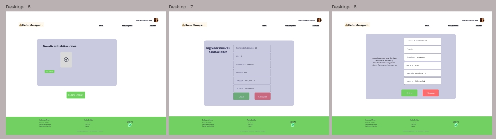
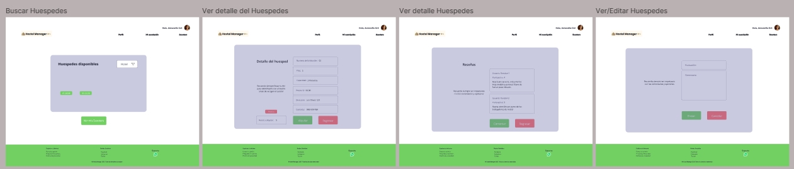

# Capítulo IV: Product Design

## 4.1. Style Guidelines

A continuación se plantean los estilos y herramientas que se están utilizando como guías para el desarrollo de la aplicación web.


### 4.1.1. General Style Guidelines

1. **Misión**
   Desarrollar una plataforma integral y accesible que permita a los administradores de hostales y hoteles pequeños gestionar reservas, huéspedes y servicios adicionales de manera eficiente, mejorando la rentabilidad y experiencia de los huéspedes.

2. **Visión**
   Ser la plataforma líder en la digitalización de la gestión hotelera en América Latina, conocida por su simplicidad, accesibilidad y su enfoque en pequeñas y medianas empresas del sector turístico.

3. **Brand Name**
   El nombre del producto es **Hostel Manager**, una solución web diseñada para optimizar las operaciones de hostales y hoteles independientes. El logo de la marca está compuesto por una combinación de símbolos que representan la simplicidad y eficiencia, con un uso predominante del color **azul**, que transmite confianza y seguridad.

4. **Logo**
   
   

5. **Colores** 
    Hemos elegido una paleta de colores que incluye verde claro, lila y azul, creando una combinación ligera y agradable a la vista para usuarios de diversas edades.

    

6. **Tipografía**
    Elegimos la fuente Open Sans porque es legible y popular en el diseño de aplicaciones web. Esto asegura que nuestros clientes, con toda clase de necesidades visuales, logren leer fácilmente el contenido de nuestra web.

    

7. **Espaciado**
   Para nuestra aplicación, usaremos un espaciado de 1.5, que es un poco más amplio que el habitual. Esto evitará que el texto se sienta pesado o genere complicaciones de legibilidad. Tamaño de letra: 42px - 20px Interlineado: 1.5px Tono de comunicación y lenguaje aplicado Usaremos un tono de comunicación entusiasta y amigable en toda la web, ya que consideramos que es adecuado para nuestro tipo de aplicación al buscar incentivar el uso frecuente de esta. Además, haremos uso de un lenguaje popular para ser inclusivos con todo tipo de niveles lingüísticos entre nuestros usuarios.

### 4.1.2. Web Style Guidelines

La aplicación web se adaptará a todo tipos de dispositivos tecnológicos usados por nuestros segmentos objetivos, garantizando que la usabilidad se mantenga en todo momento. Esto ofrecerá una experiencia de usuario satisfactoria y coherente, independientemente del dispositivo que use el usuario en ese momento.

Se utilizará un patrón Z para el diseño de nuestro landing page, dado que queremos que el usuario mire primero nuestro logo para luego proceder con las opciones del navegador, donde luego vea el contenido de cada sección y termine con el texto que contiene cada una de las secciones.

Para la aplicación web pensamos usar el patrón F porque queremos que el usuario vea las opciones disponibles para navegar para luego proceder con sus respectivas búsquedas y usos en la aplicación web.

1. **Paleta de colores**  
   Asignamos los colores verde y lila como los más representativos de la web, además del color blanco, para reducir la saturación cromática y dirigir la atención de los usuarios hacia los servicios.

2. **Diseño Responsivo**  
   La aplicación debe ser compatible con diferentes dispositivos y tamaños de pantalla para asegurar una experiencia de usuario consistente.

3. **Navegación Intuitiva**  
   Se establecerá una estructura de navegación clara y fácil de usar que permita a los usuarios encontrar rápidamente la información que buscan, priorizando la simplicidad.

4. **Carga Rápida**  
   Se optimizará el rendimiento de la aplicación para tiempos de carga rápidos, incluyendo la optimización de imágenes y el uso de técnicas de almacenamiento en caché.

5. **Diseño de Tarjetas**  
   Usaremos diseños de tarjetas para presentar información de manera visualmente atractiva y organizada, especialmente para destinos y detalles de viajes.

6. **Botones de la web**  
   Los botones serán rectangulares con esquinas redondeadas, además de incluir botones en forma de texto en la barra de navegación para mejorar la usabilidad.

**Accesibilidad:**
- Contraste de color que cumple WCAG 2.1 AA
- Textos alternativos para todas las imágenes
- Navegación completa por teclado
- Etiquetas ARIA para componentes personalizados

**Animaciones y transiciones:**
- Transiciones suaves (0.2s-0.3s) para cambios de estado
- Animaciones funcionales (no decorativas) para mejorar UX
- Feedback visual inmediato para acciones del usuario

**Accesibilidad:**
- Contraste de color que cumple WCAG 2.1 AA
- Textos alternativos para todas las imágenes
- Navegación completa por teclado
- Etiquetas ARIA para componentes personalizados

## 4.2. Information Architecture

En esta sección, estableceremos la estructura de las secciones de nuestro software que incluye el landing page y la aplicación web para cada segmento objetivo.

### 4.2.1. Organization Systems

1. **Jerarquía Visual:** Para mantener la estética de nuestra plataforma interactiva y a la vanguardia de la competencia, hemos decidido priorizar la interfaz según importancia, facilitando así la interacción con el usuario.

2. **Jerarquía de Tipografía:** La información en nuestra plataforma se presenta en un orden específico según la demanda. Es fundamental considerar las características que definen nuestros títulos, subtítulos y párrafos.

3. **Alineación:** Las imágenes y botones en nuestra plataforma están siempre alineados vertical y horizontalmente, permitiendo agrupar objetos de diversos tipos con información similar.

4. **Color y Contraste:** El color juega un rol crucial en nuestra aplicación, promoviendo composiciones adecuadas para dirigir emociones y utilizando el contraste para enfatizar elementos importantes.

5. **Organización Secuencial:** Los métodos de almacenamiento de registros que utiliza el usuario final siguen una organización secuencial, mejorando la simplicidad y rapidez en el acceso a los mismos. En nuestro proyecto, se visualizará una lista de scooters.

6. **Esquemas de Categorización de Contenido:** Utilizaremos un sistema jerárquico para resaltar los componentes a los que deseamos que el usuario preste mayor atención, dirigiendo su enfoque hacia elementos clave. Para el proceso de reservas de scooters utilizaremos organización secuencial

### 4.2.2. Labeling Systems
  
## 4.1.2. Web Style Guidelines - Landing Page Labels

Para las etiquetas en nuestra landing page, hemos elegido un lenguaje sencillo que permite a los usuarios familiarizarse fácilmente con las opciones proporcionadas, logrando una navegación intuitiva.

En la Landing Page se visualizarán los siguientes botones de navegación:

| Etiqueta       | Descripción                                                                 |
|----------------|----------------------------------------------------------------------------|
| Inicio         | Apartado donde se muestra la información de la aplicación explicando sus características. |
| Sobre Nosotros | Apartado donde se informa al usuario sobre el equipo y el propósito.       |
| Servicios      | Apartado donde se muestra el tipo de usuario que puede ser y sus ventajas. |
| Planes         | Apartado donde se muestran todos los planes de suscripción.               |
| Team           | Apartado donde el usuario puede comunicarse con nosotros.                  |
| Empieza Ya!    | Apartado para redirigir a la aplicación web.                               |

Para la página es importante contar con un sistema de etiquetado efectivo para permitir que los usuarios encuentren fácilmente la información y los servicios que necesitan. Nuestro sistema de etiquetado considera cuidadosamente cómo presentar la información en el sitio web. Después de establecer la organización visual y los esquemas de categorización del contenido, se elegirán etiquetas claras y concisas que reflejen el lenguaje común y la comprensión del usuario, utilizando palabras de no más de tres términos.  

Nos aseguraremos de utilizar etiquetas intuitivas y fáciles de recordar para representar los diferentes conjuntos de información y asociaciones entre ellos. También se utilizarán diferentes colores y diseños para resaltar y diferenciar las etiquetas y conjuntos de información en el sitio web. Para evitar confusiones y asegurar la coherencia visual en todo el sitio web, se mantendrá un sistema de etiquetado consistente y se evitará el uso de términos técnicos o jerga que podrían ser confusos para los usuarios.


### 4.2.3. SEO Tags and Meta Tags

**Landing Page:**

```html
<title>HostelManager - Gestiona tu hostal con facilidad</title>
<meta name="description" content="Plataforma web para centralizar reservas, pagos, room service y reportes de tu hostal o pequeño hotel en LATAM.">
<meta name="keywords" content="hotelera, reservas online, hotel pequeño, hostal, software hotel.
">
```

**Web Application**
```html
<head>
  <title>Hostel Manager – App de Gestión.</title>
  <meta name="description" content="Administra tus habitaciones, reservas y servicios adicionales de manera simple y efectiva.">
  <meta name="keywords" content="Administración hotelera, reservas, reportes, room service">
  <meta name="author" content="Hostel Manager Team">
</head>

```

### 4.2.4. Searching Systems

- Barra de búsqueda global en Dashboard
- Filtros disponibles:
 - Habitaciones → tipo, disponibilidad, capacidad.
 - Reservas → fecha, huésped, estado de pago.
 - Room Service → tipo de servicio, estado, fecha.


### 4.2.5. Navigation Systems

- Menú superior fijo con secciones: “Reservas”, “Habitaciones”, “Room Service”, “Reportes”, “Promociones”.
- Botones CTA en secciones clave (reservar, pagar, generar reporte).
- Navegación adaptada a Mobile: menú hamburguesa y accesos rápidos.


## 4.3. Landing Page UI Design

### 4.3.1. Landing Page Wireframe

La wireframe de la landing page de HostelManager presenta una estructura clara y orientada a la conversión, con las siguientes secciones:


### 4.3.2. Landing Page Mock-up

El mock-up de alta fidelidad incorpora todos los elementos de la wireframe con el diseño visual completo:


## 4.4. Web Applications UX/UI Design

### 4.4.1. Web Applications Wireframes


Figma: https://www.figma.com/design/THILrBvLxbxNYgkxg87gPv/Untitled?node-id=16-680&t=O7qhBrZR5laBKvN3-0

### 4.4.2. Web Applications Wireflow Diagrams


En esta sección se presentan los Wireflow Diagrams desarrollados para una aplicación web, los cuales combinan wireframes de baja fidelidad con la representación visual de los flujos de usuario asociados a funciones clave de la plataforma.

Estos wireflows permiten visualizar tanto la estructura básica de las pantallas como la navegación entre vistas, mostrando cómo los usuarios interactúan con el sistema a través de distintas funcionalidades.

Se diseñaron wireflows específicos para las siguientes acciones principales de la aplicación:

- Inicio de Sesión: Representa el flujo desde la pantalla de acceso hasta la validación de credenciales y el ingreso exitoso al sistema.

- Editar: Muestra cómo un usuario puede acceder a un registro existente y modificar su contenido.

- Buscar: Ilustra la interacción con el motor de búsqueda y visualización de resultados.

- Crear Huésped: Describe el proceso completo para agregar un nuevo huésped al sistema, desde la apertura del formulario hasta la confirmación.

- Cancelar Suscripción: Detalla los pasos necesarios para dar de baja una suscripción, incluyendo confirmaciones.

Estos wireflows sirvieron como base para validar los flujos de navegación, identificar mejoras en la experiencia de usuario y alinear al equipo de diseño y desarrollo en torno a una visión compartida del funcionamiento de la aplicación.

#### Inicio de Sesión:


#### Agregar Huesped


#### Editar Huesped  


#### Buscar Huesped  


#### Cancelar Suscripción 


### 4.4.2. Web Applications Mock-ups

Los mock-ups de alta fidelidad implementan todos los elementos de los wireframes con el diseño visual completo:

**Características visuales destacadas:**
- Paleta completa de colores aplicada coherentemente
- Tipografía Roboto para textos y Montserrat para títulos
- Iconografía Material Design personalizada
- Elementos interactivos con estados visuales claros
- Jerarquía visual definida con tamaños y pesos tipográficos

**Dashboard administrativo:**
- Widgets con información crítica resaltada
- Gráficos con paleta de colores consistente
- Indicadores visuales de estado (semáforo para ocupación)
- Accesos rápidos a funciones frecuentes

**Sistema de reservas:**
- Calendario con indicadores visuales de disponibilidad
- Formularios con validación visual inmediata
- Proceso paso a paso con indicador de progreso
- Confirmaciones visualmente destacadas

**Room service digital:**
- Catálogo visual con imágenes de alta calidad
- Estados de pedido claramente diferenciados por color
- Notificaciones push para actualizaciones de estado
- Interfaces adaptadas para acceso desde dispositivo del huésped







Figma: https://www.figma.com/design/THILrBvLxbxNYgkxg87gPv/Untitled?node-id=16-680&t=O7qhBrZR5laBKvN3-0

### 4.4.3. Web Applications User Flow Diagrams

En esta sección se presentan los User Flows (flujos de usuario) diseñados para representar las rutas que sigue un usuario dentro de la aplicación web para alcanzar objetivos específicos. Un User Flow es un diagrama que ilustra, de forma lógica y secuencial, cómo interactúa un usuario con el sistema, desde el punto de entrada hasta la finalización de una tarea.


#### Inicio de Sesión:


#### Agregar Huesped


#### Editar Huesped  


#### Buscar Huesped  


#### Cancelar Suscripción 


## 4.5. Web Applications Prototyping

En esta sección se aborda el proceso de prototipado aplicado al desarrollo de aplicaciones web. El prototyping consiste en crear una representación interactiva del producto, que permite simular su funcionamiento antes de pasar a la etapa de desarrollo final.


## 4.6. Domain-Driven Software Architecture
### 4.6.1. Design-Level EventStorming

### 4.6.2. Software Architecture Context Diagram

En esta sección se presenta el Software Architecture Context Diagram, un diagrama que proporciona una visión general del sistema en su contexto de operación. Su objetivo principal es mostrar cómo el sistema interactúa con los actores externos, como otros sistemas, usuarios y servicios. Este diagrama es fundamental para comprender el entorno en el que el sistema se despliega y cómo se conecta con componentes externos.


### 4.6.3. Software Architecture Container Diagrams

En esta sección se presenta el Software Architecture Container Diagrams, diagrama que representa los principales contenedores del sistema y cómo se comunican entre sí. Un contenedor, en este contexto, hace referencia a una unidad de ejecución que encapsula un conjunto de funcionalidades del sistema. Estos contenedores pueden ser aplicaciones, bases de datos, servicios o cualquier otro componente que ejecute código o almacene datos de manera independiente.


### 4.6.4. Software Architecture Components Diagrams

En esta sección se presenta el Software Architecture Components Diagrams, diagrama que detalla los componentes internos del sistema a un nivel más bajo de granularidad que los Container Diagrams. Este diagrama tiene como objetivo representar cómo los componentes individuales dentro de cada contenedor interactúan entre sí y cómo se organizan para cumplir con las funcionalidades del sistema.


## 4.7. Software Object-Oriented Design
### 4.7.1. Class Diagrams

En esta sección se presentan el Diagrama de Clases, una representación clave del diseño orientado a objetos del sistema HostelManager. Este diagrama permite visualizar la estructura estática del sistema, describiendo las clases principales que lo componen, sus atributos, métodos, relaciones y jerarquías.


## 4.8. Database Design
### 4.8.1. Database Diagrams

En esta sección se presenta el Diagrama de base de datos, lo cual presenta la estructura lógica del modelo de datos que sustenta el sistema HostelManager. Este diagrama describe las principales entidades del sistema, sus atributos y las relaciones entre ellas, sirviendo como guía para la implementación de la base de datos relacional.


