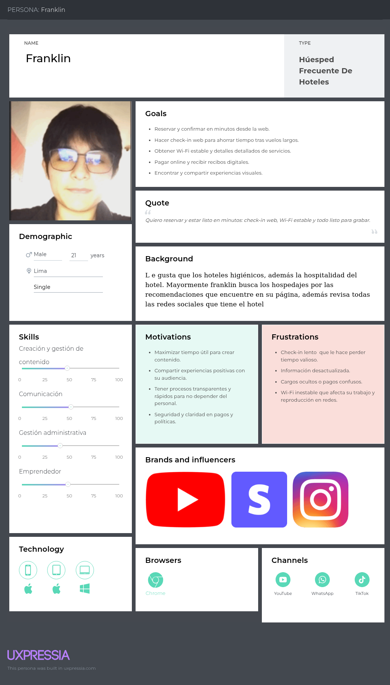

# Universidad Peruana De Ciencias Aplicadas
</img>
  **Carrera:** Ingeniería de Software
  **Ciclo:** 202520
  **Curso:** 1ASI0730 - Aplicaciones Web
  **NRC:** 7429
  **Profesor:** Villafuerte Bazan, Oscar Ivan
  **Informe del Trabajo Final**
  **Startup:** Codelab
  **Producto:** HostelManager

|             Integrantes           |   Código   |
|-----------------------------------|------------|
|    Bautista Rivera, Jose Diego    | u202310949 |
|    Curi Marcelo, Angelo Marcio    | u202022387 |
|  Janampa Gutierrez, Jhoan Darner  | u202323319 |
|   Quiroz Caceres, Adrian Alonso   | u202214864 |
|  Velarde Gonzales, Nestor Hernan  | u20211c221 |

# Registro de Versiones del Informe
| Versión | Fecha      | Autor | Descripción de modificación|
|---------|------------|-------|----------------------------|
| V0.1    | 01/09/2025 | Todos | Creación del repositorio   |

# Project Report Collaboration Insights

# Contenido
- [**Capítulo I: Introducción**](#capítulo-i-introducción)
    - [**1.1. Startup Profile.**](#11-startup-profile)
        - [**1.1.1. Descripción de la Startup.**](#111-descripción-de-la-startup)
        - [**1.1.2. Perfiles de integrantes del equipo.**](#112-perfiles-de-integrantes-del-equipo)
    - [**1.2. Solution Profile.**](#12-solution-profile)
        - [**1.2.1. Antecedentes y problemática.**](#121-antecedentes-y-problemática)
        - [**1.2.2. Lean UX Process.**](#122-lean-ux-process)
            - [**1.2.2.1. Lean UX Problem Statements.**](#1221-lean-ux-problem-statements)
            - [**1.2.2.2. Lean UX Assumptions.**](#1222-lean-ux-assumptions)
            - [**1.2.2.3. Lean UX Hypothesis Statements.**](#1223-lean-ux-hypothesis-statements)
            - [**1.2.2.4. Lean UX Canvas.**](#1224-lean-ux-canvas)
    - [**1.3. Segmentos objetivo.**](#13-segmentos-objetivo)
- [**Capítulo II: Requirements Elicitation & Analysis**](#capítulo-ii-requirements-elicitation--analysis)
    - [**2.1. Competidores.**](#21-competidores)
        - [**2.1.1. Análisis competitivo.**](#211-análisis-competitivo)
        - [**2.1.2. Estrategias y tácticas frente a competidores.**](#212-estrategias-y-tácticas-frente-a-competidores)
    - [**2.2. Entrevistas.**](#22-entrevistas)
        - [**2.2.1. Diseño de entrevistas.**](#221-diseño-de-entrevistas)
        - [**2.2.2. Registro de entrevistas.**](#222-registro-de-entrevistas)
        - [**2.2.3. Análisis de entrevistas.**](#223-análisis-de-entrevistas)
    - [**2.3. Needfinding.**](#23-needfinding)
        - [**2.3.1. User Personas.**](#231-user-personas)
        - [**2.3.2. User Task Matrix.**](#232-user-task-matrix)
        - [**2.3.3. User Journey Mapping.**](#233-user-journey-mapping)
        - [**2.3.4. Empathy Mapping.**](#234-empathy-mapping)
    - [**2.4. Big Picture EventStorming.**](#24-big-picture-eventstorming)
    - [**2.5. Ubiquitous Language.**](#25-ubiquitous-language)
- [**Capítulo III: Requirements Specification**](#capítulo-iii-requirements-specification)
    - [**3.1. To-Be Scenario Mapping.**](#31-to-be-scenario-mapping)
    - [**3.2. User Stories.**](#32-user-stories)
    - [**3.3. Impact Mapping.**](#33-impact-mapping)
    - [**3.4. Product Backlog.**](#34-product-backlog)
- [**Capítulo IV: Product Design**](#capítulo-iv-product-design)
    - [**4.1. Style Guidelines.**](#41-style-guidelines)
        - [**4.1.1. General Style Guidelines.**](#411-general-style-guidelines)
        - [**4.1.2. Web Style Guidelines.**](#412-web-style-guidelines)
    - [**4.2. Information Architecture.**](#42-information-architecture)
        - [**4.2.1. Organization Systems.**](#421-organization-systems)
        - [**4.2.2. Labeling Systems.**](#422-labeling-systems)
        - [**4.2.3. SEO Tags and Meta Tags**](#423-seo-tags-and-meta-tags)
        - [**4.2.4. Searching Systems.**](#424-searching-systems)
        - [**4.2.5. Navigation Systems.**](#425-navigation-systems)
    - [**4.3. Landing Page UI Design.**](#43-landing-page-ui-design)
        - [**4.3.1. Landing Page Wireframe.**](#431-landing-page-wireframe)
        - [**4.3.2. Landing Page Mock-up.**](#432-landing-page-mock-up)
    - [**4.4. Web Applications UX/UI Design.**](#44-web-applications-uxui-design)
        - [**4.4.1. Web Applications Wireframes.**](#441-web-applications-wireframes)
        - [**4.4.2. Web Applications Wireflow Diagrams.**](#442-web-applications-wireflow-diagrams)
        - [**4.4.2. Web Applications Mock-ups.**](#442-web-applications-mock-ups)
        - [**4.4.3. Web Applications User Flow Diagrams.**](#443-web-applications-user-flow-diagrams)
    - [**4.5. Web Applications Prototyping.**](#45-web-applications-prototyping)
    - [**4.6. Domain-Driven Software Architecture.**](#46-domain-driven-software-architecture)
        - [**4.6.1. Design-Level EventStorming.**](#461-design-level-eventstorming)
        - [**4.6.2. Software Architecture Context Diagram.**](#462-software-architecture-context-diagram)
        - [**4.6.3. Software Architecture Container Diagrams.**](#463-software-architecture-container-diagrams)
        - [**4.6.4. Software Architecture Components Diagrams.**](#464-software-architecture-components-diagrams)
    - [**4.7. Software Object-Oriented Design.**](#47-software-object-oriented-design)
        - [**4.7.1. Class Diagrams.**](#471-class-diagrams)
    - [**4.8. Database Design.**](#48-database-design)
        - [**4.8.1. Database Diagrams.**](#481-database-diagrams)
- [**Capítulo V: Product Implementation, Validation & Deployment**](#capítulo-v-product-implementation-validation--deployment)
    - [**5.1. Software Configuration Management.**](#51-software-configuration-management)
        - [**5.1.1. Software Development Environment Configuration.**](#511-software-development-environment-configuration)
        - [**5.1.2. Source Code Management.**](#512-source-code-management)
        - [**5.1.3. Source Code Style Guide & Conventions.**](#513-source-code-style-guide--conventions)
        - [**5.1.4. Software Deployment Configuration.**](#514-software-deployment-configuration)
    - [**5.2. Landing Page, Services & Applications Implementation.**](#52-landing-page-services--applications-implementation)
        - [**5.2.1. Sprint 1**](#521-sprint-1)
            - [**5.2.1.1. Sprint Planning 1.**](#5211-sprint-planning-1)
            - [**5.2.1.2. Aspect Leaders and Collaborators.**](#5212-aspect-leaders-and-collaborators)
            - [**5.2.1.3. Sprint Backlog 1.**](#5213-sprint-backlog-1)
            - [**5.2.1.4. Development Evidence for Sprint Review.**](#5214-development-evidence-for-sprint-review)
            - [**5.2.1.5. Execution Evidence for Sprint Review.**](#5215-execution-evidence-for-sprint-review)
            - [**5.2.1.6. Services Documentation Evidence for Sprint Review.**](#5216-services-documentation-evidence-for-sprint-review)
            - [**5.2.1.7. Software Deployment Evidence for Sprint Review.**](#5217-software-deployment-evidence-for-sprint-review)
            - [**5.2.1.8. Team Collaboration Insights during Sprint.**](#5218-team-collaboration-insights-during-sprint)
- [**Conclusiones**](#conclusiones)
- [**Bibliografía**](#bibliografía)
- [**Anexos**](#anexos)

## Student Outcome
**El curso contribuye al cumplimiento del Student Outcome ABET:** ABET – EAC - Student Outcome 5
  **Criterio:** La capacidad de funcionar efectivamente en un equipo cuyos miembros
juntos proporcionan liderazgo, crean un entorno de colaboración e inclusivo,
establecen objetivos, planifican tareas y cumplen objetivos.

|                                        Criterio específico                                     | Acciones realizadas | Conclusiones |
|------------------------------------------------------------------------------------------------|---------------------|--------------|
|                   Trabaja en equipo para proporcionar liderazgo en forma conjunta              |                     |              |
| Crea un entorno colaborativo e inclusivo, establece metas, planifica tareas y cumple objetivos |                     |              |

# Capítulo I: Introducción

## 1.1. Startup Profile
### 1.1.1. Descripción de la Startup
### 1.1.2. Perfiles de integrantes del equipo

## 1.2. Solution Profile
### 1.2.1. Antecedentes y problemática
### 1.2.2. Lean UX Process
#### 1.2.2.1. Lean UX Problem Statements
#### 1.2.2.2. Lean UX Assumptions
#### 1.2.2.3. Lean UX Hypothesis Statements
#### 1.2.2.4. Lean UX Canvas

## 1.3. Segmentos objetivo

# Capítulo II: Requirements Elicitation & Analysis

## 2.1. Competidores
### 2.1.1. Análisis competitivo

<table border="1" style="text-align: center; border-collapse: collapse; width: 100%;">
  <tbody>
    <tr>
      <td colspan="6"><strong>Competitive Analysis Landscape</strong></td>
    </tr>
    <tr>
      <td colspan="2"><strong>¿Por qué llevar a cabo este análisis?</strong></td>
      <td colspan="4">
        Este análisis nos permitirá identificar las fortalezas y carencias de los competidores actuales en el sector hotelero,
        para posicionar a <strong>Hostel Manager</strong> como la solución más accesible, escalable y adaptada a hostales y pequeños hoteles en LATAM.
      </td>
    </tr>
    <tr>
      <td colspan="2"></td>
      <td><strong>Hostel Manager</strong></td>
      <td><strong>Small Hotels Latin America</strong></td>
      <td><strong>Samin PMS</strong></td>
      <td><strong>Amenitiz</strong></td>
    </tr>
    <tr>
      <td rowspan="2"><strong>Perfil</strong></td>
      <td>Overview</td>
      <td>Plataforma web moderna para gestión de reservas, huéspedes e inventario de habitaciones en hostales y pequeños hoteles, con foco en simplicidad, bajo costo y escalabilidad en LATAM.</td>
      <td>Software hotelero para hoteles boutique y medianos, con foco regional y funcionalidades básicas de gestión, reservas y reportes.</td>
      <td>PMS robusto orientado a hoteles medianos y grandes, con herramientas avanzadas de housekeeping, reportes e integraciones globales.</td>
      <td>Plataforma todo en uno que integra PMS, motor de reservas, channel manager y creador de páginas web, enfocada en pequeños hoteles y B&Bs.</td>
    </tr>
    <tr>
      <td>Ventaja competitiva / Valor</td>
      <td>Accesible, fácil de usar, soporte cultural y regional para hostales en LATAM. Permite digitalizar procesos sin grandes inversiones.</td>
      <td>Experiencia consolidada en la región, solución confiable para hoteles boutique con mayor presupuesto.</td>
      <td>Escalabilidad, integraciones avanzadas y funcionalidades completas para cadenas y hoteles de gran operación.</td>
      <td>Simplicidad, solución integral y rápida adopción, con fuerte enfoque en reservas directas y digitalización rápida.</td>
    </tr>
    <tr>
      <td rowspan="2"><strong>Perfil de Marketing</strong></td>
      <td>Mercado objetivo</td>
      <td>Hostales y pequeños hoteles independientes con menos de 30 habitaciones en LATAM, que operan aún con sistemas manuales.</td>
      <td>Hoteles pequeños y medianos (20–100 habitaciones) en zonas turísticas de LATAM.</td>
      <td>Hoteles medianos y grandes (50+ habitaciones), cadenas hoteleras y resorts.</td>
      <td>Pequeños hoteles, hostales y B&Bs (menos de 50 habitaciones) en Europa y LATAM.</td>
    </tr>
    <tr>
      <td>Estrategias de marketing</td>
      <td>Marketing digital segmentado, alianzas con asociaciones de turismo, y modelo freemium para captar pequeños hostales.</td>
      <td>Ferias de turismo, alianzas con cámaras hoteleras, marketing B2B directo.</td>
      <td>Presencia en ferias internacionales, alianzas con cadenas hoteleras, promoción en medios especializados.</td>
      <td>Marketing digital intensivo, inbound con tutoriales y casos de éxito, fuerte presencia en redes sociales.</td>
    </tr>
    <tr>
      <td rowspan="3"><strong>Perfil de Producto</strong></td>
      <td>Productos & Servicios</td>
      <td>Gestión de reservas, huéspedes, inventario, reportes básicos, soporte multicanal y conexión con OTAs.</td>
      <td>Motor de reservas online, gestión de ocupación, reportes financieros básicos e integración con Booking/Expedia.</td>
      <td>Gestión avanzada de reservas, housekeeping, reportes detallados, integraciones con OTAs y soporte multi-sucursal.</td>
      <td>PMS básico, motor de reservas directo, channel manager, creador de páginas web, facturación y pagos online.</td>
    </tr>
    <tr>
      <td>Precios & Costos</td>
      <td>Planes accesibles y flexibles según tamaño; orientado a pequeños negocios con bajo presupuesto.</td>
      <td>Suscripción mensual alta, escalada por habitaciones; costo adicional por integraciones.</td>
      <td>Precio elevado, suscripción mensual/anual por número de habitaciones; módulos premium aparte.</td>
      <td>Suscripción mensual accesible, escalada según servicios; sin grandes costos iniciales.</td>
    </tr>
    <tr>
      <td>Canales de distribución</td>
      <td>Plataforma web con soporte en español.</td>
      <td>Web responsive y app móvil limitada, SaaS directo.</td>
      <td>Plataforma web completa + app móvil para staff, SaaS.</td>
      <td>Web + app móvil básica, distribución online con onboarding guiado.</td>
    </tr>
    <tr>
      <td rowspan="4"><strong>Análisis SWOT</strong></td>
      <td>Fortalezas</td>
      <td>
        <ul>
          <li>Precios accesibles.</li>
          <li>Enfoque en hostales pequeños de LATAM.</li>
          <li>Plataforma simple y escalable.</li>
        </ul>
      </td>
      <td>
        <ul>
          <li>Presencia regional consolidada.</li>
          <li>Conexión con OTAs internacionales.</li>
        </ul>
      </td>
      <td>
        <ul>
          <li>Plataforma robusta y escalable.</li>
          <li>Integraciones con OTAs globales.</li>
        </ul>
      </td>
      <td>
        <ul>
          <li>Todo en uno (PMS + web + reservas).</li>
          <li>Fácil de usar y rápida adopción.</li>
        </ul>
      </td>
    </tr>
    <tr>
      <td>Debilidades</td>
      <td>
        <ul>
          <li>Menos funciones avanzadas.</li>
          <li>Menor presencia internacional.</li>
        </ul>
      </td>
      <td>
        <ul>
          <li>No apto para hostales pequeños.</li>
          <li>Precios altos.</li>
        </ul>
      </td>
      <td>
        <ul>
          <li>Costo elevado.</li>
          <li>Curva de aprendizaje alta.</li>
        </ul>
      </td>
      <td>
        <ul>
          <li>PMS limitado frente a opciones más robustas.</li>
          <li>Menos personalizable.</li>
        </ul>
      </td>
    </tr>
    <tr>
      <td>Oportunidades</td>
      <td>
        <ul>
          <li>Aprovechar la digitalización en LATAM.</li>
          <li>Captar segmento desatendido de micro-hoteles.</li>
        </ul>
      </td>
      <td>
        <ul>
          <li>Expansión a micro-hoteles.</li>
          <li>Crecimiento turístico regional.</li>
        </ul>
      </td>
      <td>
        <ul>
          <li>Versión ligera para pequeños hoteles.</li>
          <li>Demanda de soluciones integradas.</li>
        </ul>
      </td>
      <td>
        <ul>
          <li>Expansión en LATAM.</li>
          <li>Integrar nuevas tecnologías (IA, check-in online).</li>
        </ul>
      </td>
    </tr>
    <tr>
      <td>Amenazas</td>
      <td>
        <ul>
          <li>Competidores globales con mayor alcance.</li>
          <li>Expectativas de mayor sofisticación.</li>
        </ul>
      </td>
      <td>
        <ul>
          <li>Competencia de soluciones más baratas.</li>
          <li>Entrada de players globales.</li>
        </ul>
      </td>
      <td>
        <ul>
          <li>Competidores accesibles y simples.</li>
          <li>Mercado saturado de PMS.</li>
        </ul>
      </td>
      <td>
        <ul>
          <li>Competidores regionales más baratos.</li>
          <li>Falta de escalabilidad para clientes en crecimiento.</li>
        </ul>
      </td>
    </tr>
  </tbody>
</table>

### 2.1.2. Estrategias y tácticas frente a competidores

Para destacar frente a competidores como Small Hotels Latin America, Samin PMS y Amenitiz y consolidar nuestra posición en el mercado de soluciones de gestión para hostales y pequeños hoteles, resulta imprescindible diseñar un conjunto de estrategias y tácticas coordinadas que refuercen la diferenciación de HostelManager, aumenten la adopción en LATAM y consoliden su escalabilidad.

1. Desarrollo de una Propuesta de Valor Distintiva

Estrategia:

Posicionar a HostelManager como el PMS más simple y económico para hoteles y hostales de LATAM, ofreciendo en una sola plataforma las funciones esenciales (reservas, gestión de huéspedes, facturación y calendario de disponibilidad), sin necesidad de soporte externo ni configuraciones complejas.

Tácticas:

- Entrevistas con administradores para identificar problemas clave (sobreventa, errores, pagos).

- Encuestas masivas para validar funciones mínimas necesarias.

- Pruebas A/B en landing pages con mensajes directos.

- Videos cortos demostrativos.

- Testimonios de clientes piloto.

Indicadores de éxito:

- Conversión en landing pages ≥ 12 %.

- Valor percibido en encuestas ≥ 4.3/5.

- Engagement en videos ≥ 40 % visualización.

2. Optimización de la Experiencia de Usuario (UX)

Estrategia:

Diseñar una plataforma intuitiva y práctica que no requiera asistencia externa, garantizando que cualquier administrador pueda aprender a usarla en pocos minutos.

Tácticas:

- Flujos simples para tareas críticas (reservas, check-in, facturación).

- Testeo con usuarios sin experiencia en 3 rondas.

- Medición de errores y tiempos para mejorar la interfaz.

Indicadores de éxito:

- SUS (System Usability Scale) > 80.

- Tasa de error en tareas clave < 10 %.

- Tiempo de check-in ≤ 2 minutos.

3. Expansión de la Base de Usuarios

Estrategia:

Iniciar con hostales independientes de bajo presupuesto en LATAM y luego expandirse a pequeños hoteles familiares y B&B urbanos.

Tácticas:

- Flujos simples para tareas críticas (reservas, check-in, facturación).

- Testeo con usuarios sin experiencia en 3 rondas.

- Medición de errores y tiempos para mejorar la interfaz.

Indicadores de éxito:

- Conversión de freemium a suscripción ≥ 18 %.

- Penetración inicial en segmento hostales ≥ 10 % en 6 meses.

- Tasa de referidos ≥ 20 %.

4. Marketing Digital de Alta Precisión

Estrategia:

Atraer administradores mediante campañas enfocadas en simplicidad y bajo costo, sin prometer soporte extra.

Tácticas:

- Publicidad en Facebook, Instagram y Google Ads.

- Retargeting para visitantes no convertidos.

- Casos de éxito en formatos visuales (videos, carruseles).

Indicadores de éxito:

- ROAS ≥ 3.5x.

- CPA ≤ S/ 45.

- CTR en anuncios de video ≥ 2.5 %.

5. Alianzas Comerciales y Cooperaciones Estratégicas

Estrategia:

Aumentar la visibilidad y adopción de HostelManager mediante convenios con actores del ecosistema turístico y educativo.

Tácticas:

- Convenios con asociaciones y cámaras de turismo.

- Alianzas con universidades y escuelas de hotelería.

- Participación en ferias y eventos.

- Programa de comisiones para consultores.

Indicadores de éxito:

- ≥ 15 alianzas estratégicas en el primer año.

- Ventas vía alianzas ≥ 20 % del total.

- Conversión en eventos ≥ 30 % de asistentes interesados.

## 2.2. Entrevistas
### 2.2.1. Diseño de entrevistas

Con el fin de comprender a profundidad las necesidades, problemas y expectativas de nuestros usuarios potenciales, hemos realizado entrevistas a administradores de hoteles y huéspedes que se hospedan en establecimientos de mediana y pequeña escala.

Para ello, les planteamos una serie de preguntas generales y específicas que nos permiten mapear su contexto, hábitos, experiencias previas y nivel de disposición hacia soluciones como nuestro sistema de gestión digital.

Administradores de hoteles (pequeños y medianos).

a) Preguntas Generales
- ¿Cómo se llama su establecimiento y cuántas habitaciones administran?

- ¿Cuál es su rol dentro del hostal/hotel?

- ¿Actualmente cómo gestionan las reservas, check-in, check-out y servicios adicionales?

- ¿Qué métodos de pago ofrecen a sus clientes?

- ¿Han usado antes algún sistema digital para gestión? ¿Qué les gustó y qué no?

b) Preguntas Específicas

- ¿Cuáles son los principales problemas que enfrentan en la administración diaria (errores en reservas, pagos, comunicación, etc.)?

- ¿Qué tan importante es para usted contar con reportes de ocupación, ingresos y satisfacción de clientes?

- ¿Le resultaría útil contar con una plataforma que integre en un solo lugar reservas, pagos y comunicación con clientes?

- Si tuviera un sistema que enviará notificaciones automáticas (ej. recordatorios de pago o llegada de clientes), ¿lo usaría?

- ¿Qué tan dispuesto estaría a pagar una suscripción mensual por un sistema que le ahorre tiempo y evite pérdidas económicas?

- ¿Qué funcionalidades considera más críticas para su negocio (control de habitaciones, facturación digital, integración con pasarelas de pago, etc.)?

- ¿Cuánto tiempo diario invierte en la gestión manual de su hostal/hotel y cuánto le gustaría reducirlo?

- ¿Le sería útil un sistema que le muestre estadísticas de temporadas altas y bajas para planificar precios?

Huéspedes de hoteles

a) Preguntas Generales

- ¿Cómo te llamas y cuántos años tienes?

- ¿Qué tan seguido te hospedas en hoteles/hostales (viajes de estudio, trabajo, turismo)?

- ¿Cómo sueles buscar y reservar hospedajes (apps, webs, agencias, redes sociales)?

- ¿Qué dispositivos utilizas más para buscar hospedajes (celular, laptop, tablet)?

-¿Qué factores consideras más importantes al elegir un hospedaje (precio, ubicación, reseñas, servicios)?

b) Preguntas Específicas

-¿Has tenido alguna vez problemas con reservas manuales (ej. confusión al llegar, reservas no registradas)?

-¿Qué tan importante es para ti poder reservar, pagar y solicitar servicios desde el celular sin llamadas o papeleo?

-¿Qué servicios adicionales valoras más al hospedarte (desayuno, limpieza, lavandería, transporte, WiFi)?

- ¿Qué tan útil te parecería que un sistema te confirme en tiempo real tu reserva y pago?

- ¿Te gustaría recibir notificaciones automáticas con información de tu reserva, horarios de check-in y promociones?

- ¿Qué canales digitales usas para validar la confianza de un hotel (reseñas en Google, Booking, Instagram, TikTok)?

- ¿Qué fue lo que más te frustró en tu última experiencia de hospedaje y qué te gustaría que mejorara?

- ¿Qué tan importante sería para ti poder chatear con el hotel directamente por la app antes y durante tu estancia?

- ¿Si tuvieras que recomendar un hospedaje a un amigo, qué aspecto debería destacar para que lo recomiendes?

- ¿Qué tanto confiarías en un sistema digital que centraliza todo (reserva, pago y comunicación con el hotel) en un solo lugar?

### 2.2.2. Registro de entrevistas

Segmento Objetivo 1: Administrador/a

Entrevista N1:

* **Nombre y apellidos:** Jakeline Gutierrez 
  * **Edad:** 36 años
  * **Departamento:** Ayacucho
  * **Ocupación:** Administradora de hostel   
  * **Tiempo de Entrevista:** 3 minutos con 02 segundos
  * **Inicio de Entrevista:** 0:00
  * **Final de Entrevista:** 3:02

* **Resumen De Entrevista**

Jalkelin explicó que administra el hostal Nogales en Ayacucho con 15 habitaciones. Maneja las reservas manualmente en un cuaderno y coordina algunas por WhatsApp. Los métodos de pago más comunes son efectivo y transferencias por Yape/Plin. Nunca ha usado un sistema digital de gestión.
Mencionó que los problemas principales son las reservas duplicadas y la falta de control de pagos cuando los clientes llegan por diferentes canales. Dedica entre 3 y 4 horas diarias a la gestión, y desearía reducirlo a menos de 1 hora con ayuda de un sistema digital. Considera críticas funciones como control de habitaciones, facturación digital, integración con pagos con tarjeta y reportes de temporadas altas/bajas. Estaría dispuesta a pagar aproximadamente S/100 mensuales si el sistema realmente le ahorra tiempo y pérdidas.

**Link:** https://url-shortener.me/4UMU

---

Entrevista N2:

* **Nombre y apellidos:** Heydi Janampa Silva
  * **Edad:** 35 años
  * **Departamento:** Ayacucho
  * **Ocupación:** Administradora de hostel   
  * **Tiempo de Entrevista:** 4 minutos con 37 segundos
  * **Inicio de Entrevista:** 0:00
  * **Final de Entrevista:** 4:37 min

* **Resumen De Entrevista**

Resumen: Heydi explicó que administra el hospedaje Sueño Dorado en Ayacucho, el cual cuenta con 25 habitaciones. Actualmente maneja las reservas de manera manual en un cuaderno y también coordina algunas a través de WhatsApp. Los métodos de pago más comunes entre sus huéspedes son efectivo y transferencias por Yape/Plin. Comentó que nunca ha utilizado un sistema digital de gestión.
Entre los principales problemas mencionó las reservas duplicadas y la falta de control en los pagos, especialmente cuando los clientes llegan por diferentes canales como Booking o redes sociales. Dijo que dedica entre 3 y 4 horas diarias a la gestión administrativa, y le gustaría reducir ese tiempo a menos de 1 hora con ayuda de un sistema digital.
Respecto a las funciones que considera más importantes, destacó el control de habitaciones, la facturación digital, la integración con pagos con tarjeta y los reportes de temporadas altas/bajas para planificar mejor sus precios. Aunque no supo precisar cuánto estaría dispuesta a pagar por un sistema de este tipo, aseguró que sí está interesada en implementarlo si le ofrece una solución práctica y confiable para mejorar la administración de su hospedaje.

**Link:** https://acortar.link/gFQKlK

---

Entrevista N3:

* **Nombre y apellidos:** José Luis Carranza Gastelo
  * **Edad:** 35 años
  * **Departamento:** Cajamarca
  * **Ocupación:** Administrador de Hotel  
  * **Tiempo de Entrevista:** 6 minutos con 20 segundos
  * **Inicio de Entrevista:** 0:00
  * **Final de Entrevista:** 6:20 min

* **Resumen De Entrevista**

Resumen: José Carranza menciona que es dueño y administrador de un Hotel de 15 habitaciones llamado “Hotel Cutervo” en la ciudad de Cutervo en Cajamarca. Menciona que las reservas y la gestión general del hotel las hace mediante un cuaderno de notas y redes sociales como Whatsapp, los métodos de pago que usa son las billeteras digitales como Yape.

Menciona que le es muy complicado administrar un hotel usando solamente métodos manuales, esto muchas veces le ha traído problemas ya que no puede llevar una buena contabilidad cuando trabaja. En términos generales, le toma mucho tiempo administrar y le gustaría que fuese todo más digitalizado para poder reducir costos y tiempos.

Las funcionalidades que él menciona gustaría que se implementen es poder realizar reservas de manera digital, el cual le ayudaría a llevar un control de la cantidad de huéspedes que se hospedan, fechas de entrada y salida más precisas. Le gustaría también una funcionalidad que le permita generar reportes detallados y estadísticas por temporadas, para poder así administrar de una mejor manera su hotel y evitar contratiempos.

**Link:** https://acortar.link/HERdbK

---

Entrevista N4:

* **Nombre y apellidos:** Milagro Del Castillo alvera
  * **Edad:** 22 años
  * **Departamento:**  Cusco
  * **Ocupación:** Administrador de Hotel  
  * **Tiempo de Entrevista:** 4 minutos con 52 segundos
  * **Inicio de Entrevista:** 0:00
  * **Final de Entrevista:** 4:52 min

* **Resumen De Entrevista**

Resumen: Milagro trabaja en un hotel ubicado en Megantoni, Cusco, una provincia algo alejada de las principales ciudades. El hotel, llamado Max, cuenta con 18 habitaciones. Actualmente, Milagro lleva el registro de manera manual, lo cual le consume tiempo, especialmente al calcular el monto total de las ganancias. Nos comenta que le gustaría contar con un programa que le facilite este proceso, además de permitirle generar reportes sobre la cantidad de personas que ingresan al hotel según la temporada. Ella estaría dispuesta a pagar por este servicio si le ayuda a reducir el tiempo que dedica al registro y a la contabilización de las ganancias.

**Link:** https://acortar.link/TrBNLa

---

Segmento Objetivo 2: Huesped de Hotel

Entrevista N5:

* **Nombre y apellidos:** María Yolanda Pérez Diaz 
  * **Edad:** 35 años
  * **Departamento:** Lima
  * **Ocupación:** Docente de primaria  
  * **Tiempo de Entrevista:** 6 minutos con 25 segundos
  * **Inicio de Entrevista:** 0:00
  * **Final de Entrevista:** 6:25 min

* **Resumen De Entrevista**

Resumen: María Yolanda explica que suele viajar en épocas de vacaciones o temporadas variadas, busca hoteles mediante redes sociales y mediante recomendaciones de amistades.

Menciona que la principal complicación que tiene es que se le es muy complicado hacer una reserva en el momento, muchas veces ha tenido problemas con ello o al momento de hacer el checking.

Le gustaría que se implementaran funcionalidades tales como poder realizar reservas desde la comodidad de su casa, para así evitar largas esperas y costos innecesarios. En general que todo sea más digital y automatizado.

**Link:** https://acortar.link/kpEQW0

---

Entrevista N6:

* **Nombre y apellidos:** Franklin ochoa
  * **Edad:** 21 años
  * **Departamento:** Lima
  * **Ocupación:** Estudiante universitario  
  * **Tiempo de Entrevista:** 7 minutos con 41 segundos
  * **Inicio de Entrevista:** 0:00
  * **Final de Entrevista:** 7:41 min

* **Resumen De Entrevista**

Resumen: Franklin explicó que mayormente viaja por turismos y que según él busca hoteles según la ubicación y recomendaciones que encuentra en las redes, mayormente busca hoteles desde su celular y laptop.

Según franklin le gusta que los hoteles higiénicos, además la hospitalidad del hotel. Mayormente franklin busca los hospedajes por las recomendaciones que encuentre en su página, además revisa todas las redes sociales que tiene el hotel.

Nos comentó que si le gustaría tener un sistema que le facilite las reservas, también quiere saber los detalles de la reserva y tener el contacto con la administradora del hotel para saber si por algún inconveniente le cancelan la reserva .

**Link:** https://acortar.link/gpGcJY

### 2.2.3. Análisis de entrevistas

### Análisis de Entrevistas: Administradores de Hoteles

#### Contexto y Características Comunes

- **Tamaño y tipo de los establecimientos**: Los administradores entrevistados están a cargo de pequeños establecimientos, la mayoría con entre 15 y 25 habitaciones.
- **Métodos de gestión**: Predomina la gestión manual, especialmente a través de cuadernos y WhatsApp. Ninguno de los entrevistados ha utilizado un sistema digital para la gestión.
- **Métodos de pago**: Los métodos más comunes son efectivo y billeteras electrónicas como Yape/Plin, lo que sugiere una preferencia por pagos rápidos y directos, sin necesidad de tarjetas.
- **Problemas comunes**: Los problemas recurrentes mencionados incluyen la duplicación de reservas, falta de control en los pagos, y dificultad para gestionar la información dispersa (por ejemplo, reservas hechas por WhatsApp y otras plataformas).

#### Problemas Identificados

- **Gestión manual y falta de control**: Todos los administradores expresaron que la gestión manual es ineficiente y propensa a errores, como reservas duplicadas o la pérdida de información clave.
- **Tiempo invertido en la gestión**: Los administradores mencionaron que dedican entre 3 y 4 horas diarias a la gestión manual, un tiempo que desearían reducir a menos de 1 hora mediante el uso de un sistema digital.
- **Necesidad de centralización de procesos**: La mayoría mostró un fuerte interés en tener un sistema que integre reservas, pagos y comunicación con los clientes en una sola plataforma. Esto sería clave para evitar los errores derivados de múltiples canales.

#### Expectativas sobre el Sistema Digital

##### Funcionalidades clave:
- **Control de habitaciones**: Fundamental para evitar duplicaciones y pérdidas.
- **Facturación digital**: Crucial para simplificar los pagos y mejorar la contabilidad.
- **Integración con métodos de pago (especialmente Yape/Plin) y tarjetas**: Para facilitar las transacciones y evitar complicaciones.
- **Reportes de ocupación y estadísticas por temporadas**: Esto permitiría a los administradores ajustar precios según la demanda y optimizar los ingresos.

- **Disposición a pagar**: Los administradores están dispuestos a pagar una suscripción mensual que ronde los S/100 si el sistema les ahorra tiempo y mejora la eficiencia.

#### Resumen y Oportunidades de Mejora

- **Falta de sistemas digitales**: Hay una oportunidad clara para introducir un sistema de gestión digital fácil de usar que permita centralizar la información y automatizar tareas.
- **Interés en la simplificación**: Los administradores necesitan herramientas que les ayuden a reducir el tiempo de gestión y minimizar los errores humanos. La integración con sistemas de pago actuales y la automatización de notificaciones son características valoradas positivamente.

---

### Análisis de Entrevistas: Huéspedes de Hoteles

#### Contexto y Características Comunes

- **Motivos de viaje**: Los huéspedes consultados viajan principalmente por turismo y vacaciones, aunque algunos también lo hacen por trabajo o estudios.
- **Métodos de reserva**: La mayoría de los huéspedes buscan y reservan alojamiento a través de redes sociales, apps, y recomendaciones de amigos.
- **Dispositivos de búsqueda**: El celular es el dispositivo más utilizado para realizar reservas, seguido de cerca por las laptops.

#### Problemas y Necesidades Identificadas

- **Problemas con reservas manuales**: Algunos huéspedes mencionaron dificultades al realizar reservas manuales o problemas al llegar al hotel, como reservas no registradas o confusión con la disponibilidad.
- **Importancia de la digitalización**: Los huéspedes valoran la capacidad de hacer reservas de manera autónoma y rápida, sin tener que realizar llamadas telefónicas o enfrentarse a papeleo innecesario.
- **Valoración de la facilidad de pago**: Quieren poder reservar, pagar y solicitar servicios directamente desde su celular, lo que les ahorra tiempo y evita posibles inconvenientes.
- **Comunicación directa con el hotel**: Los huéspedes expresaron que sería útil poder chatear directamente con el hotel para resolver dudas o confirmar detalles de la reserva.

#### Expectativas sobre el Sistema Digital

- **Confirmación en tiempo real**: Los huéspedes valoran la confirmación instantánea de sus reservas y pagos, lo que les genera confianza en el proceso.
- **Notificaciones automáticas**: Están interesados en recibir notificaciones automáticas sobre su reserva, horarios de check-in y promociones.
- **Confianza digital**: Algunos huéspedes mencionaron que confían en reseñas y redes sociales para validar la reputación del hotel. Un sistema que centralice todo el proceso (reserva, pago y comunicación) en una sola plataforma les parecería conveniente y confiable.

#### Resumen y Oportunidades de Mejora

- **Facilidad de uso**: Los huéspedes desean un sistema que les permita realizar todo el proceso de manera sencilla, rápida y segura, desde la búsqueda de alojamiento hasta el pago y la comunicación con el hotel.
- **Automatización y notificaciones**: La implementación de notificaciones automáticas es una oportunidad clave para mejorar la experiencia del usuario, especialmente si el sistema permite un seguimiento continuo y notificaciones sobre cualquier cambio.

---

### Conclusiones Generales

- **Para los Administradores**: Existe una fuerte necesidad de sistemas de gestión digital que puedan centralizar reservas, pagos y comunicaciones. Además, los administradores valoran profundamente las herramientas de facturación digital y la posibilidad de obtener reportes de ocupación y estadísticas.
- **Para los Huéspedes**: La demanda de una experiencia digital simplificada es clara, desde la reserva hasta la comunicación con el hotel. Los huéspedes buscan sistemas que les permitan hacer todo el proceso de forma eficiente desde su celular, con notificaciones automáticas y sin complicaciones.

## 2.3. Needfinding

En esta sección presentamos los artefactos generados a partir del análisis exhaustivo de la información recopilada en las entrevistas: perfiles de User Personas, User Task Matrix, User Journey Maps, Empathy Mapping y As-Is Scenario Mapping. Cada uno de estos elementos refleja las necesidades, motivaciones y puntos de dolor identificados, y sirve como base para definir soluciones de diseño centradas en el usuario. Al mostrar estos entregables, buscamos asegurar que todas las decisiones de producto se fundamenten en datos cualitativos sólidos y en una comprensión profunda de los comportamientos reales de nuestros usuarios.

### 2.3.1. User Personas

En esta sección presentamos la construcción de las fichas de User Persona para los dos segmentos clave de nuestro proyecto: administradores de hostales y huéspedes. Estas fichas se basan en un análisis detallado de los comportamientos, necesidades y desafíos típicos de cada grupo, combinando información demográfica y psicográfica para comprender mejor sus expectativas. Esto nos permite orientar el diseño de Hostel Manager hacia funcionalidades que faciliten la gestión eficiente para los administradores y una experiencia digital fluida y satisfactoria para los huéspedes.

#### Segmento Objetivo: Administrador/a

#### Segmento Objetivo: Huesped

### 2.3.2. User Task Matrix

El User Task Matrix nos permite identificar las acciones clave que realizan los administradores de hostales y los huéspedes durante su experiencia de gestión u hospedaje, sin suponer aún la existencia de una solución digital. A través de esta matriz, analizamos cada tarea según su frecuencia y nivel de importancia, lo cual nos permite priorizar funcionalidades en Hostel Manager que respondan directamente a los procesos más críticos y frecuentes para cada segmento, asegurando así un diseño funcional alineado con sus necesidades reales.

#### Segmento Objetivo: Administrador/a

| Actividades                                               | Frecuencia | Importancia |
|-----------------------------------------------------------|------------|-------------|
| Gestionar reservas y disponibilidad de habitaciones       | Alta       | Alta        |
| Realizar check-in y check-out de huéspedes                | Alta       | Alta        |
| Generar reportes de ingresos y ocupación                  | Media      | Alta        |
| Coordinar servicios adicionales (desayunos, limpieza, lavandería) | Media      | Media       |
| Configurar precios y promociones                          | Media      | Alta        |
| Gestionar pagos y emitir comprobantes                     | Alta       | Alta        |
| Atender consultas y solicitudes de huéspedes              | Alta       | Media       |
| Revisar reseñas y feedback de huéspedes                   | Media      | Media       |

#### Segmento Objetivo: Huesped

| Actividades                                                          | Frecuencia | Importancia |
|----------------------------------------------------------------------|------------|-------------|
| Buscar y comparar hostales/hoteles en la web                         | Alta       | Alta        |
| Realizar reserva online                                              | Alta       | Alta        |
| Hacer check-in web antes o al llegar                                 | Media      | Alta        |
| Realizar pago online y recibir comprobante digital                   | Alta       | Alta        |
| Consultar servicios adicionales (ej: desayuno, tours, lavandería)    | Media      | Media       |
| Solicitar servicios extra desde la web                               | Media      | Media       |
| Revisar fotos, reseñas y detalles prácticos (Wi-Fi, horarios)        | Alta       | Alta        |
| Dejar reseña o compartir experiencia                                 | Baja       | Media       |
| Descargar o guardar factura digital para sus gastos                  | Baja       | Alta        |

### 2.3.3. User Journey Mapping

Aquí se presentan los User Journey Maps para cada uno de nuestros User Personas, mostrando el recorrido actual que realizan tanto los administradores como los huéspedes al gestionar o acceder a servicios de un hostal. Analizamos cada etapa del proceso, desde la reserva hasta la solicitud de servicios y el check-out, identificando puntos de fricción y oportunidades de mejora. Esta visualización nos permite diseñar flujos más eficientes y una experiencia centrada en el usuario.

### Segmento Objetivo : Productor

### Segmento Objetivo : Huesped

### 2.3.4. Empathy Mapping

En esta sección se describen el proceso y los resultados de los Empathy Maps desarrollados para cada User Persona definida previamente. A partir de la información recopilada en entrevistas y análisis del contexto, organizamos las observaciones en seis áreas clave:

- ¿Qué ve?

- ¿Qué dice?

- ¿Qué hace?

- ¿Qué escucha?

- ¿Qué piensa?

- ¿Qué siente?

Luego, identificamos los principales Pains (frustraciones y obstáculos) y Gains (motivaciones y necesidades) para comprender en profundidad la experiencia del usuario. Este ejercicio nos permite diseñar soluciones más alineadas con sus expectativas, comportamientos y emociones.

### Segmento Objetivo : Productor

### Segmento Objetivo : Huesped

### 2.3.5. As-is Scenario Mapping.

El As-Is Scenario Mapping es una herramienta clave en Hostel Manager para analizar cómo los administradores de hostales y hoteles pequeños actualmente gestionan sus operaciones sin tecnología integrada. A través de esta metodología, se identifican paso a paso sus acciones (Doing), pensamientos (Thinking) y emociones (Feeling) en tareas como reservas, check-in o cobros, lo que permite detectar puntos de dolor, ineficiencias y oportunidades de mejora que guían el diseño de una solución digital centrada en sus necesidades reales.

### Segmento Objetivo : Productor

### Segmento Objetivo : Huesped

## 2.4. Big Picture EventStorming

En esta sección se realiza el Event Storming, una técnica colaborativa y visual utilizada para explorar y modelar los procesos de negocio de nuestro sistema propuesto. A través de la identificación y discusión de los eventos clave que ocurren en el dominio, se busca comprender de manera integral cómo los diferentes componentes interactúan entre sí, las reglas que los gobiernan y las posibles áreas de mejora.

## 2.5. Ubiquitous Language

En esta sección presentamos el glosario de Lenguaje Ubicuo, conformado por los términos clave del dominio de la gestión hotelera independiente utilizados en Hostel Manager. Cada término está escrito en inglés, con su equivalente en español entre paréntesis, y acompañado de una definición clara y específica. Este glosario busca garantizar que todos los miembros del equipo —desde desarrolladores hasta stakeholders— compartan un entendimiento común y sin ambigüedades, facilitando así la comunicación efectiva durante todo el ciclo de vida del proyecto. El Lenguaje Ubicuo se enfoca exclusivamente en conceptos del dominio del negocio, excluyendo jerga técnica de ingeniería de software.

| **Term**                                   | **Definición**                                                                                                                                                                |
| ------------------------------------------ | ----------------------------------------------------------------------------------------------------------------------------------------------------------------------------- |
| **Administrator**                          | Persona encargada de gestionar un hostal o pequeño hotel. Es el usuario principal de la plataforma Hostel Manager. Puede ser el propietario o un trabajador asignado.         |
| **Guest**                                  | Cliente que se aloja en el establecimiento. Su experiencia debe ser fluida, rápida y digitalizada, desde la reserva hasta el check-out.                                       |
| **Reservation**                            | Proceso por el cual un huésped solicita y asegura una habitación. Puede ser realizada manualmente o a través de canales digitales.                                            |
| **Check-in / Check-out**                   | Proceso de entrada/salida del huésped. Hostel Manager permite automatizar este flujo con formularios digitales, notificaciones y validación de identidad.                     |
| **Overbooking**                            | Error en la gestión de reservas que genera múltiples asignaciones para una misma habitación en el mismo periodo. Uno de los principales problemas que resuelve la plataforma. |
| **Availability**                           | Estado de ocupación de las habitaciones. La plataforma gestiona esta información en tiempo real para evitar errores.                                                          |
| **Additional Services**                    | Productos o servicios complementarios al hospedaje, como desayuno, lavandería, tours, transporte, etc. También se gestionan desde la plataforma.                              |
| **Payment Gateway**                        | Sistema que permite recibir pagos de forma electrónica, segura y eficiente. Se integra con Hostel Manager para transacciones online o presenciales.                           |
| **MRR (Monthly Recurring Revenue)**        | Ingreso mensual recurrente derivado del modelo de suscripción de Hostel Manager.                                                                                              |
| **Churn Rate**                             | Porcentaje de clientes que cancelan su suscripción en un periodo determinado. Indicador clave de retención.                                                                   |
| **Dashboard**                              | Interfaz principal donde el administrador visualiza el estado del hostal, reservas, pagos y reportes clave.                                                                   |
| **Dynamic Reports**                        | Informes generados automáticamente por la plataforma, que permiten visualizar métricas como ocupación, ingresos, desempeño del personal, etc.                                 |
| **Monthly Subscription**                   | Modelo de negocio basado en pagos periódicos que da acceso al sistema y a sus funcionalidades.                                                                                |
| **Intuitive**                              | Diseño de interfaz amigable y fácil de usar, que requiere poca o ninguna capacitación técnica para operar.                                                                    |
| **Automation**                             | Eliminación de tareas manuales mediante procesos digitales que se ejecutan de forma autónoma o programada.                                                                    |
| **Automated Notifications**                | Mensajes enviados automáticamente al huésped o administrador para confirmar reservas, recordar pagos, etc.                                                                    |
| **Reviews/Ratings**                        | Comentarios dejados por los huéspedes después de su estadía, visibles en el módulo de retroalimentación.                                                                      |
| **Independent Hostel/Lodging**             | Establecimiento de alojamiento pequeño o mediano, que no forma parte de una cadena hotelera. Público objetivo principal de Hostel Manager.                                    |
| **Online Check-in**                        | Proceso digital que permite al huésped registrarse antes de llegar, agilizando su ingreso al hostal.                                                                          |
| **FAQs**                                   | Sección de preguntas frecuentes que ayuda al administrador a resolver dudas sin necesidad de contactar soporte.                                                               |
| **CRM (Customer Relationship Management)** | Sistema que gestiona la relación con clientes, usado en Hostel Manager para seguimiento de huéspedes y administración de contactos.                                           |

# Capítulo III: Requirements Specification

## 3.1. To-Be Scenario Mapping
## 3.2. User Stories
## 3.3. Impact Mapping
## 3.4. Product Backlog

# Capítulo IV: Product Design

## 4.1. Style Guidelines
### 4.1.1. General Style Guidelines
### 4.1.2. Web Style Guidelines

## 4.2. Information Architecture
### 4.2.1. Organization Systems
### 4.2.2. Labeling Systems
### 4.2.3. SEO Tags and Meta Tags
### 4.2.4. Searching Systems
### 4.2.5. Navigation Systems

## 4.3. Landing Page UI Design
### 4.3.1. Landing Page Wireframe
### 4.3.2. Landing Page Mock-up

## 4.4. Web Applications UX/UI Design
### 4.4.1. Web Applications Wireframes
### 4.4.2. Web Applications Wireflow Diagrams
### 4.4.2. Web Applications Mock-ups
### 4.4.3. Web Applications User Flow Diagrams

## 4.5. Web Applications Prototyping

## 4.6. Domain-Driven Software Architecture
### 4.6.1. Design-Level EventStorming
### 4.6.2. Software Architecture Context Diagram
### 4.6.3. Software Architecture Container Diagrams
### 4.6.4. Software Architecture Components Diagrams

## 4.7. Software Object-Oriented Design
### 4.7.1. Class Diagrams

## 4.8. Database Design
### 4.8.1. Database Diagrams

# Capítulo V: Product Implementation, Validation & Deployment

## 5.1. Software Configuration Management
### 5.1.1. Software Development Environment Configuration
### 5.1.2. Source Code Management
### 5.1.3. Source Code Style Guide & Conventions
### 5.1.4. Software Deployment Configuration

## 5.2. Landing Page, Services & Applications Implementation
### 5.2.1. Sprint 1
#### 5.2.1.1. Sprint Planning 1
#### 5.2.1.2. Aspect Leaders and Collaborators
#### 5.2.1.3. Sprint Backlog 1
#### 5.2.1.4. Development Evidence for Sprint Review
#### 5.2.1.5. Execution Evidence for Sprint Review
#### 5.2.1.6. Services Documentation Evidence for Sprint Review
#### 5.2.1.7. Software Deployment Evidence for Sprint Review
#### 5.2.1.8. Team Collaboration Insights during Sprint
